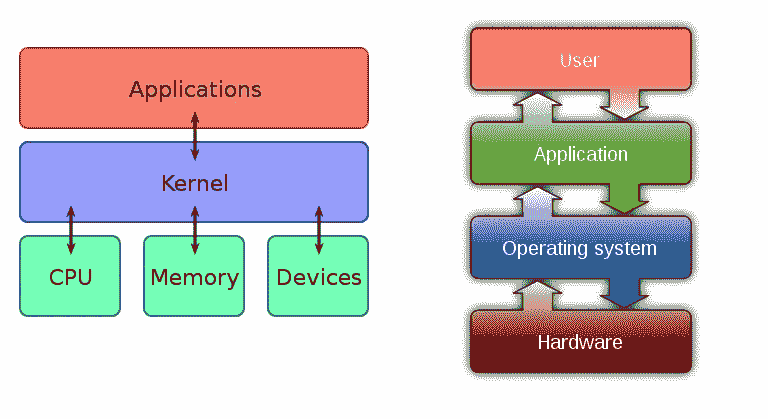
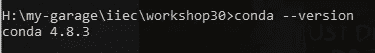
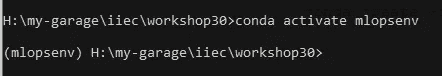
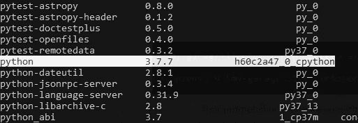
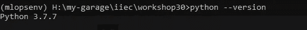

# 30 天 MLOps:安装和设置

> 原文：<https://medium.com/analytics-vidhya/30-days-of-mlops-day-1-108aa4b61f2c?source=collection_archive---------24----------------------->

## 适用于初学者的 MLops

## 入门安装和一些人们觉得枯燥的概念。

> 我认为你是初学者。因此，我将从操作系统、Python3 编程、数据分析、机器学习、深度学习、Dev-Ops、ML-Ops 等基础知识开始我的故事。

为了深入研究 MLops，我们需要弄清楚一些基础知识。

1.  **程序**:计算机程序是可以由计算机执行以完成特定任务的指令集合。大多数计算机设备需要程序才能正常工作。(来源:[维基](https://en.wikipedia.org/wiki/Computer_program) )
    *(它们存在于存储领域——硬盘)*
    所以这意味着键盘、鼠标、摄像头，甚至你的笔记本电脑/台式机风扇都需要一个程序才能正常工作。但是我一个都没写过？？是的，很明显，你的操作系统在内核的帮助下做到了这一点。
2.  **OS(操作系统)**:操作系统(OS)是管理计算机硬件、软件资源，为计算机程序提供通用服务的系统软件。
3.  内核:内核是位于计算机操作系统核心的计算机程序，对系统中的一切拥有完全的控制权
4.  **进程**:它只是程序的一个实例。就像建筑与其蓝图的关系一样。程序通常是硬件资源在执行后应该如何表现的蓝图。当执行时，会创建一个正在进行的过程。总之，过程只是一个运行的程序。您可以通过多次运行一个程序来创建多个进程。*(它们存在于内存— RAM 中)*

所以直到这里，我们知道一切都是由你的硬件资源完成的。如果你没有这些，什么也帮不了你。你需要一个操作系统来让你的硬件为你工作。操作系统已经编写了许多程序来与你的相机、键盘、鼠标、扬声器和其他硬件资源进行交互。



这就是事情的运作方式

好酷！！！

现在怎么办？？

第一个问题的时间到了…**为什么是 Python？**
关于为什么使用 python 有一个庞大的列表，但长话短说..
1。Python 很简单。
2。Python 是一种通用语言。
3。Python 速度很快。(*等等！…因为 Python 是一种解释型语言，所以它应该很慢。不是吗？可以，但是* [*PyPy*](https://www.pypy.org/) *社区做了一些很大的努力，通过几种方式让它变得更快)* 4。Python 不是 python。(什么！！…我的意思是 python 不仅仅是一种编程语言..这是一个实现..python 有几种实现。检查它们[这里](https://wiki.python.org/moin/PythonImplementations)

如果你还没有安装 python，你还在等什么？？？

我们将使用 Python 和 Windows 操作系统的 Anaconda 包管理器(为了简单起见)。我将在后面讨论什么是包管理器以及我们为什么使用它。你会知道的。但现在不是时候。

 [## 安装- Anaconda 文档

### 在安装 Anaconda 个人版之前，请阅读下面列出的系统要求。如果你不想要…

docs.anaconda.com](https://docs.anaconda.com/anaconda/install/) 

如果安装成功，那么就该检查了。

在 CMD 中键入以下命令。
*(您的 conda 版本可能与我的版本不同。)*

```
conda --version
```



抽样输出

现在让我们跳到一些技术性的东西…
首先我们将创建一个虚拟环境，这样我们就可以将我们的实验室与其他程序隔离开来。每当事情变得乱七八糟，只要删除虚拟环境，一切都没了。不需要重新安装 anaconda 和其他主要库。

要创建环境，请跟随 Anaconda 团队的这篇文章→ [点击这里](https://docs.conda.io/projects/conda/en/latest/user-guide/tasks/manage-environments.html)。
或者在 CMD 上键入以下命令。

```
conda create -n mlopsenv anaconda
```

然后激活它。

```
conda activate mlopsenv
```



您的提示应该会改变如下内容

这表明您现在正在虚拟环境中工作。

让我们检查一下这个环境中有哪些包。

```
conda list
```

这个命令将会给我们一个巨大的包列表…
吸引我的是还有一个 Python 包..特别是 CPython 的一个版本(最常用的实现)



让我们用传统的方法确认一下我们用的是哪个版本的 python。

```
python --version
```



如果你对 python 编程很陌生，我推荐你先过[这个](https://docs.python.org/3.7/tutorial/appetite.html)(入门)和[这个](https://docs.python.org/3.7/tutorial/interpreter.html)(了解一下 python 解释器)。

Python 社区也将[制作成了学习](https://docs.python.org/3.7/tutorial/index.html)的非常好的博客教程。
它介绍了 Python 许多最值得注意的特性，并会让你对这种语言的风格和风格有一个很好的了解。

现在我们完成了基本的设置。接下来，我们将关注一些基本的编程知识，为了继续学习 ML 和 ML-Ops，你应该具备这些知识。