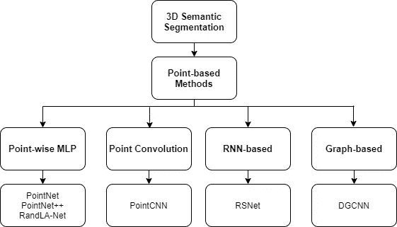
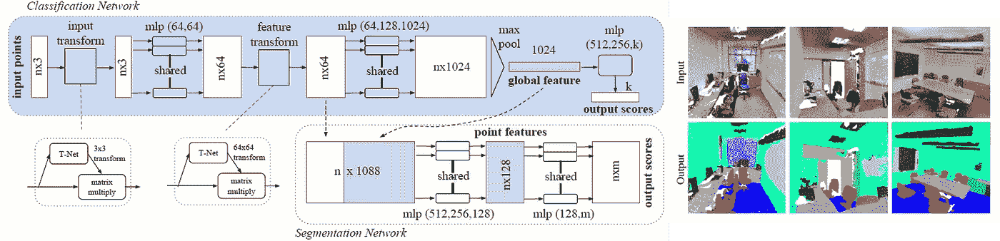
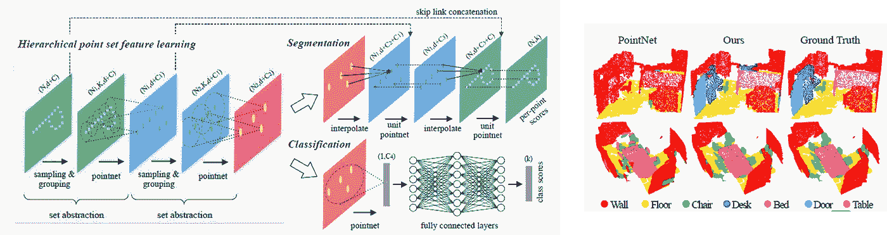
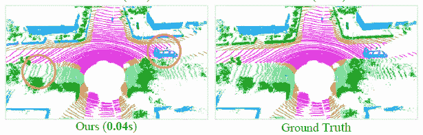
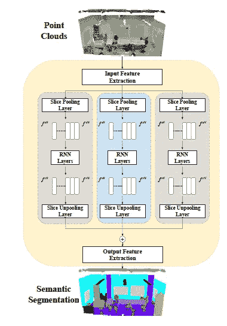
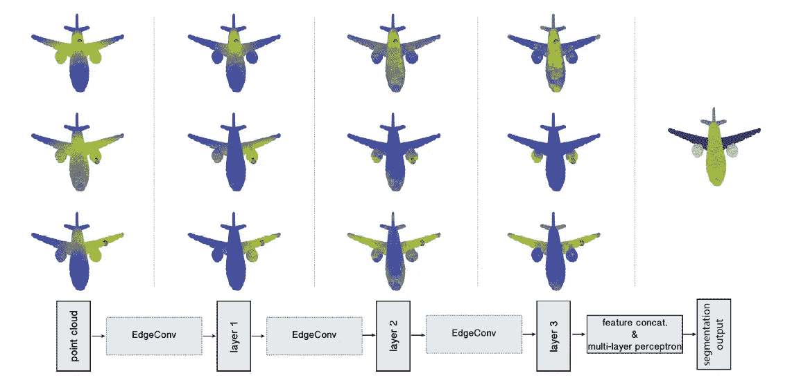
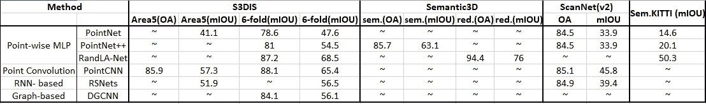

# 基于深度学习技术的三维点云语义分割

> 原文：<https://medium.com/analytics-vidhya/3d-point-cloud-semantic-segmentation-using-deep-learning-techniques-6c4504a97ce6?source=collection_archive---------0----------------------->

[保罗·格伦](https://unsplash.com/@pgreen1983?utm_source=medium&utm_medium=referral)在 [Unsplash](https://unsplash.com?utm_source=medium&utm_medium=referral) 上拍照

# 介绍

由于增强现实/虚拟现实的发展及其在计算机视觉、自动驾驶和机器人领域的广泛应用，点云学习最近引起了人们的关注。深度学习已被成功用于解决 2D 视觉问题，然而，深度学习技术在点云上的使用仍处于初级阶段，因为其处理面临独特的挑战。深度学习的早期方法通过将点云预处理成结构化网格格式来克服这一挑战，代价是增加计算成本或损失深度信息。3D 点云分割是将点云分类到不同的同质区域中的过程，使得同一孤立且有意义的区域中的点具有相似的属性。由于点云数据的高度冗余、不均匀的采样密度以及缺乏明确的结构，3D 分割是一项具有挑战性的任务。将点云分割成前景和背景是处理三维点云的基本步骤。人们可以精确地确定 3D 数据中对象的形状、大小和其他属性。然而，分割三维点云中的对象并不是一项简单的任务。点云数据通常是嘈杂的、稀疏的和无组织的。除此之外，点的采样密度是不均匀的，并且表面形状可以是任意的，在数据中没有统计分布模式。此外，由于 3D 传感器的限制，背景与前景纠缠在一起。此外，很难有一个计算效率高且内存占用少的深度学习模型来执行分割。分割过程有助于在各种应用中分析场景，如定位和识别对象、分类和特征提取。3D 点云分割可以部署在场景级(语义分割)、对象级(实例分割)和零件级(零件分割)。语义分割是一种为每个像素检测其所属的对象类别的技术，并且还将同一类别的多个对象视为单个实体。

基于点的三维语义分割分类法

给定一个点云，语义分割的目标是根据点的语义将其分成若干子集。本文主要研究基于点的语义分割技术。各种基于点的 3D 语义分割技术的分类可以由 4 个范例给出，如(a)逐点 MLP，(b)点卷积，(c)基于 RNN，和(d)基于图形。

# 点网

卷积架构需要高度规则的输入数据格式，以便执行权重共享和其他内核优化。由于点云和网格不是规则的格式，大多数方法通常在将数据馈送到深度网络架构之前，将数据转换成规则的 3D 体素网格或图像集合。然而，这种变换使得结果数据不必要地庞大，并且还引入了量化伪像，这些伪像会模糊数据的自然不变性。PointNet 直接消耗点云，这些点云考虑了输入中的置换不变性。点网络体系结构包含三个关键模块:作为对称函数聚合所有点信息的最大池层、局部和全局信息组合结构以及两个用于对齐输入点和点要素的联合对齐网络。为了找到无序输入的对称函数，通过对变换元素应用对称函数来近似定义在点集上的一般函数。点网通过一个多层感知器网络逼近一个函数，通过一个单变量函数和一个最大池函数的组合来变换函数。该函数的输出形成一个向量，该向量被认为是输入集的全局特征，并通过将全局特征与每个点特征连接起来而被提供给每个点特征。然后，基于组合的点特征提取新的每点特征，因为每点将知道局部和全局信息。形成第三个模块的联合对齐网络受到以下事实的启发:如果点云经历几何变换，则点云的语义标记必须是不变的。PointNet 通过 T-net 架构预测仿射变换矩阵，并将该变换直接应用于输入点的坐标。T-net 由独立于点的特征提取、最大池和完全连接的层组成。特征空间中的变换矩阵具有更高的维数。因此，为了优化，将约束特征变换矩阵接近正交矩阵的正则化项添加到 softmax 训练损失中。该图给出了点网的详细架构和语义分段的输出。

语义分割的点网结构和输出

# PointNet++

PointNet 不能捕获由点所在的度量空间引起的局部结构，这限制了它识别细粒度模式的能力和对复杂场景的推广能力。PointNet++引入了一个分层神经网络，它在输入点集的嵌套分区上递归地应用 PointNet。通过利用度量空间距离，PointNet++能够随着上下文比例的增加而学习局部特征。PointNet++通过底层空间的距离度量将一组点划分为重叠的局部区域。类似于 CNN，它从小邻域中提取捕获精细几何结构的局部特征，并且这些局部特征被进一步分组为更大的单元，并被处理以产生更高级别的特征。重复这个过程，直到获得整个点集的特征。PointNet++的设计解决了两个问题:如何生成点集的划分，以及如何通过局部特征学习器抽象点集或局部特征。PointNet 使用单个 max-pooling 操作来聚合整个点集，而 PointNet++构建点的分层分组，并沿着分层结构逐步抽象更大的局部区域。这个层次结构由许多抽象层组成，在每一层，一组点被处理和抽象以产生具有更少元素的新集合。抽象层由三层组成:采样层、分组层和点网层。采样层从输入点中选择一组点，这些点定义了局部区域的质心。然后，分组层通过寻找质心周围的“相邻”点来构建局部区域集。点网层使用迷你点网将局部区域模式编码成特征向量。图中显示了用于 PointNet++的体系结构的细节及其与 PointNet 的比较。

PointNet++架构与语义分割的输出

# 兰德拉网

RandLA-Net 引入了一种轻量级神经架构，它可以处理大规模点云，比其他架构快 200 倍，因为大多数现有架构都使用昂贵的采样技术和计算昂贵的后处理和预处理方法。PointNet 的计算效率很高，但无法捕捉每个点的上下文信息。RandLA-Net 一次处理大规模 3D 点云，无需任何预处理/后处理步骤，如体素化、块分割或图形构建。RandLA-Net 仅依赖于网络内的随机采样，因此需要更少的内存和计算。局部特征聚集器通过考虑局部空间关系和点特征获得连续更大的感受野。整个网络包含共享的多层感知器，而不依赖于图形构造和内核化，因此是有效的。不同的采样方法，如最远点采样、逆密度重要性采样、基于生成器的采样，计算效率非常高。但是，它们可能会导致重要功能的丢失。因此，RandLA-Net 提出了一个本地聚合模块。该模块并行应用于每个 3D 点，由三个神经单元组成。

*   LocSE:在这个模块中，给定一个点云，所有的特征都被明确地用来编码三维坐标信息。它使用 K-最近邻算法来收集相邻点，然后执行相对点位置编码步骤，这有助于网络学习局部特征。最后，在点特征扩充中，编码的相对点位置与对应的点特征连接，并获得扩充的特征向量。这个向量编码局部几何结构。
*   注意力集中:对于一组给定的局部特征，设计一个共享函数来学习唯一的注意力分数，并在邻域点特征集中聚集使用信息。共享的多层感知器之后是一个 softmax 函数。然后将这些习得的注意力分数相加。
*   扩张的残差块:由于随机采样对输入点云连续下采样，所以需要增加每个点的感受野。使用 Resnet 架构和跳过连接，将多个 LocSE 和 Attentive Pooling 块连接起来，形成扩展的剩余块。这个块负责扩大感受野，扩大有效邻域。图 4 给出了 RandLA-Net 和 PointNet++的输出比较。

语义分割的随机网络输出与 PointNet++的比较

# 点 CNN

PointCNN 能够利用网格中密集表示的数据的空间局部相关性，并提供了从点云中进行特征学习的框架。PointCNN 从输入点学习一个**χ**-变换，以提升与点相关联的输入特征的权重以及将点排列成规范顺序。PointCNN 的架构包含两种设计:

1.分层卷积:在规则网格中，卷积递归地应用于局部网格块，这通常会降低网格分辨率，同时增加通道数。类似地，在点云中， **χ** -Conv 被递归地应用于“投射”，或“聚集”，来自邻域的信息成为更少的代表性点，但每个点具有更丰富的信息。

2. **χ** -Conv 算子: **χ** -Conv 算子在局部区域内操作，以关联点和邻域点为输入，并与之卷积。邻近点被转换到代表点的局部坐标系中，然后，这些局部坐标被单独提升并与相关特征组合。

具有两个 **χ** -Conv 图层的 PointCNN 将输入点转换为更少的要素制图表达，但每个要素都更丰富。然而，顶部 **χ** -Conv 层的训练样本数量迅速下降，使得训练效率低下。为了解决这个问题，PointCNN 使用了更密集的连接，其中更多的代表性点保存在 **χ** -Conv 层中。此外，为了在保持感受野生长率的同时保持网络的深度，使用了扩张的回旋。对于分割任务，需要高分辨率的逐点输出，因此使用 conv-德康架构，并遵循 U-Net 设计。

# 递归切片网络

大多数其他语义分割网络没有模拟点云之间所需的依赖性。RSNet 的关键组件是一个轻量级的本地依赖模块。局部依赖性模块是高效的，并且具有作为输入点数量的 O(n) w.r.t .和局部上下文分辨率的 O(1) w.r.t .的切片汇集/取消汇集层的时间复杂度。RSNet 将原始点云作为输入，并输出每个点云的语义标签。给定一组无序点和一个候选标签集，RSNets 的任务是给每个点分配一个语义标签。输入和输出特征提取块用于独立的特征生成。中间是本地依赖模块。输入要素块消耗输入点并生成要素，输出要素块将处理后的要素作为输入并为每个点生成最终预测。这两个块都使用多个 1 x 1 卷积层序列来为每个点生成独立的要素表示。本地依赖模块是新颖的切片池层、双向递归神经网络(RNN)层和切片解池层的组合。通过首先将无序点投影到有序特征中，然后应用传统的端到端学习算法，来解决局部上下文问题。投影是通过一种新颖的切片池层实现的。在这一层中，输入是无序点的特征，输出是聚合特征的有序序列。接下来，rnn 被应用于该序列中的模型依赖性。最后，切片取消 pooling 层将序列中的特征分配回点。该图给出了 RSNets 的详细架构。RSNets 在三个广泛使用的基准测试中超过了以前的最先进的方法，同时需要更少的推理时间和内存。

RSNet 架构

# 动态图形 CNN

DGCNN 是一个 EdgeConv，适用于基于 CNN 的点云高级任务，包括分类和分割。EdgeConv 作用于网络各层中动态计算的图形。它捕捉局部几何结构，同时保持置换不变性。EdgeConv 不是直接通过嵌入生成点要素，而是生成描述点与其相邻点之间关系的边要素。EdgeConv 被设计为对邻居的排序不变，因此是置换不变的。因为 EdgeConv 构建了一个局部图并学习了边的嵌入，所以该模型能够在欧几里得空间和语义空间中对点进行分组。DGCNN 不是像 PointNet 那样处理单个点，而是通过构建局部邻域图并在连接相邻点对的边上应用类似卷积的操作来利用局部几何结构。边缘卷积具有介于平移不变性和非局部性之间的性质。与图形 CNN 不同，DGCNN 的图形不是固定的，而是在网络的每一层之后动态更新。也就是说，一个点的 k-最近邻集在网络的各层之间变化，并且是根据嵌入序列计算的。DGCNN 可以执行分类以及分割任务。分类模型将 n 个点作为输入，为 EdgeConv 层的每个点计算大小为 k 的边特征集，并聚合每个集中的特征以计算对应点的 EdgeConv 响应。最后一个 EdgeConv 图层的输出要素被全局聚合以形成 1D 全局描述符，该描述符用于生成 cc 类的分类分数。分割模型通过连接每个点的 1D 全局描述符和所有 EdgeConv 输出(用作局部描述符)来扩展分类模型。它输出 p 个语义标签的每点分类分数。该网络包含两个模块:

1)点云变换块:该块被设计成通过应用估计的 3 × 3 矩阵来将输入点集对齐到规范空间。为了估计 3 × 3 矩阵，使用了连接每个点的坐标及其 k 个相邻点之间的坐标差的张量。

2) EdgeConv 块:该块将形状 n × f 的张量作为输入，通过应用具有层神经元数量的多层感知器(MLP)来计算每个点的边缘特征，并且在相邻边缘特征之间汇集之后生成形状 n × an 的张量。DGCNN 架构可以轻松地按原样整合到基于点云的图形、学习和视觉的现有管道中。

DGCNN 架构

# 总结和量化结果

下表给出了对 3 个公开可用数据集 S3DIS、Semantic3D、ScanNet(v2)和 Sem 的结果的定量分析。KITTI 使用评估指标 OA，mIOU。

定量结果

# 参考

[1] Y. Guo，H. Wang，Q. Hu，H. Liu，L. Liu 和 M. Bennamoun，“3d 点云的深度学习:一项调查”，IEEE 模式分析和机器智能汇刊，2020 年。

[2] Q. Hu，B. Yang，L. Xie，S. Rosa，Y. Guo，Z. Wang，N. Trigoni 和 a .马卡姆，“Randla-net:大规模点云的有效语义分割”，载于 2020 年 IEEE/CVF 计算机视觉和模式识别会议论文集，第 11 108-11 117 页。

[3] C. R. Qi，H. Su，K. Mo，L. J. Guibas，“点网:用于 3d 分类和分割的点集的深度学习”，载于 IEEE 计算机视觉和模式识别会议论文集，2017 年，第 652–660 页。

[4] C. R. Qi，L. Yi，H. Su，L. J. Guibas，“Pointnet++:度量空间中点集上的深度层次特征学习”，载于《神经信息处理系统进展》，2017 年，第 5099–5108 页。

[5] Y. Li，R. Bu，M. Sun，W.Wu，X. Di，B. Chen，“点 CNN:x 变换点上的卷积”，神经信息处理系统进展，2018 年，第 820–830 页。

[6] Q. Huang，W. Wang，U. Neumann，“点云三维分割的递归切片网络”，IEEE 计算机视觉与模式识别会议论文集，2018 年，第 2626–2635 页。

[7] A. V. Phan，M. Le Nguyen，Y. L. H. Nguyen 和 L. T. Bui，“Dgcnn:大规模标记图上的卷积神经网络”，神经网络，第 108 卷，第 533-543 页，2018 年。