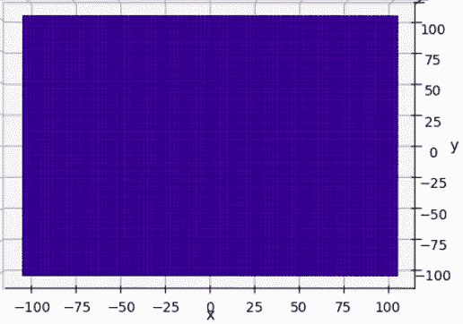
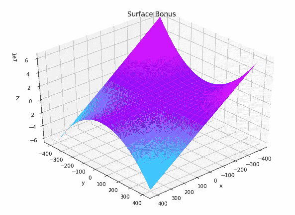

# 用 Python -Matplotlib 实现二元函数的 3D 可视化(从ℝ到ℝ)

> 原文：<https://medium.com/analytics-vidhya/3d-visualization-of-a-function-of-two-variables-from-%E2%84%9D%C2%B2-into-%E2%84%9D-with-python-matplotlib-5bd3df39fc94?source=collection_archive---------7----------------------->


两个实变量函数的交互式表示(图片由作者提供)

在本教程中，我们将了解如何使用 python 以三维交互方式显示从ℝ到ℝ的函数。这里我用 Jupyter 笔记本。

如果你想直接运行代码，你可以[在我的回购上下载笔记本。](https://github.com/joctet/3D-visualization-of-a-function-of-two-variables-with-Python--Matplotlib)

首先，有些库是必要的:

# 装置

```
pip install numpy
pip install matplotlib 
```

# 进口

```
import numpy as np
import matplotlib.pyplot as plt
import mpl_toolkits
from mpl_toolkits.mplot3d import Axes3D
```

如果您在导入 mpl _ toolkits 时遇到困难，请尝试运行:

```
!pip install — upgrade matplotlib
import mpl_toolkits
```

# 预处理

设函数 f 从ℝ到ℝ.对于ℝ的任何一对夫妇(x，y ):

f(x，y) = 2*x — x*y + 2*y

函数 f 在 python 中定义如下:

```
def f(x, y):
    return 2*x**2 - x*y + 2*y**2
```

我们从实数ℝ集合中为 x 和 y 选择一个值范围(我将以[-100，100]为例，每个变量有 100 个值)。

```
x = np.linspace(-100, 100, 100)
y = np.linspace(-100, 100, 100)
```

然后，我们将创建一个包含所有值对(xi，易)的值数组，其中 xi 在 x 轴上，易在 y 轴上



x 和 y 在其值范围内的映射(图片由作者提供)

```
X, Y = np.meshgrid(x, y)
```

然后，我们为每对值(xi，易)计算上面定义的函数的值，并将这些值存储在新的变量 Z 中:

```
Z = f(X,Y)
```

之后，只需将 Z 显示为 X 和 y 的函数。

## 交互式可视化

对于可以在三维空间中旋转图形的交互式可视化，请指定以下命令:

```
%matplotlib notebook
```

## 形象化

```
fig = plt.figure()
ax = plt.axes(projection='3d')
ax.plot_surface(X, Y, Z, rstride=1, cstride=1,cmap='jet', edgecolor = 'none')
```


作者图片

您可以进一步添加标题、为轴添加标题、选择图形的大小、调整图形的单元格大小(rstride 和 cstride 参数)、修改 cmap 色阶(我在页面底部的奖金部分列出了 cmap 的可能值)、…

## 一个更完整的例子

```
# We define the size of the figure
fig = plt.figure(figsize = (10,7))
ax = plt.axes(projection='3d')
ax.plot_surface(X, Y, Z, rstride=1, cstride=1, cmap='jet', edgecolor='none')# We caption the figure and set a size with fontsize
ax.set_title("Surface", fontsize = 13)
ax.set_xlabel('x', fontsize = 11)
ax.set_ylabel('y', fontsize = 11)
ax.set_zlabel('Z', fontsize = 10)
```


作者图片

那就好多了！

要一次运行所有内容，您可以使用以下代码:

```
import matplotlib.pyplot as plt
import numpy as np
from mpl_toolkits.mplot3d import Axes3D%matplotlib notebookdef f(x, y):
    return 2*x**2 - x*y + 2*y**2x = np.linspace(-100, 100, 100)
y = np.linspace(-100, 100, 100)X, Y = np.meshgrid(x, y)Z = f(X,Y)fig = plt.figure(figsize = (10,7))ax = plt.axes(projection='3d')
ax.plot_surface(X, Y, Z, rstride=1, cstride=1,
cmap='jet', edgecolor='none')
ax.set_title("Surface", fontsize = 13)
ax.set_xlabel('x', fontsize = 11)
ax.set_ylabel('y', fontsize = 11)
ax.set_zlabel('Z', fontsize = 10)
```

# 奖金

另一个完整代码的例子:

```
import numpy as np
import matplotlib.pyplot as plt
from mpl_toolkits.mplot3d import Axes3D%matplotlib notebookdef fonction1 (x, y):
    return 2*x**2 - x*y**2 + 2*y**2x = np.linspace(-400, 400, 100)
y = np.linspace(-400, 400, 100)
X, Y = np.meshgrid(x, y)
Z = fonction1(X,Y)fig = plt.figure(figsize = (10,7))
ax = plt.axes(projection='3d')
ax.plot_surface(X, Y, Z, rstride=5, cstride=5,
                cmap='cool')
ax.set_title("Surface Bonus", fontsize = 13)
ax.set_xlabel('x', fontsize = 11)
ax.set_ylabel('y', fontsize = 11)
ax.set_zlabel('Z', fontsize = 11)
plt.show()
```



作者图片

## cmap 的选择

cmap 可以采用多种值，但这里先给出一些示例来帮助您理解:


作者图片


作者图片

最后，为了达到迷幻效果:


作者图片

## cmap 的可能值:

```
‘Accent’, ‘Accent_r’, ‘Blues’, ‘Blues_r’, ‘BrBG’, ‘BrBG_r’, ‘BuGn’, ‘BuGn_r’, ‘BuPu’, ‘BuPu_r’, ‘CMRmap’, ‘CMRmap_r’, ‘Dark2’, ‘Dark2_r’, ‘GnBu’, ‘GnBu_r’, ‘Greens’, ‘Greens_r’, ‘Greys’, ‘Greys_r’, ‘OrRd’, ‘OrRd_r’, ‘Oranges’, ‘Oranges_r’, ‘PRGn’, ‘PRGn_r’, ‘Paired’, ‘Paired_r’, ‘Pastel1’, ‘Pastel1_r’, ‘Pastel2’, ‘Pastel2_r’, ‘PiYG’, ‘PiYG_r’, ‘PuBu’, ‘PuBuGn’, ‘PuBuGn_r’, ‘PuBu_r’, ‘PuOr’, ‘PuOr_r’, ‘PuRd’, ‘PuRd_r’, ‘Purples’, ‘Purples_r’, ‘RdBu’, ‘RdBu_r’, ‘RdGy’, ‘RdGy_r’, ‘RdPu’, ‘RdPu_r’, ‘RdYlBu’, ‘RdYlBu_r’, ‘RdYlGn’, ‘RdYlGn_r’, ‘Reds’, ‘Reds_r’, ‘Set1’, ‘Set1_r’, ‘Set2’, ‘Set2_r’, ‘Set3’, ‘Set3_r’, ‘Spectral’, ‘Spectral_r’, ‘Wistia’, ‘Wistia_r’, ‘YlGn’, ‘YlGnBu’, ‘YlGnBu_r’, ‘YlGn_r’, ‘YlOrBr’, ‘YlOrBr_r’, ‘YlOrRd’, ‘YlOrRd_r’, ‘afmhot’, ‘afmhot_r’, ‘autumn’, ‘autumn_r’, ‘binary’, ‘binary_r’, ‘bone’, ‘bone_r’, ‘brg’, ‘brg_r’, ‘bwr’, ‘bwr_r’, ‘cividis’, ‘cividis_r’, ‘cool’, ‘cool_r’, ‘coolwarm’, ‘coolwarm_r’, ‘copper’, ‘copper_r’, ‘cubehelix’, ‘cubehelix_r’, ‘flag’, ‘flag_r’, ‘gist_earth’, ‘gist_earth_r’, ‘gist_gray’, ‘gist_gray_r’, ‘gist_heat’, ‘gist_heat_r’, ‘gist_ncar’, ‘gist_ncar_r’, ‘gist_rainbow’, ‘gist_rainbow_r’, ‘gist_stern’, ‘gist_stern_r’, ‘gist_yarg’, ‘gist_yarg_r’, ‘gnuplot’, ‘gnuplot2’, ‘gnuplot2_r’, ‘gnuplot_r’, ‘gray’, ‘gray_r’, ‘hot’, ‘hot_r’, ‘hsv’, ‘hsv_r’, ‘inferno’, ‘inferno_r’, ‘jet’, ‘jet_r’, ‘magma’, ‘magma_r’, ‘nipy_spectral’, ‘nipy_spectral_r’, ‘ocean’, ‘ocean_r’, ‘pink’, ‘pink_r’, ‘plasma’, ‘plasma_r’, ‘prism’, ‘prism_r’, ‘rainbow’, ‘rainbow_r’, ‘seismic’, ‘seismic_r’, ‘spring’, ‘spring_r’, ‘summer’, ‘summer_r’, ‘tab10’, ‘tab10_r’, ‘tab20’, ‘tab20_r’, ‘tab20b’, ‘tab20b_r’, ‘tab20c’, ‘tab20c_r’, ‘terrain’, ‘terrain_r’, ‘twilight’, ‘twilight_r’, ‘twilight_shifted’, ‘twilight_shifted_r’, ‘viridis’, ‘viridis_r’, ‘winter’, ‘winter_r’
```