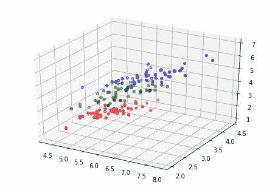
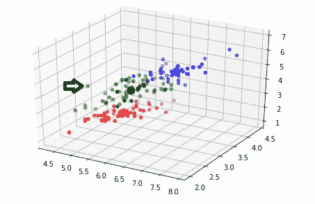

# K 均值聚类的三维可视化

> 原文：<https://medium.com/analytics-vidhya/3d-visualization-of-k-means-clustering-47d3d3e82117?source=collection_archive---------0----------------------->

在上一篇文章中，我解释了如何为 K-Means 聚类选择最佳 K 值。由于帖子的主要目的不是介绍 K-means 的实现，所以我使用了 sklearn 库的内置函数，并认为读者已经知道这个算法是什么。

但是今天我想重点说一下实现部分，做一个关于 K-means 的教程。我们将编写自定义函数来计算数据点和聚类之间的距离，并在每次迭代后更新聚类中心。最后，我们将通过 3D 图形来可视化我们的集群，并得到一个非常酷的图片。所以，如果你准备好了，那就开始吧！

在本教程中，我们将像上一课一样使用 Iris 数据集。我们已经知道，虹膜数据集包含 3 种不同类型的花和每种花的 4 个特征。但是在本教程中我们将只使用 3 个特征，因为我们不能想象一个四维空间。因此，选择 3 个随机的聚类中心作为起点是一个明智的想法。

```
import numpy as np
from sklearn import datasets
import random
iris=datasets.load_iris()
x=iris.data
target=iris.target
min_of_features=np.zeros((1,3))
max_of_features=np.zeros((1,3))
for i in range(3):
    min_of_features[0,i]=min(x[:,i])
    max_of_features[0,i]=max(x[:,i])cluster_centers=np.zeros((3,3))
for i in range(3):
    for j in range(3):
        cluster_centers[i,j]=round(random.uniform(min_of_features[0,j],max_of_features[0,j]),3)
```

“Cluster_centers”是一个 3×3 矩阵，包括 3 个中心和每个中心的 3 个维度。我找到了每个特征的最小值和最大值，并在这些值之间分配了一个随机值(为了接近数据点)。

因为我们已经分配了聚类中心，所以我们可以开始计算数据点和每个聚类中心之间的距离。我们有 3 个聚类中心，因此，每个数据点有 3 个距离值。对于聚类，我们必须选择最近的中心，并将相关数据点分配给该中心。让我们看看这部分的代码:

```
#a  is the row vector including 4 features(only 3 will be used)
#b is a 3x3 matrix containing cluster centersdef **distance_find**(a,b):
    total_1=np.square(a[0]-b[0,0])+np.square(a[1]-b[0,1])+np.square(a[2]-b[0,2])

total_2=np.square(a[0]-b[1,0])+np.square(a[1]-b[1,1])+np.square(a[2]-b[1,2])

total_3=np.square(a[0]-b[2,0])+np.square(a[1]-b[2,1])+np.square(a[2]-b[2,2])

vec=np.array([total_1,total_2,total_3])
    if min(vec)==total_1:
        return 0
    elif min(vec)==total_2:
        return 1
    elif min(vec)==total_3:
        return 2
```

上面的代码为每个数据点找到 3 个距离值，并在最后对它们进行比较。例如，如果“total_1”是 3 个距离值中的最小值，我们推断第一个分类是最接近的，并返回零。

我们完成了距离测量部分，但还没有完成。因为我们从随机的聚类中心开始，我们不期望我们的聚类是正确的。我们需要继续更新集群中心，直到系统稳定，集群中没有发生变化。

更新聚类中心意味着取每个聚类的平均值，并将该值指定为新的中心。平均有助于我们缩小聚类的范围，并消除异常值或噪声。因此，我们将迫使我们的集群尽可能相互靠近，从而拥有更好的群组。

```
def mean_finder():
    cluster_new=np.zeros((3,3))
    for i in range(3):
        number_of_elements=sum(cluster_labels==i)
        for j in range(3):
            total=0
            for z in range(len(cluster_labels)):
                if cluster_labels[z]==i:
                    total=total+x[z,j]
                else:
                    total=total
            cluster_new[i,j]=round(total/(number_of_elements[0]+0.001),4)
    return cluster_new
```

上面，我们编写了更新聚类中心的函数。它基于 4 个特征对每个聚类中的数据点进行平均，并返回一个新的 3x4 矩阵。这些中心应该比以前的更好，因为我们降低了随机性水平。我想指出的是，在下面的代码中，我在右边表达式的分母上加了 0.001，以避免元素个数为零时出现 NaN 值。("***)cluster _ new[I，j]= round(total/(number _ of _ elements[0]+0.001)，4)*** ))

既然我们的函数已经准备好了，我们可以开始运行代码并观察结果:

```
cluster_labels=np.zeros((len(x),1))for iteration in range(15):
    for i in range(len(x)):
        row=x[i,:]
        cluster_labels[i]=distance_find(row,cluster_centers)
    cluster_centers=mean_finder()
```

仅此而已！我将迭代次数设置为 15，我希望看到一个好的结果，因为我们有一个小的数据集(150 行和 4 列)。现在，我们准备好查看我们的 3D 图形。让我们来看看该图在聚类之前的样子，以便比较我们的模型的性能:

```
fig=plt.figure()
ax=Axes3D(fig)
ax.scatter(x[:50,0],x[:50,1],x[:50,2],color='red')
ax.scatter(x[50:100,0],x[50:100,1],x[50:100,2],color='green')
ax.scatter(x[100:150,0],x[100:150,1],x[100:150,2],color='blue')
plt.show()
```



让我们看看群集后的情况:

```
cluster_labels2=np.array(cluster_labels)
cluster_labels2=np.zeros(len(x))
cluster_labels2[:]=cluster_labels[:,0]
fig=plt.figure()
ax=Axes3D(fig)ax.scatter(x[cluster_labels2==0,0],x[cluster_labels2==0,1],x[cluster_labels2==0,2],color='red')ax.scatter(cluster_centers[0,0],cluster_centers[0,1],cluster_centers[0,2],color='red',marker='o',s=120)ax.scatter(x[cluster_labels2==2,0],x[cluster_labels2==2,1],x[cluster_labels2==2,2],color='green')ax.scatter(cluster_centers[2,0],cluster_centers[2,1],cluster_centers[2,2],color='green',marker='o',s=120)ax.scatter(x[cluster_labels2==1,0],x[cluster_labels2==1,1],x[cluster_labels2==1,2],color='blue')ax.scatter(cluster_centers[1,0],cluster_centers[1,1],cluster_centers[1,2],color='blue',marker='o',s=120)plt.show()
```



正如你所看到的，两个图表非常相似。但是有一些不同之处需要强调。例如，箭头所指的绿点最初是蓝色的。然而，它和绿点聚集在一起。原因很简单。由于该点距离绿色聚类中心比距离蓝色聚类中心更近，因此被归类为绿色点。顺便说一下，每个星团中间较大的球代表星团中心。因此，我们可以看到，聚类中心是这样一个点，它能够携带整个集群的平均特征。

我希望您喜欢本教程，并提高您对 K 均值聚类的理解。下一篇文章再见！