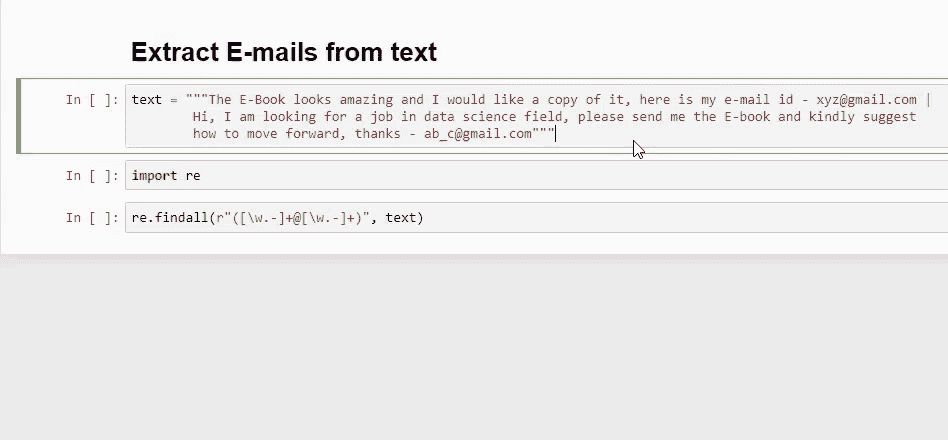
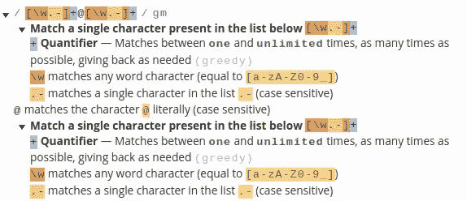
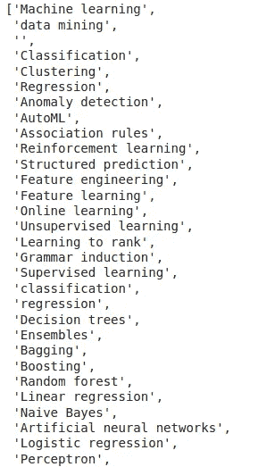
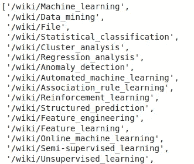
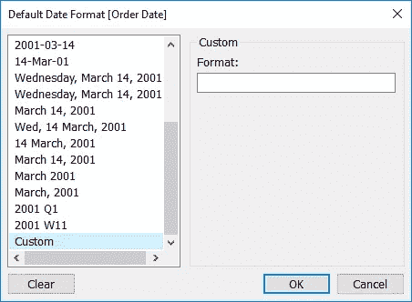
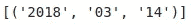
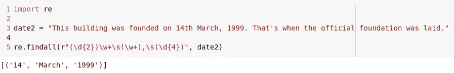
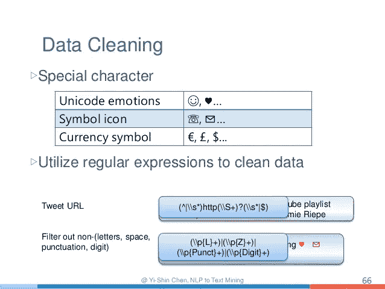
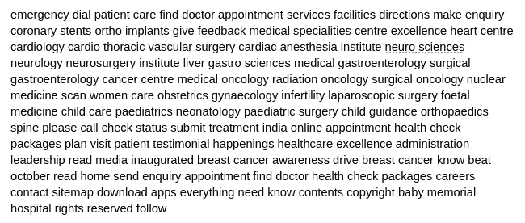

# 每个数据科学家都应该知道的正则表达式的 4 个应用(附 Python 代码)！

> 原文：<https://medium.com/analytics-vidhya/4-applications-of-regular-expressions-that-every-data-scientist-should-know-with-python-code-796aac79a95e?source=collection_archive---------11----------------------->

你见过他们，听说过他们，可能已经使用他们完成各种任务，甚至没有意识到在引擎盖下发生了什么？

是的，我说的不是别人，正是——正则表达式；数据科学家工具包的精髓技能！

从数据预处理到[自然语言处理](https://courses.analyticsvidhya.com/courses/natural-language-processing-nlp?utm_source=blog)、模式匹配、[网页抓取](https://www.analyticsvidhya.com/blog/2017/07/web-scraping-in-python-using-scrapy/)、[数据提取](https://www.analyticsvidhya.com/blog/2019/09/introduction-information-extraction-python-spacy/)等等无处不在！


这就是为什么我想写这篇文章，列出一些您或您的数据团队可以在正则表达式的帮助下自动完成的普通任务。

# 目录

1.  从文本文档中提取电子邮件
2.  Web 抓取的正则表达式(数据收集)
3.  使用日期时间功能
4.  使用正则表达式进行文本预处理(NLP)

# 从文本文档中提取电子邮件

很多时候，销售和营销团队可能需要从大型文本文档中查找/提取电子邮件和其他联系信息。

现在，如果您尝试手动操作，这可能是一项繁琐的任务！这正是 Regex 大放异彩的情况。以下是你如何编写一个基本的电子邮件提取器:

只需将“文本”替换为文档的文本，就可以了。下面是我们得到的一个输出示例:



很神奇，不是吗？如果您想直接读取一个文件并处理它，您可以简单地将文件读取代码添加到 Regex 代码中:

代码可能看起来很吓人，但实际上很容易理解。让我给你分析一下。我们使用 *re.findall()* 从遵循以下格式的文档中提取所有字符串:

```
any character a-z, any digit 0-9 and symbol '_' followed by a '@' symbol and after this symbol we can again have any character, any digit and especially a dot.
```

这里有一张图片，可以让你更好地理解这一点



这不是很简单吗？这就是正则表达式的优点，它让你用简单的表达式执行真正复杂的任务！

# Web 抓取的正则表达式(数据收集)

数据收集是数据科学家工作中非常常见的一部分，鉴于我们生活在互联网时代，在网上查找数据比以往任何时候都更容易。人们可以简单地浏览维基百科等网站。收集/生成数据。

但是网络抓取也有自己的问题——下载的数据通常是杂乱的，充满了噪音。这就是正则表达式可以有效使用的地方！


假设这是您想要处理的 HTML:

它来自维基百科的一个页面，并链接到维基百科的其他页面。你可以检查的第一件事是它有什么主题/页面的链接？

让我们使用下面的正则表达式:

```
import re re.findall(r">([\w\s()]*?)</a>", html)
```

一旦你使用了上面的代码，你将很快得到主题列表:



同样，您可以使用以下正则表达式提取所有这些页面的链接:

```
import re re.findall(r"\/wiki\/[\w-]*", html)
```

一旦你执行了上面的代码，你将得到所有这些维基百科页面的链接。



请注意，如果你将上述每个链接与[**【http://wikipedia.com】**](http://wikipedia.com)**结合起来，你就能导航到所有这些维基百科页面。例如，要去维基百科上关于**无监督学习**的页面，你可以使用这个链接:**

```
[https://en.wikipedia.org**/wiki/Unsupervised_learning**](https://en.wikipedia.org/wiki/Unsupervised_learning)
```

**URL 的第一部分只是一个模板，您可以将我们刚刚从 HTML 页面中提取的第二部分附加到其中。**

**您可以从本文中了解更多关于使用 Regex 提取 web 抓取文档信息的信息:**

*   **[Python 正则表达式初学者教程](https://www.analyticsvidhya.com/blog/2015/06/regular-expression-python/)**

# **使用日期时间功能**

**大多数真实世界的数据都有某种与之相关联的日期或时间列。这种列包含模型的有用信息，但是由于日期和时间有多种格式，因此很难处理这些数据。**

****

**在这种情况下，我们可以使用正则表达式来处理这些不同的格式吗？让我们一探究竟！**

**我们从一个简单的例子开始，假设您有一个日期时间值，如下所示:**

```
date = "2018-03-14 06:08:18"
```

**让我们从日期中提取“年”。我们可以简单地使用正则表达式来查找 4 个数字同时出现的模式:**

```
import re re.findall(r"\d{4}", date)
```

****

```
12th September, 2019
```

****

**您可以类似地为各种日期时间格式创建正则表达式，一旦您的正则表达式准备好了，您就可以在 pandas 中使用循环或 apply 函数对数据集的列运行代码。**

**如果您想了解更多关于使用 python 中的日期时间功能进行机器学习的信息，可以快速阅读以下内容:**

*   **[时序数据的 6 种强大的特征工程技术(使用 Python)](https://www.analyticsvidhya.com/blog/2019/12/6-powerful-feature-engineering-techniques-time-series/)**

# **使用正则表达式进行文本预处理(NLP)**

**当处理文本数据时，特别是在 NLP 中，我们为文本分类、机器翻译和文本摘要等任务建立模型，我们处理来自不同来源的各种文本。**

**例如，我们可以有网络搜集的数据，或者手动收集的数据，或者使用 OCR 技术从图像中提取的数据等等！**

****

**可以想象，数据的多样性也意味着大量的**不一致。**这些大部分对我们的机器学习任务没有用，因为它只是添加了不必要的噪声，可以从数据中删除。这就是 Regex 真正派上用场的地方！**

**让我们以下面这段文字为例:**

****

**很明显，上面的文本有很多不一致的地方，比如随机的电话号码、web 链接、一些奇怪的 unicode 字符形式“\x86…”等等。对于我们的文本分类任务，我们只需要干净和纯粹的文本，让我们看看如何解决这个问题。**

**我们将编写一个函数来使用正则表达式清理这些文本:**

**一旦在上面的文本上运行给定的代码，您会看到输出非常清晰:**

****

**我们在这里做了什么？我们基本上对输入字符串应用了一系列操作:**

```
# removing links 
newString = re.sub(r'(https|http)?:\/\/(\w|\.|\/|\?|\=|\&|\%)*\b', '', newString)# fetching alphabetic characters 
newString = re.sub("[^a-zA-Z]", " ", newString)# removing stop words 
tokens = [w for w in newString.split() if not w in stop_words]# removing short words 
long_words=[] 
for i in tokens: 
    if len(i)>=4: 
        long_words.append(i) 
return (" ".join(long_words)).strip()
```

**这就是文本预处理，不是很有趣吗？您可以从这个直观的博客中了解关于文本预处理的所有内容:**

*   **[处理文本数据(使用 Python)的终极指南——面向数据科学家和工程师](https://www.analyticsvidhya.com/blog/2018/02/the-different-methods-deal-text-data-predictive-python/)**

# **结束注释**

**在本文中，我们看到了一些使用正则表达式的简单而有用的方法。然而，我们仅仅触及了这个伟大工具的皮毛。**

**我鼓励你深入挖掘并理解正则表达式是如何工作的(因为它们在开始时可能会很混乱！)而不是简单的盲目使用它们。**

**以下是一些资源，您可以通过它们了解更多信息:**

*   **[Regex101](https://regex101.com/) —这是一个非常有用的网站，可以直观地了解 Regex 在幕后是如何工作的。**
*   **[Python 3 的正则表达式文档](https://docs.python.org/3/howto/regex.html)**
*   **Regex Quickstart CheatSheet —这是为那些想要快速修改 Regex 操作符的人准备的。**

**你以前用过正则表达式吗？您想将我错过的应用程序添加到此列表中吗？请在下面的评论中回答！**

***原载于 2020 年 1 月 26 日 https://www.analyticsvidhya.com**的* [*。*](https://www.analyticsvidhya.com/blog/2020/01/4-applications-of-regular-expressions-that-every-data-scientist-should-know-with-python-code/)**