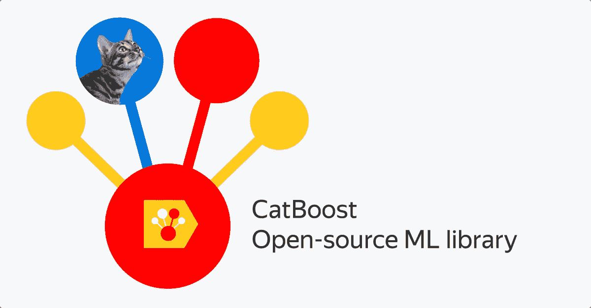

# 你应该知道的 4 种升压算法——GBM、XGBM、XGBoost 和 CatBoost

> 原文：<https://medium.com/analytics-vidhya/4-boosting-algorithms-you-should-know-gbm-xgbm-xgboost-catboost-b13b07de7029?source=collection_archive---------12----------------------->

提升算法已经存在多年了，但直到最近它们才成为机器学习社区的主流。但是为什么这些助推算法变得如此流行呢？

boosting 算法采用率上升的主要原因之一是机器学习竞赛。助推算法赋予机器学习模型超能力，以提高它们的预测精度。快速浏览一下 Kaggle 竞赛和 [DataHack 黑客马拉松](https://datahack.analyticsvidhya.com/?utm_source=blog&utm_medium=4-boosting-algorithms-machine-learning)就足以证明——助推算法非常流行！

简而言之，助推算法往往胜过更简单的模型，如[逻辑回归](https://www.analyticsvidhya.com/blog/2015/11/beginners-guide-on-logistic-regression-in-r/?utm_source=blog&utm_medium=4-boosting-algorithms-machine-learning)和[决策树](https://courses.analyticsvidhya.com/courses/getting-started-with-decision-trees?utm_source=blog&utm_medium=4-boosting-algorithms-machine-learning)。事实上，在我们的 DataHack 平台上，大多数顶尖的完成者要么使用一种增强算法，要么使用多种增强算法的组合。

在这篇文章中，我将向你介绍四种流行的助推算法，你可以在你的下一个[机器学习](https://courses.analyticsvidhya.com/courses/applied-machine-learning-beginner-to-professional?utm_source=blog&utm_medium=4-boosting-algorithms-machine-learning)黑客马拉松或项目中使用它们。

# 机器学习中的 4 种助推算法

1.  梯度推进机
2.  极限梯度推进机
3.  LightGBM
4.  CatBoost

# Boosting 快速入门(什么是 Boosting？)

想象一下这个场景:

您已经构建了一个[线性回归](https://www.analyticsvidhya.com/blog/2017/06/a-comprehensive-guide-for-linear-ridge-and-lasso-regression/?utm_source=blog&utm_medium=4-boosting-algorithms-machine-learning)模型，该模型在验证数据集上为您提供了 77%的正确率。接下来，您决定通过在同一数据集上构建 [k 近邻(KNN)](https://www.analyticsvidhya.com/blog/2018/03/introduction-k-neighbours-algorithm-clustering/?utm_source=blog&utm_medium=4-boosting-algorithms-machine-learning) 模型和[决策树](https://courses.analyticsvidhya.com/courses/getting-started-with-decision-trees?utm_source=blog&utm_medium=4-boosting-algorithms-machine-learning)模型来扩展您的投资组合。这些模型在验证集上分别给出了 62%和 89%的准确率。

很明显，这三种模式的工作方式完全不同。例如，线性回归模型试图捕捉数据中的线性关系，而决策树模型试图捕捉数据中的非线性关系。

> 我们不使用这些模型中的任何一个进行最终预测，而是使用所有这些模型的组合，这样如何？

我在考虑这些模型预测的平均值。通过这样做，我们将能够从数据中获取更多的信息，对吗？

这主要是集成学习背后的想法。助推从何而来？

Boosting 是使用集成学习概念的技术之一。boosting 算法结合多个简单模型(也称为弱学习器或基本估计器)来生成最终输出。

在本文中，我们将研究一些重要的提升算法。

# 1.梯度推进机

梯度推进机器或 GBM 组合来自多个决策树的预测来生成最终预测。请记住，梯度推进机器中的所有弱学习器都是决策树。

但是如果我们使用相同的算法，那么使用一百棵决策树怎么会比使用一棵决策树好呢？不同的决策树如何从数据中捕捉不同的信号/信息？

这里有一个诀窍— **每个决策树中的节点都采用不同的特征子集来选择最佳分割。这意味着每棵树都不相同，因此它们能够从数据中捕捉不同的信号。**

此外，每个新的树都考虑了以前的树所犯的错误。所以，每一棵后继的决策树都是建立在先前的错误之上的。这就是梯度推进机器算法中的树是如何顺序构建的。

这里有一篇文章解释了 GBM 算法的超参数调整过程:

*   [Python 中的梯度推进机(GBM)参数调整指南](https://www.analyticsvidhya.com/blog/2016/02/complete-guide-parameter-tuning-gradient-boosting-gbm-python/?utm_source=blog&utm_medium=4-boosting-algorithms-machine-learning)

# 2.极限梯度推进机

极端梯度增强或 XGBoost 是另一种流行的增强算法。事实上，XGBoost 只是 GBM 算法的一个临时版本！XGBoost 的工作程序与 GBM 相同。XGBoost 中的树是按顺序构建的，试图纠正前面树的错误。

这里有一篇文章直观地解释了 XGBoost 背后的数学原理，并且用 Python 实现了 XGBoost:

*   [理解 XGBoost 背后的数学原理的端到端指南](https://www.analyticsvidhya.com/blog/2018/09/an-end-to-end-guide-to-understand-the-math-behind-xgboost/?utm_source=blog&utm_medium=4-boosting-algorithms-machine-learning)

但是有一些特性使 XGBoost 比 GBM 略胜一筹:

*   最重要的一点是，XGBM 实现了并行预处理(在节点级别),这使得它比 GBM 更快
*   XGBoost 还包括各种正则化技术，可以减少过度拟合并提高整体性能。您可以通过设置 XGBoost 算法的超参数来选择正则化技术

在此了解 XGBoost 的不同超参数以及它们在模型训练过程中的作用:

*   [Python 中 XGBoost 的超参数调优指南](https://www.analyticsvidhya.com/blog/2016/03/complete-guide-parameter-tuning-xgboost-with-codes-python/?utm_source=blog&utm_medium=4-boosting-algorithms-machine-learning)

此外，如果使用 XGBM 算法，就不必担心在数据集中输入缺失值。**XGBM 模型可以自己处理缺失值**。在训练过程中，模型学习缺失值应该在右节点还是左节点。

# 3.LightGBM

由于其速度和效率，LightGBM boosting 算法正变得日益流行。LightGBM 能够轻松处理大量数据。但请记住，这种算法在数据点数量较少的情况下表现不佳。

让我们花点时间来理解为什么会这样。

LightGBM 中的树是逐叶生长，而不是逐层生长。第一次分割后，下一次分割仅在具有较高增量损失的叶节点上进行。

考虑我在下图中举例说明的例子:

在第一次分割后，左边的节点具有更高的丢失，并被选择用于下一次分割。现在，我们有三个叶节点，中间的叶节点损失最大。LightGBM 算法的逐叶分割使其能够处理大型数据集。

为了加速训练过程， **LightGBM 使用基于直方图的方法来选择最佳分割**。对于任何连续变量，不使用单个值，而是将这些值划分到箱或桶中。这使得训练过程更快，并降低内存使用。

这里有一篇比较 LightGBM 和 XGBoost 算法的优秀文章:

*   [LightGBM vs XGBOOST:哪种算法摘得桂冠？](https://www.analyticsvidhya.com/blog/2017/06/which-algorithm-takes-the-crown-light-gbm-vs-xgboost/?utm_source=blog&utm_medium=4-boosting-algorithms-machine-learning)

# 4.CatBoost

顾名思义，CatBoost 是一种 boosting 算法，可以处理数据中的分类变量。大多数[机器学习算法](https://www.analyticsvidhya.com/blog/2017/09/common-machine-learning-algorithms/?utm_source=blog&utm_medium=4-boosting-algorithms-machine-learning)无法处理数据中的字符串或类别。因此，将分类变量转换成数值是一个必要的预处理步骤。

CatBoost 可以在内部处理数据中的分类变量。使用各种特征组合的统计将这些变量转换成数字变量。

如果你想了解这些类别如何转换成数字背后的数学原理，你可以浏览这篇文章:

*   [将分类特征转换为数字特征](https://catboost.ai/docs/concepts/algorithm-main-stages_cat-to-numberic.html#algorithm-main-stages_cat-to-numberic)

CatBoost 被广泛使用的另一个原因是，它与默认的超参数集配合得很好。因此，作为用户，我们不必花费大量时间来调优超参数。

下面是一篇在机器学习挑战上实现 CatBoost 的文章:

*   [CatBoost:自动处理分类数据的机器学习库](https://www.analyticsvidhya.com/blog/2017/08/catboost-automated-categorical-data/?utm_source=blog&utm_medium=4-boosting-algorithms-machine-learning)

# 结束注释

在本文中，我们介绍了集成学习的基础知识，并研究了 4 种 boosting 算法。有兴趣了解其他集成学习方法吗？你应该看看下面这篇文章:

*   [集成学习综合指南(带 Python 代码)](https://www.analyticsvidhya.com/blog/2018/06/comprehensive-guide-for-ensemble-models/?utm_source=blog&utm_medium=4-boosting-algorithms-machine-learning)

你还用过其他什么助推算法？你用这些助推算法成功了吗？在下面的评论区和我分享你的想法和经验。

*原载于 2020 年 2 月 13 日*[*【https://www.analyticsvidhya.com】*](https://www.analyticsvidhya.com/blog/2020/02/4-boosting-algorithms-machine-learning/)*。*