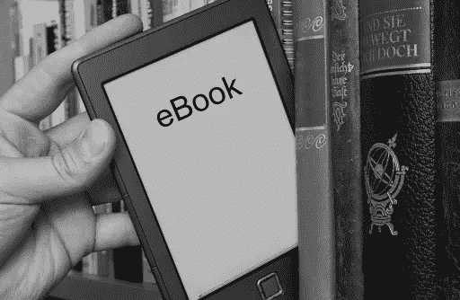

# 4 个有趣而简单的树莓 Pi 项目

> 原文：<https://medium.com/analytics-vidhya/4-fun-and-simple-raspberry-pi-projects-937b8d6d00c?source=collection_archive---------8----------------------->

所以你买了或收到了一个树莓派。你得到它的背后有没有意图，有没有一个计划？或者你只是对它能提供什么感兴趣？

我个人知道，我得到了我的礼物。我去把它安装好，环顾桌面，享受用它给人们发信息的新奇感觉。但是后来它在那里呆了一段时间，我没有任何想做的事情。我想过在上面设置 [RetroPie](https://retropie.org.uk/) ，但是决定还是留着做别的事情。

最终，我明白了我想做什么。我惊喜地发现 Pi 一次能处理多少东西，以及那里的项目有多好。

# 1.网络连接存储(NAS)💿

你们有些人可能想知道 NAS 是什么。基本上，它是一个连接到你的网络而不是你的电脑的存储设备(比如 u 盘或外置硬盘)。我发现它非常方便。

我发现 [PiMyLifeUp](https://pimylifeup.com/) 是 Raspberry Pi 项目的一个很好的来源，我可能会链接到他们的网站或 YouTube 频道来获得本文中的大多数条目。[NAS 也不例外](https://pimylifeup.com/raspberry-pi-samba/)。这个简单明了的教程将让您立刻在您的 Pi 上设置一个 Samba 服务器。这将允许您从家庭网络上的其他计算机访问存储在其上的文件，就像它们存储在计算机本身一样！

# 2.家庭媒体服务器🎥 📺

我想我们都同意，网飞和其他流媒体服务是近年来可消费媒体最伟大的发展之一。但是你下载的所有 DVD、电视节目和电影呢？在智能电视和 Chromecasts 让你在电视前舒适地使用网飞的时代，看这些似乎很麻烦。嗯，Pi 可以帮助你更好地利用你身边的所有“旧”媒体。

提示[丛媒体服务器](https://youtu.be/yt3WDsXtI7o)。这与上面描述的 NAS 结合得非常好。Plex 有一个配套的应用程序，可以安装在你的智能电视或智能手机上，让你通过与网飞非常相似的界面浏览你的媒体库。

它甚至会对照数据库检查你的媒体库(只使用文件名),找出演员名单、流派、烂番茄之类的评级，等等。我最喜欢的一个功能是，它会根据所有的信息从你的库中推荐一些下一步要看的东西！

# 3.电子书图书馆📚

好吧，也许你很乐意和网飞一起拍电影。也许我们在寻找更简单的东西。你有电子书收藏吗？(由于 [HumbleBundle](https://www.humblebundle.com/) ，我知道这些年来我已经收集了一些)在我设置了 Plex 之后，我想知道是否有什么东西可以以类似的流方式处理这些。

快速的谷歌搜索显示有很多选择。所以很自然地，我选择了最容易设置的，同时确保它有一个好的界面。没有比 Plex 更好的了，但你只能这么幸运。 [Ubooquity](https://vaemendis.net/ubooquity/) 是我选择的服务。已经敲了一会儿了；没有大的错误，我没有发现设置它的问题。主要是由于[这个非常好的贯穿这里](https://www.htpcguides.com/install-ubooquity-on-raspberry-pi-for-personal-ebook-server/)(可能是唯一的非 PiMyLifeUp 教程我会列出！).请务必阅读评论，虽然，有两行(天哪不！)需要改变才能让它正常工作。

登录到它的管理页面后(注意是“your . pi . IP . address”:220***3***/admin，而不是教程所说的 2202)，我稍微摆弄了一下设置，想知道它是如何工作的。我觉得它很好，也很人性化。一定要仔细检查你的电子书是否是正确的文件类型，因为 Ubooquity 不能处理所有的事情，但是它支持最常见的文件类型。

# 4.文件传输协议(FTP)服务器💻

我们已经了解了用于本地文件存储的 NAS。但是，当您想从家庭网络外部访问您的文件时，该怎么办呢？这将是一个两部分的设置。不过不要担心，两者都不太棘手！

首先，你需要[端口转发](https://www.youtube.com/watch?v=muBrjhso1tA)你的 Pi，使它可以从互联网上访问。就我个人而言，我没有使用视频中提到的任何动态 DNS 方面—我是唯一需要能够访问 Pi 的人，所以我是唯一需要知道 IP 地址的人。但是，如果它更接近您想要的 Pi，您没有理由不这样做！

在您设置了端口转发之后，您会想要将您的 Pi 设置为一个 [FTP 服务器](https://www.raspberrypi.org/documentation/remote-access/ftp.md)。一旦做到这一点，你只需要在另一台计算机上安装一个文件共享客户端，我使用了 [FileZilla](https://filezilla-project.org/) ，允许你在你的 Pi 上浏览和下载文件！

# 需要挑挑拣拣吗？❓

您可能会感到惊讶，也可能不会惊讶，我在我的小 Pi 计算机上同时运行了以上所有(以及更多)功能，并且它没有给我带来任何问题！(当我试图介绍我自己的小脚本时，除了我自己的失误)。

树莓派仍然是令人印象深刻的小机器，可以用更少的资源做更多的事情。

我希望你觉得这很有用，并喜欢把你的 Pi 变成一个家庭媒体中心！(或者你最终做出来的任何东西！)

如果你想联系我，请在 LinkedIn 上找到我！