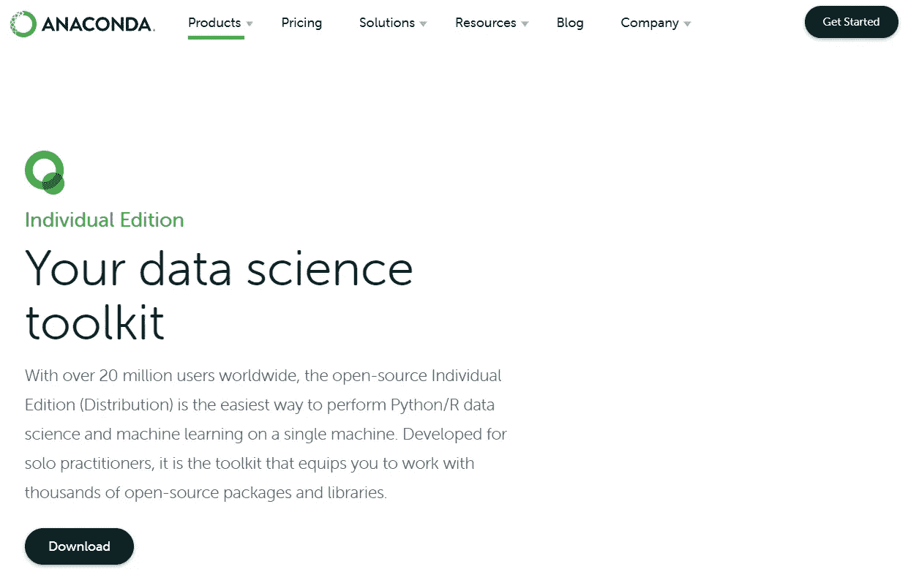
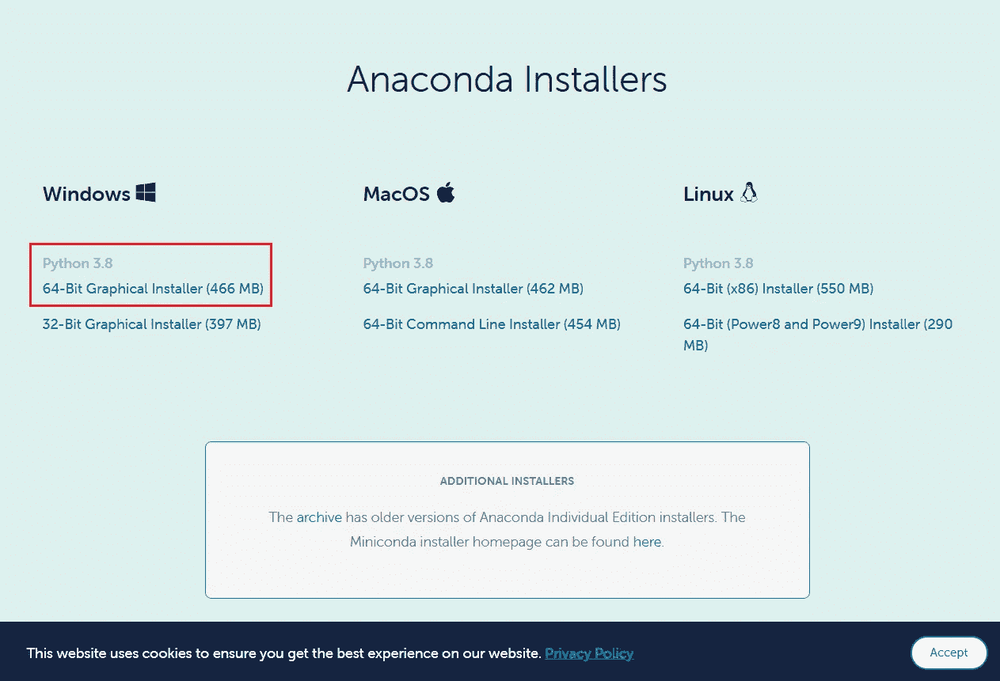
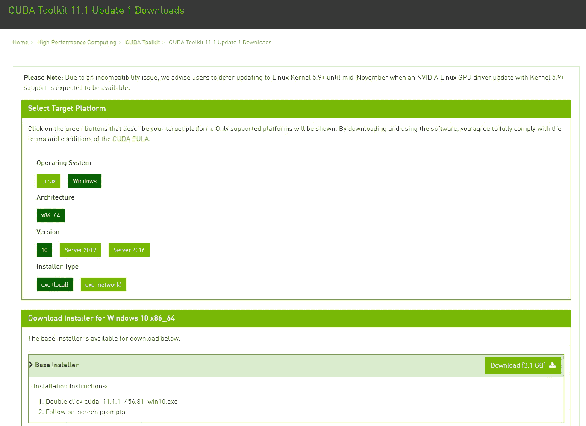
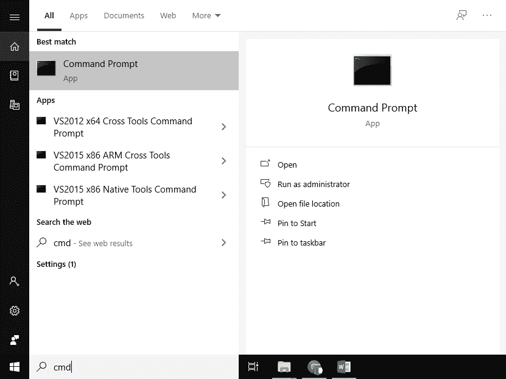
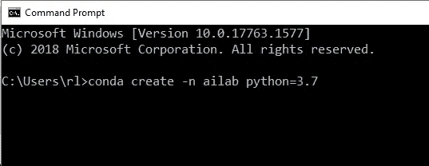
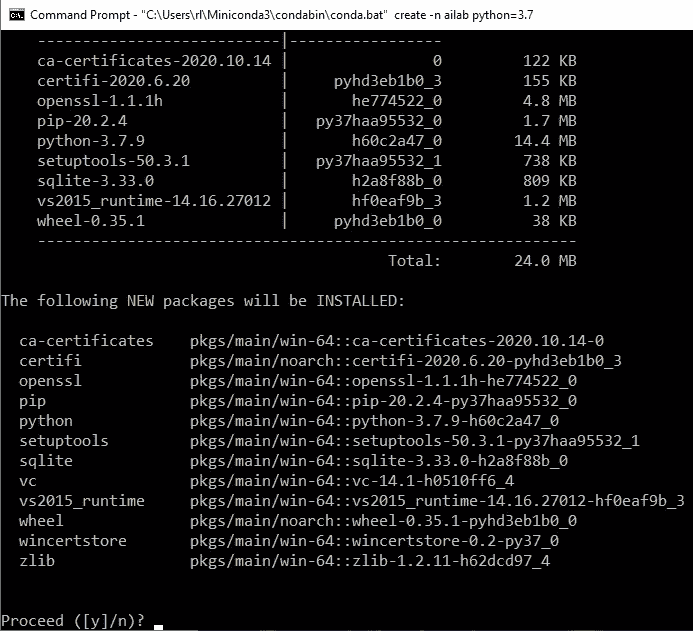
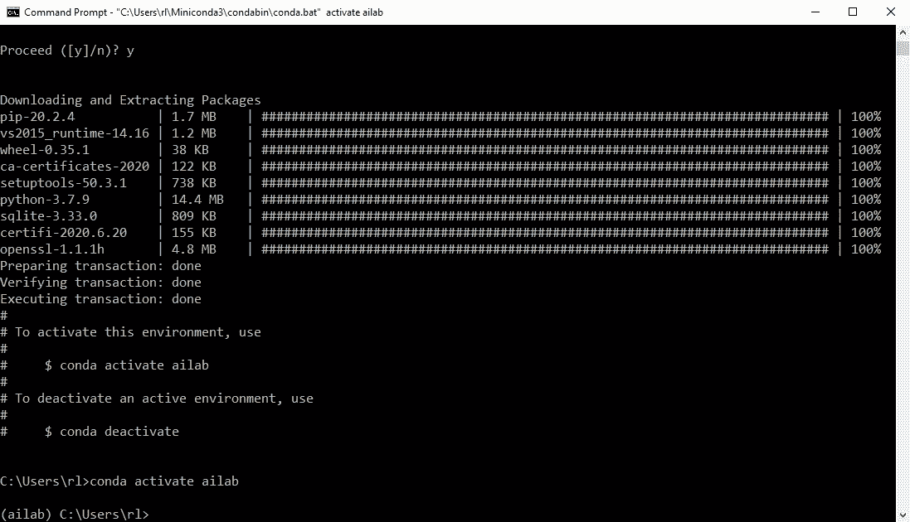
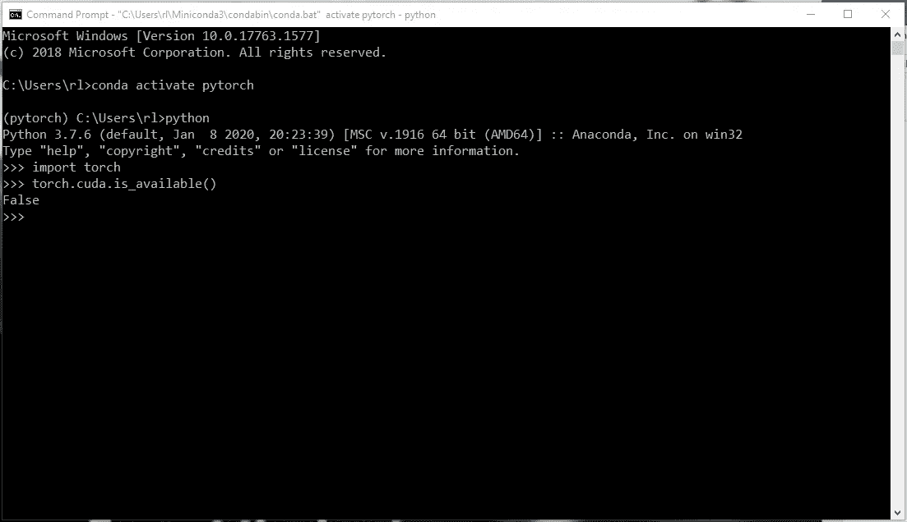

# 在 Windows 10 上安装 Anaconda 和 PyTorch 的 4 个步骤

> 原文：<https://medium.com/analytics-vidhya/4-steps-to-install-anaconda-and-pytorch-onwindows-10-5c9cb0c80dfe?source=collection_archive---------0----------------------->

嗨伙计们:)今天，我想分享一下如何在 Windows 10 中安装 Anaconda 和 PyTorch(有/没有 GPU)，这样你就可以运行不同的基于深度学习的应用程序。开始吧！

图片由作者提供。老虎的图像取自[ [此处](https://phys.org/news/2019-11-indian-authorities-exaggerated-tiger.html) ] (CC0 公共领域)

# 1.安装 Anaconda

第一步是安装 Anaconda，这样就可以为不同的应用程序创建不同的环境。注意不同的应用程序可能需要不同的库。比如有的可能需要 OpenCV 3，有的需要 OpenCV 4。因此，最好为不同的应用程序创建不同的环境。

请点击[此处](https://www.anaconda.com/products/individual#windows)进入 Anaconda 官网。然后点击**下载**，如下图。

图一。蟒蛇官方网站。作者摘自[[此处的](https://www.anaconda.com/products/individual#windows)

根据您的操作系统选择安装程序。假设你的操作系统是 Windows 10 64 位。图 2 是选择安装程序的例子。

图二。Anaconda 安装程序选择页面来自 Anaconda 的官方网站。作者摘自[ [此处](https://www.anaconda.com/products/individual#windows)

开始下载安装程序的 EXE 文件，然后按照说明将 Anaconda 安装到您的操作系统中。屏幕截图的详细说明可在[ [此处](https://docs.anaconda.com/anaconda/install/windows/)获得。

# 2.安装 CUDA 工具包(如果你有 GPU 的话)

如果您的计算机上有 GPU，并且您想使用 GPU 来加速您的应用程序，您必须安装 CUDA Toolkit。请在此下载 CUDA 工具包[。](https://developer.nvidia.com/cuda-downloads)

如下所示，选择您的操作系统、架构、版本和安装程序类型。

图 3。选择 CUDA 工具包 11.1 的安装程序。作者摘自[ [此处](https://developer.nvidia.com/cuda-downloads)

点击上面图 3 所示的**下载**按钮，然后安装 CUDA 工具包。在撰写本安装指南时，CUDA Toolkit 的最新版本是 11.1。注意，你得检查你用的是哪个 GPU，适用哪个版本的 CUDA 工具包。

# 3.为 PyTorch 创造康达环境

如果您已经完成了第 1 步和第 2 步，那么您已经成功地将 Anaconda 和 CUDA Toolkit 安装到了您的操作系统中。

请通过搜索“cmd”打开命令提示符，如下所示。

图 4。正在搜索 cmd。作者图片

然后，在 cmd 中键入下面一行

`conda create -n ailab python=3.7`

通过输入这一行，您正在创建一个名为‘ailab’的 Conda 环境

图 5。键入该行以创建 Conda 环境的示例。作者图片

图 5 显示了向 cmd 输入上面一行的例子。

您应该看到以下内容，请键入“y”继续创建。请注意，您可能需要等待几分钟。

图 6。创建 Conda 环境的示例(键入“y”继续)。作者图片

完成创建后，输入下面一行来激活您的 conda 环境‘ailab’

`conda activate ailab`

您应该会看到类似下面的内容。

图 7。激活 Conda 环境“ailab”的示例。作者图片

现在，你在你的康达环境中。可以为基于深度学习的应用安装必要的库。

一行一行地输入下面的代码(#代表对下面代码的解释)，

#使用 CUDA 工具包版本 11 安装 PyTorch 和 Torchvision 库

`conda install pytorch torchvision torchaudio cudatoolkit=11.0 -c pytorch`

#安装 Pandas 库，用于处理数据帧、csv 数据等。

`pip install pandas`

#安装 matplotlib 库，用于绘制训练和测试曲线

`pip install matplotlib`

#安装 OpenCV 库进行图像预处理/后处理

`conda install -c conda-forge opencv`

#安装用于读取和写入图像的枕头库

`conda install -c anaconda pillow`

# 4.验证您的安装

在这里，我们将验证安装。

要检查 PyTorch 的安装是否有 GPU 可用，请键入以下三行:

`python`

`import torch`

`torch.cuda.is_available()`

如果 GPU 可用于 PyTorch 平台，则返回 True，否则返回 False，如下所示。

图 8。使用/不使用 GPU 验证 PyTorch 的示例。作者图片

在上面的例子中，我们没有 GPU，因此它返回 False。

# 祝贺

现在，你可以尝试在电脑上运行不同的基于深度学习的应用。你可以尝试简单的直接使用预先训练好的 AlexNet 进行图像分类[ [此处](/analytics-vidhya/pytorch-directly-use-pre-trained-alexnet-for-image-classification-and-visualization-of-the-dea0de3eade9) ]。希望你们觉得这篇文章有用:)

感谢您阅读我的帖子。如果您有任何问题，请随时给我发电子邮件或在这里留下评论。我很高兴收到你的来信，欢迎任何建议。希望下次能见到你！:)