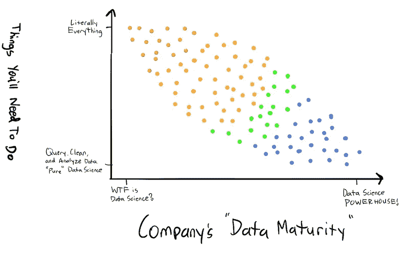
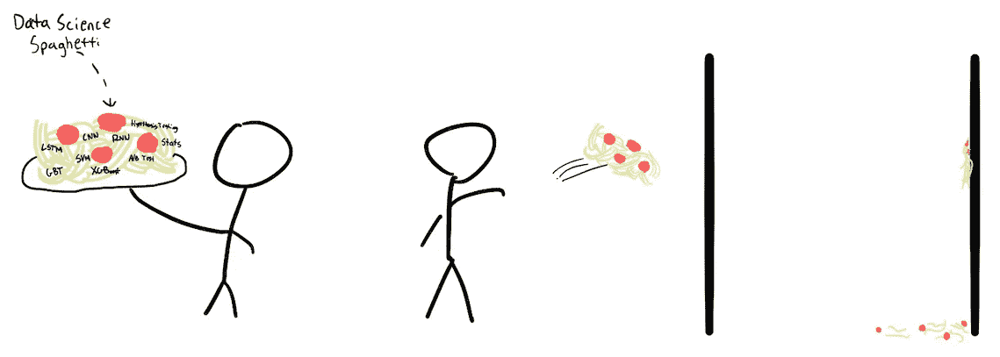
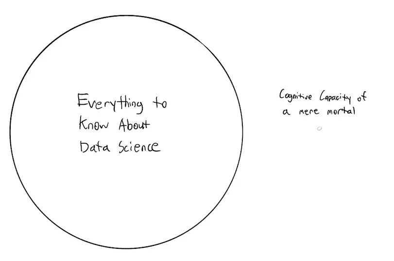
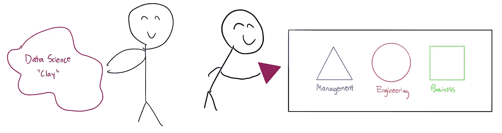

# 我作为数据科学家的前 8 个月学到的 4 件事(用蹩脚的图纸)

> 原文：<https://medium.com/analytics-vidhya/4-things-ive-learned-during-my-first-8-months-as-a-data-scientist-in-crappy-drawings-758e8d1878c3?source=collection_archive---------23----------------------->

在过去的 8 个月里，我学到了很多东西，我最初打算写另一篇“我从成为<的数据科学家中学到的东西，在此插入时间长度>”文章，充满了人们已经看过无数次的花哨词语和段落。很明显以前已经有人这样做过了，那么为什么不尝试做一些新的事情呢？更有创意的东西？

奇怪的是，我在工作中因在所有演示中使用手绘图表而赢得了声誉，从与我们首席数据科学家的每周接触到有 100 多人参加的技术设计会议，包括工程师、产品经理和其他高级主管。我想，如果我能把我的蹩脚画融入全公司的演示中，我也可以把它们融入我的媒体文章中！

所以我们开始吧，我作为一个数据科学家学到的四个最大的教训(通过我令人尴尬的糟糕的绘画技巧来描绘)。

> 请注意，这篇文章是基于我的个人经验，所以从现在开始，你可以完全无视我所说的一切。

# 您的角色与您公司的“数据成熟度”相关

x 轴代表公司“数据成熟度”的可能范围。如果你的公司知道它有数据，但不知道如何处理它，那么你的公司正处于数据青春期，它将需要你，数据科学家，做更多的事情，而不仅仅是运行一些回归。另一方面，如果你的公司已经经历了几次数据科学的阻碍，你可能不会被要求将机器学习模型扩大规模或设计下一个人工智能产品。但是你可能需要进行商业价值驱动的研究，这将帮助你的组织更接近它的目标。

# 当其他方法都失败时，扔一些意大利面条

我永远不会忘记我与经理的第一次对话:

> 经理:“你知道你在这里做什么吗？”
> 
> 我:“嗯，是的。我是来创建公司的异常检测系统的……对吗？”
> 
> 经理:“对。你知道你要怎么做吗？”
> 
> 我:“说实话，我没有”(诚实为上策)
> 
> 经理:“太好了。我也不知道。所以我们要把意大利面扔在墙上，看看会粘上什么。”

我感觉有些人觉得数据科学家知道所有事情的答案。我知道我没有。有时候，你唯一能做的就是把你所有众所周知的数据科学解决方案扔向众所周知的问题墙，看看什么能坚持住。如果什么都没有，那你就去做更多的研究，收集另一个盘子——满满的意大利面，然后制造另一个混乱:)

# 这可能会让人不知所措

与我之前所说的略有关联，我知道我过去给自己施加了很大的压力，要了解关于数据科学的一切。所有的算法，数据，数学。这个清单还在继续。事实是，要跟上数据科学世界中发生的一切简直是不可能的。每天都有大量关于最新最伟大的算法/模型的论文发表。新技术似乎每个月都会出现。真是势不可挡啊哥们！好消息是，一旦你意识到不可能什么都知道，你可以改变你的心态。在我看来，作为数据科学家，我们的工作不是*了解*一切，而是能够*使用*一切。我们需要能够学习不熟悉的技术和方法来解决新的问题。我们需要能够使用所有可用的工具，即使我们最初并不确切知道它们是什么。我们欢迎失败，但要求成功。女士们先生们，这需要很多意大利面。

# 你需要擅长雕刻

作为一名数据科学家，你的责任远远超出了你的电脑。你不仅有责任解决问题，还需要向其他人展示你的发现，这些人很可能不是数据科学家的同事*。你需要能够把你的发现，你的“粘土”，塑造成适合你的听众理解范围的形状。有一天，你必须将你的粘土塑造成一个三角形，以便管理层牢牢掌握你最新研究的结果，第二天，你将把你的三角形重新加工成一个圆形，这样工程团队就可以想出如何将你的结果付诸行动。沟通是关键。对于任何数据科学家来说，将你的奇特数据科学“粘土”塑造成其他人能够理解和联系的形状*的能力是一项极其重要的技能。就我个人而言，这是我作为数据科学家最大的乐趣所在。**

这里只有一个散点图、两个圆圈、一些意大利面和一个粘土隐喻，可以传达在数据科学的疯狂世界中导航时要学习的课程，但我想他们传达的信息是极其强大和谦卑的，尽管图纸的质量很糟糕。

自开始数据科学之旅以来，您学到了什么？更重要的是，你如何把他们引出来？欢迎在下面的评论中留下它们。我很想看看他们！