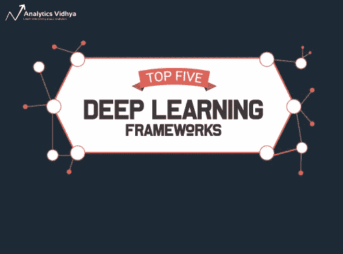
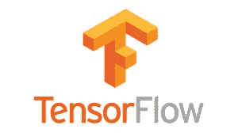
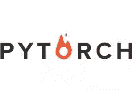
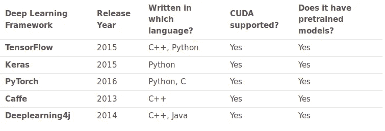
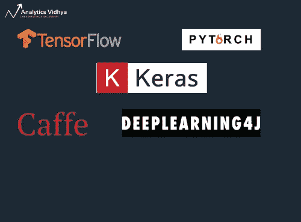
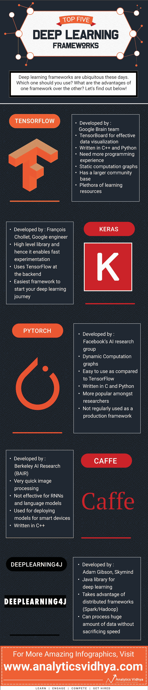

# 每个数据科学家都必须知道的 5 个惊人的深度学习框架！(附有图解信息图)

> 原文：<https://medium.com/analytics-vidhya/5-amazing-deep-learning-frameworks-every-data-scientist-must-know-with-illustrated-infographic-6e50e4d79e39?source=collection_archive---------0----------------------->

从我记事起，我就是一名程序员。我喜欢从头开始编写代码——这有助于我清楚地理解那个主题(或技术)。当我们刚开始学习数据科学时，这种方法特别有用。

尝试[从头开始实现一个神经网络](https://courses.analyticsvidhya.com/courses/computer-vision-using-deep-learning?utm_source=blog&utm_medium=comparison-deep-learning-framework)，你会明白很多有趣事情。但是，当在真实世界的数据集上建立深度学习模型时，你认为这是一个好主意吗？如果你有几天或几周的时间来等待模型的建立，这是完全可能的。

对于我们这些无法使用无限计算资源的人来说，你来对地方了。



好消息是——我们现在有了易于使用的开源[深度学习](https://courses.analyticsvidhya.com/courses/computer-vision-using-deep-learning?utm_source=blog&utm_medium=)框架，旨在简化复杂和大规模深度学习模型的实施。使用这些惊人的框架，我们可以立即实现像卷积神经网络这样的复杂模型。

在这篇文章中，我们将看看 5 个超级有用的深度学习框架，它们的优势和应用。我们将比较每个框架，以了解何时何地可以使用每个框架。

**我们还创建了一个非常酷的信息图，展示了每个深度学习框架的价值。它在本文末尾提供，是每个数据科学家的必备工具。**

# 目录

1.  什么是深度学习框架？
2.  张量流
3.  克拉斯
4.  PyTorch
5.  咖啡
6.  深度学习 4j
7.  比较这些深度学习框架

# 什么是深度学习框架？

让我们用一个例子来理解这个概念。考虑以下图片集:


这幅图像中有各种各样的类别——猫、骆驼、鹿、大象等等。我们的任务是将这些图像分类到它们相应的类(或类别)中。快速的谷歌搜索告诉我们[卷积神经网络](https://www.analyticsvidhya.com/blog/2019/01/guide-pytorch-neural-networks-case-studies/https://www.analyticsvidhya.com/blog/2019/01/guide-pytorch-neural-networks-case-studies/?utm_source=blog&amp;utm_medium=comparison-deep-learning-framework)对于这样的图像分类任务非常有效。

所以我们需要做的就是实现这个模型，对吗？好吧，如果你从零开始编码一个卷积神经网络，你需要几天(甚至几周)才能得到一个工作模型。我们等不起那么久！

这就是深度学习框架真正改变了格局的地方。

> 深度学习框架是一个接口、库或工具，它允许我们更容易、更快速地建立深度学习模型，而无需进入底层算法的细节。它们提供了一种清晰简洁的方法，使用一组预先构建和优化的组件来定义模型。

我们可以使用一个合适的框架来帮助我们快速构建这样一个模型，而不是编写数百行代码。以下是一个良好的深度学习框架的一些关键特征:

1.  针对性能进行优化
2.  易于理解和编码
3.  良好的社区支持
4.  并行处理流程以减少计算
5.  自动计算渐变

这些是我用来挑选我的前 5 个深度学习框架的标准。让我们深入了解每一个细节。

# 张量流



TensorFlow 是由谷歌大脑团队的研究人员和工程师开发的。它是深度学习领域中最常用的软件库(尽管其他人正在快速赶上)。

> *我非常喜欢 TensorFlow 的两点——它是完全开源的，并且有出色的社区支持。TensorFlow 为你将遇到的大多数复杂的深度学习模型预先编写了代码，例如递归神经网络和卷积神经网络。*

TensorFlow 如此受欢迎的一个最大原因是它支持多种语言来创建深度学习模型，如 Python、C++和 r。它有适当的[文档和演练](https://www.tensorflow.org/tutorials)作为指导(你真的认为谷歌的工作很糟糕吗？).

TensorFlow 由许多组件组成。两个突出的例子是:

1.  **TensorBoard:** 使用数据流图帮助实现有效的数据可视化
2.  **张量流:**用于快速部署新算法/实验

TensorFlow 灵活的架构使我们能够在一个或多个 CPU(以及 GPU)上部署我们的深度学习模型。下面是 TensorFlow 的几个流行用例:

1.  基于文本的应用:语言检测、文本摘要
2.  图像识别:图像字幕、人脸识别、物体检测
3.  声音识别
4.  时间序列分析
5.  视频分析

还有更多的用例。如果您在我上面提到的应用程序之外使用过 TensorFlow，我希望收到您的来信！请在这篇文章下面的评论区告诉我，我们会讨论的。

安装 TensorFlow 也是一项非常简单的任务。

仅适用于 CPU:

```
*pip install tensorflow*
```

对于支持 CUDA 的 GPU 卡:

```
*pip install tensorflow-gpu*
```

从以下综合教程中了解如何使用 TensorFlow 构建神经网络模型:

*   [使用 TensorFlow 实现神经网络的介绍](https://www.analyticsvidhya.com/blog/2016/10/an-introduction-to-implementing-neural-networks-using-tensorflow/?utm_source=blog&amp;utm_medium=comparison-deep-learning-framework)
*   [TensorFlow 教程](https://www.tensorflow.org/tutorials)

# 克拉斯


你习惯使用 Python 吗？如果是，那么你会立即与 Keras 连接。它是您开始深度学习之旅的完美框架。

Keras 是用 Python 写的，可以在 TensorFlow 上面运行(还有 [CNTK](https://docs.microsoft.com/en-us/cognitive-toolkit/) 和 [Theano](http://deeplearning.net/software/theano/) )。TensorFlow 接口可能有点困难，因为它是一个低级的库，新用户可能会发现很难理解某些实现。

另一方面，Keras 是一个高级 API，开发的目的是支持快速实验。因此，如果想要快速的结果，Keras 会自动处理核心任务并生成输出。Keras 支持卷积神经网络和递归神经网络。它可以在 CPU 和 GPU 上无缝运行。

深度学习初学者的一个常见抱怨是，他们无法正确理解复杂的模型。如果你是这样的用户，Keras 就是为你准备的！它旨在最大限度地减少用户操作，并使理解模型变得非常容易。

我们可以将 Keras 中的模型大致分为两类:

*   **顺序:**模型的层是以顺序的方式定义的。这意味着当我们训练深度学习模型时，这些层是按顺序实现的。下面是一个顺序模型的示例:

```
from keras.models import Sequential
from keras.layers import Dense

model = Sequential()
# we can add multiple layers to the model using .add()
model.add(Dense(units=64, activation='relu', input_dim=100))
model.add(Dense(units=10, activation='softmax'))
```

*   **Keras functional API:** 一般用于定义复杂的模型，比如多输出模型或者共享层的模型。查看下面的代码，以实际的方式理解这一点:

```
from keras.layers import Input, Dense
from keras.models import Model

inputs = Input(shape=(100,)) # specify the input shape
x = Dense(64, activation='relu')(inputs)
predictions = Dense(10, activation='softmax')(x)

model = Model(inputs=inputs, outputs=predictions)
```

Keras 有多种架构，如下所述，用于解决各种各样的问题。这包括我一直以来的最爱之一——图像分类！

1.  VGG16
2.  VGG19
3.  InceptionV3
4.  Mobilenet 等等

你可以参考官方的 Keras 文档来详细了解这个框架是如何工作的。

只需一行代码就可以安装 Keras:

```
*pip install keras*
```

被 Keras 迷住了？继续学习下面的教程，在那里你将理解如何使用 Keras 实现一个神经网络:

*   [使用 Keras 优化神经网络](https://www.analyticsvidhya.com/blog/2016/10/tutorial-optimizing-neural-networks-using-keras-with-image-recognition-case-study/?utm_source=blog&amp;utm_medium=comparison-deep-learning-framework)

# PyTorch



还记得我们说过 TensorFlow 是目前最常用的深度学习框架吗？鉴于数据科学家和开发人员拥抱脸书 PyTorch 的快速步伐，它可能不会保持这个斗篷太久。

我是 PyTorch 的忠实拥护者。在我做过的所有框架中，PyTorch 是最灵活的。

*PyTorch 是 Torch 深度学习框架的一个端口，可用于构建深度神经网络和执行* [*张量计算*](https://www.analyticsvidhya.com/blog/2019/01/guide-pytorch-neural-networks-case-studies/https://www.analyticsvidhya.com/blog/2019/01/guide-pytorch-neural-networks-case-studies/?utm_source=blog&amp;utm_medium=comparison-deep-learning-framework) *。Torch 是基于 Lua 的框架，而 PyTorch 运行在 Python 上。*

PyTorch 是一个提供张量计算的 Python 包。张量是多维数组，就像 numpy 的 ndarrays 一样，也可以在 GPU 上运行。PyTorch 使用动态计算图。[*py torch 的亲笔签名包*](https://pytorch.org/docs/stable/autograd.html) *从张量构建计算图，自动计算梯度。*

PyTorch 为我们提供了一个框架来构建计算图，甚至在运行时更改它们，而不是使用特定功能的预定义图。这对于我们不知道创建一个神经网络需要多少内存的情况是有价值的。

您可以使用 PyTorch 解决各种深度学习挑战，包括:

1.  图像(检测、分类等。)
2.  文本(自然语言)
3.  强化学习

如果您想知道如何在您的机器上安装 PyTorch，请稍等片刻。安装步骤根据您的操作系统、您想要用来安装 PyTorch 的包、您正在使用的工具/语言、CUDA 和一些其他依赖项而有所不同。

点击查看 PyTorch 在您机器[上的安装步骤。一旦你准备好了框架，查看下面的两个资源，使用 PyTorch 构建你的第一个神经网络:](https://pytorch.org/)

*   [了解如何使用 PyTorch 构建快速&精确的神经网络— 4 个令人惊叹的案例研究](https://www.analyticsvidhya.com/blog/2019/01/guide-pytorch-neural-networks-case-studies/https://www.analyticsvidhya.com/blog/2019/01/guide-pytorch-neural-networks-case-studies/?utm_source=blog&amp;utm_medium=comparison-deep-learning-framework)
*   [PyTorch 教程](https://pytorch.org/tutorials/beginner/deep_learning_60min_blitz.html)

# 咖啡


Caffe 是另一个面向图像处理领域的流行深度学习框架。这是·贾在加州大学攻读博士期间发明的。是的，它也是开源的！

首先，有一个警告— Caffe 对递归网络和语言建模的支持不如上面三个框架。但是 Caffe 的突出之处在于它处理和学习图像的速度。这很容易，它的主要美国药典。

> *Caffe 每天可以用一个 NVIDIA K40 GPU 处理超过 6000 万张图像。推断需要 1 毫秒/图像，学习需要 4 毫秒/图像。*

它为 C、C++、Python、MATLAB 等接口以及传统的命令行提供了坚实的支持。

[Caffe Model Zoo](https://github.com/BVLC/caffe/wiki/Model-Zoo) 框架允许我们访问预训练的网络、模型和权重，这些可以应用于解决深度学习问题。这些模型处理以下任务:

1.  简单回归
2.  大规模视觉分类
3.  图像相似性的连体网络
4.  语音和机器人应用

您可以查看 caffe 的[安装和](http://caffe.berkeleyvision.org/installation.html)[文档](http://caffe.berkeleyvision.org/)了解更多详情。

# 深度学习 4j


我们社区里有 Java 程序员吗？这里是你理想的深度学习框架！Deeplearning4j 是用 Java 实现的，因此比 Python 更高效。它使用名为 [ND4J](https://deeplearning4j.org/docs/latest/nd4j-overview) 的张量库，该库提供了处理 n 维数组(也称为张量)的能力。这个框架也支持 CPU 和 GPU。

Deeplearning4j 将加载数据和训练算法的任务视为独立的过程。这种功能分离提供了很大的灵活性。谁会不喜欢呢，尤其是在深度学习领域？！

Deeplearning4j 也支持不同的数据类型:

使用 Deeplearning4j 可以构建的深度学习模型有:

1.  卷积神经网络
2.  递归神经网络
3.  长短期记忆(LSTM)和许多其他架构。

浏览 Deeplearning4j 的[安装步骤](https://deeplearning4j.org/docs/latest/deeplearning4j-config-gpu-cpu)和[文档](https://deeplearning4j.org/docs/latest/deeplearning4j-quickstart)，开始使用这个框架。

# 比较这 5 个深度学习框架

我们已经讨论了五个最流行的深度学习框架。每一种都有自己独特的功能，这也是数据科学家选择一种而不是另一种的原因。

你决定要用哪一个了吗？或者您可能正计划切换到一个全新的框架？无论是哪种情况，理解每个框架的优点和局限性都很重要。如果你在某个时候面临错误，你不会想以惊讶告终的！

有些框架可以很好地处理图像数据，但是无法解析文本数据。其他框架在处理图像和文本数据时表现良好，但是它们的内部工作方式可能难以理解。

在本节中，我们将使用以下标准来比较我们的五个深度学习框架:

1.  社区支持
2.  书写它们的语言
3.  连接
4.  支持预训练模型

下表比较了这些框架:



下次使用这些框架时，这是一个非常方便的表格！

所有这些框架都是开源的，支持 CUDA，并有预训练的模型来帮助你开始。但是，什么应该是正确的起点，你应该选择哪个框架来建立你的(初始)深度学习模型？大家讨论一下！



# 张量流

我们从张量流开始。TensorFlow 适用于图像和基于序列的数据。如果你是深度学习的初学者，或者对线性代数和微积分等数学概念没有扎实的理解，那么 TensorFlow 陡峭的学习曲线可能会令人望而生畏。

我完全理解，对于刚刚起步的人来说，这方面可能很复杂。我的建议是继续练习，继续探索社区，继续阅读文章来掌握 TensorFlow。一旦你对框架有了很好的理解，实现深度学习模型对你来说就非常容易了。

# 克拉斯

Keras 是一个非常坚实的框架，可以帮助您开始深度学习之旅。如果您熟悉 Python，并且没有做一些高级研究或开发某种特殊的神经网络，Keras 是适合您的。

重点更多的是实现结果，而不是被模型的复杂性所困扰。因此，如果给你一个与图像分类或序列模型相关的项目，从 Keras 开始。你将能够很快得到一个工作模型。

Keras 也集成在 TensorFlow 中，因此你也可以使用 *tf.keras* 构建你的模型。

# PyTorch

与 TensorFlow 相比，PyTorch 更加直观。一个包含这两个框架的快速项目将使这一点变得非常清楚。

即使你没有扎实的数学或者纯机器学习背景，你也一定能理解 PyTorch 模型。随着模型的进行，您可以定义或操作图形，这使得 PyTorch 更加直观。

PyTorch 没有像 TensorBoard 这样的可视化工具，但是你可以使用像 matplotlib 这样的库。我不会说 PyTorch 比 TensorFlow 更好*，但这两个深度学习框架都非常有用。*

# *咖啡*

*当我们在图像数据上建立深度学习模型时，Caffe 工作得非常好。但是当涉及到递归神经网络和语言模型时，Caffe 落后于我们已经讨论过的其他框架。Caffe 的关键优势是，即使你没有很强的机器学习或微积分知识，你也可以建立深度学习模型。*

*Caffe 主要用于为手机和其他计算受限的平台构建和部署深度学习模型。*

# *深度学习 4j*

*就像我之前提到的，Deeplearning4j 是 Java 程序员的天堂。它为不同的神经网络如 CNN、RNNs 和 LSTMs 提供了大量支持。它可以在不牺牲速度的情况下处理大量数据。听起来是一个不容错过的好机会！*

# *结尾注释和图解信息图*

*你还做过其他深度学习框架吗？我很乐意听到你的想法和反馈，以及我们在这篇文章中提到的。请在下面的评论区与我联系。*

*请记住，这些框架本质上只是帮助我们实现最终目标的工具。明智地选择它们可以减少很多努力和时间。*

*正如我所承诺的，这是我们所涉及的每个深度学习框架的详细信息图。下载它，打印它，并在下次构建深度学习模型时使用它！*

**

**原载于 2019 年 3 月 14 日*[*https://www.analyticsvidhya.com*](https://www.analyticsvidhya.com/blog/2019/03/deep-learning-frameworks-comparison/)*。**