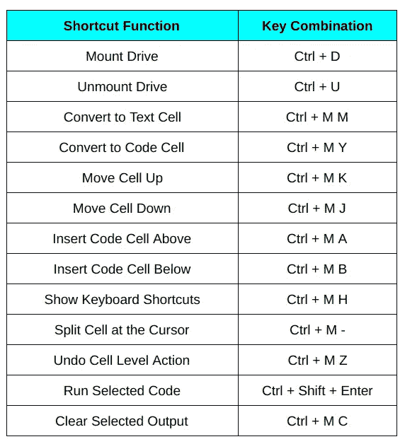

# 你今天应该尝试的 5 个惊人的 Google Colab 黑客！

> 原文：<https://medium.com/analytics-vidhya/5-amazing-google-colab-hacks-you-should-try-today-6ce97702b33a?source=collection_archive---------18----------------------->

# 介绍

Google Colab 是 Google 优秀员工送给数据科学界的一份令人惊叹的礼物。Colab 让我们能够建立复杂而繁重的机器学习和深度学习模型，而不必花费我们机器有限的资源。

我当然能理解这一点，因为我曾经在我的机器上挣扎过。“内存不足”错误现在在数据科学社区中相当臭名昭著——Google Colab 为我们提供了解决方法，并在顶部添加了几个樱桃！

我喜欢免费的 GPU 和 TPU 支持——这在任何其他编码 IDE 中都是无与伦比的。如果你是 Google Colab 的新手，我强烈推荐你在这里查看我的新手教程。


在这篇文章中，我列出了五个我个人认为在我的数据科学之旅中非常有用的 Google Colab 技巧。这些技巧不仅能为你节省大量时间，还能从整体上拓宽你对 Colab 的理解。

所以，让我们让你成为 Google Colab 专家吧！

# 我们将讨论的 5 个 Google Colab 黑客:

*   增加 Google Colab 内存
*   阻止 Google Colab 断开连接
*   Google Colab 中的片段
*   Google Colab 的顶级键盘快捷键
*   Colab 中的模式

# 1.增加 Google Colab 内存

谷歌 Colab 已经免费给了我们大约 13 GB 的内存。这非常令人印象深刻，但当我们构建沉重的深度学习模型时，有时甚至这还不够。以下是如何快速增加 Colab 笔记本的内存。

这是一个非常简单的技巧，它几乎可以让你的内存容量翻倍。为了获得更高的 RAM，您需要在您的 Colab 代码单元中运行以下代码，并等待 Google Colab 崩溃:

```
i = []
while(True):
    i.append('a')
```

是的，你没看错——等着 Google Colab 崩溃吧。一旦由于缺少 RAM 而崩溃，它就会询问您是否需要更多的 RAM:


现在，点击**获取更多内存**，你会看到另一个弹出窗口:


只需点击**是**按钮:


瞧啊。您现在有大约 25 GB 的 RAM 可供使用！

# 2.阻止 Google Colab 断开连接

这里有一个故事，我相信你们很多人都很熟悉。有一天我在研究 Colab，让我的笔记本电脑开着，运行了大约一个小时。回来后看到 Google Colab 断开了我的笔记本，模型训练已经停止。想象一下我有多失望！

当然，我后来发现，如果我们让笔记本闲置超过 30 分钟，谷歌 Colab 就会断开我们的笔记本。但好消息是，从今天开始，你将永远不会面对这个问题。


只需在 Linux 上按 F12 或 Ctrl+Shift+I 打开 Chrome DevTools，并在控制台中运行以下 JavaScript 代码:

```
function KeepClicking(){
   console.log("Clicking");
   document.querySelector("colab-toolbar-button#connect").click() }setInterval(KeepClicking,60000)
```

这里，值 60，000 表示毫秒(相当于一分钟)。这段代码每隔 60 秒就会点击一次 Colab 屏幕。由此，Colab 认为笔记本不是闲置的，你不用担心断线！

# 3.Google Colab 中的片段

记住代码语法是几乎每个初学者在数据科学旅程的开始阶段面临的最大问题之一。由于这一点，人们经常发现学习数据科学非常困难，并很快失去动力。我们不能这样！

因此，我有一个简单的解决方案给你。即使你不认为自己是初学者，我相信这个技巧会在你的数据科学之旅中的某个时候帮助你。

处理这种情况的最好方法是创建一个您最需要的代码片段，否则您会发现很难学习它的语法。代码片段是一段可重复使用的代码，你可以随时使用。

这样，你就可以从记忆代码的头痛中解脱出来，专注于数据科学的概念。如果你问我我最喜欢的 Colab 功能，我的第一个答案是免费的 GPU 和 TPU，第二个是创建自定义代码片段的能力。是的，您可以在 Google Colab 中创建自己的自定义片段。

让我告诉你怎么做。首先，您需要在 Colab 中创建一个笔记本。然后，添加一个文本单元格，并键入您的代码片段名称。在下面，添加代码单元格并键入您的代码:


在这里，我为 import 语句创建了一个非常基本的代码片段——您可以创建任何您想要的代码片段。接下来，是时候在另一个笔记本中使用这个片段了。进入**工具**，打开**设置**:


现在，你会看到一个弹出窗口，如下图所示。只需粘贴包含片段的笔记本链接，点击**保存**，您就可以开始了:


你可以在这里看到你所有的片段。只需通过代码段名称搜索代码段，并将其插入到您的代码中:


# 4.Google Colab 中的顶级键盘快捷键

在你的键盘和鼠标之间切换是一件乏味且耗时的任务。因此，为了加快速度，Google Colab 为我们提供了某些非常有用的键盘快捷键。老实说，在您使用并熟悉这些键盘快捷键之前，您无法掌握 Colab 体验。

老实说，我觉得这些键盘快捷键提高了我们作为数据科学家的生产力。我知道学习这些需要一些时间，但是一旦你掌握了它们，你就能更快地完成工作。

我创建了一个顶级键盘快捷键列表，你应该知道当你使用 Google Colab 的时候。这些组合键是我所使用的，但是你可以根据更舒适的方式来修改它们:



# 5.Colab 中的模式

这篇文章是关于 Google Colab 提供的不同浏览模式，以及如何在它们之间切换。从长远来看，你们中的很多人会欣赏这种转变，你们的眼睛也会感谢你！

除了默认的灯光模式，Google Colab 还为我们提供了黑暗模式。是的，和其他代码编辑器一样，Google Colab 也有一个黑暗模式。即使是 Jupyter 笔记本默认也没有这个功能。

将您的查看模式更改为黑暗模式。进入**工具**，打开**设置**:


在这里，您将看到一个弹出窗口，如下图所示。只需在主题中选择黑暗模式，点击**保存**，就万事俱备了:


正如你所看到的，这种模式对你的眼睛更放松。当您在黑暗中工作时，可以使用此模式，因为它可以减轻您的眼睛疲劳:


我们还没完呢！给你的 Colab 屏幕增加一些乐趣怎么样？欢迎来到柯基和小猫模式。在 Corgi 模式下，你会看到狗在你的 colab 屏幕上奔跑，如下图所示:


你可以很容易地猜到你在 Kitty 模式下得到什么。是的，这是给所有爱猫人士的。你也可以在 Colab 屏幕上看到你的猫:


或者你可以两者兼得，一边编码一边享受乐趣:


现在，让我们看看如何获得这些模式。转到工具，打开设置并转到**其他**部分。在这里，你可以选择你的柯基和小猫模式，点击**保存**，你的猫和狗就会在你的屏幕上漫步:


# 结束注释

这些技巧涵盖了你可以在 Google Colab 中做的许多事情。从高效运行代码到在设计深度学习模型时获得乐趣，这些 Colab 技巧将丰富您的编码体验。

如果你想了解更多与数据科学相关的技巧和窍门，我推荐你参加这个免费的 [**课程**](https://courses.analyticsvidhya.com/courses/data-science-hacks-tips-and-tricks?utm_source=blog&utm_medium=5-amazing-google-colab-hacks-you-should-try-today) **。**

如果你有任何疑问或反馈，请分享这篇文章并在下面评论。还有别忘了在[**Analytics vid hya**](https://www.analyticsvidhya.com/blog/?utm_source=blog&utm_medium=5-amazing-google-colab-hacks-you-should-try-today)**上报名，阅读各种与机器学习和数据科学相关的精彩文章！**

***原载于 2020 年 4 月 8 日*[*https://www.analyticsvidhya.com*](https://www.analyticsvidhya.com/blog/2020/04/5-amazing-google-colab-hacks-you-should-try-today/)*。***