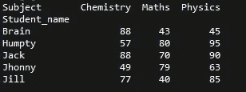
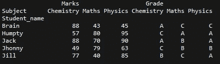
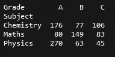
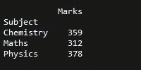
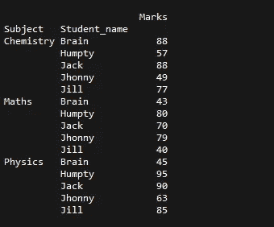
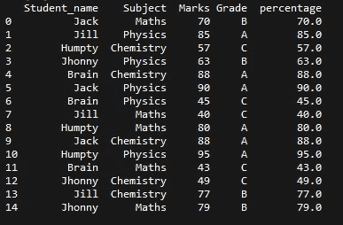
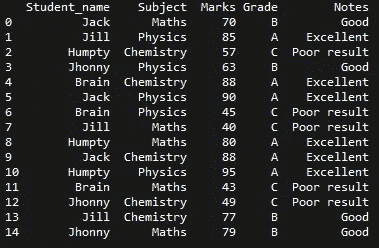

# 关于熊猫的 5 件令人惊奇的事情！

> 原文：<https://medium.com/analytics-vidhya/5-amazing-things-about-pandas-ed8a6decdfb2?source=collection_archive---------19----------------------->


锡德·巴拉钱德朗在 [Unsplash](https://unsplash.com?utm_source=medium&utm_medium=referral) 上拍摄的照片

不要！不是这个。我说的是改变了我们处理数据方式的 python 库，“熊猫”。随着 python 越来越受欢迎和适应，pandas 成为处理数据的高效便捷的工具。在过去的十年中，这个开源工具已经有了很大的发展，为开发人员提供了更好的代码直观和用户友好的环境。虽然 pandas 提供的每个功能本身都是独一无二的，但还有一些鲜为人知的已实现的功能经常会派上用场。您可能不会每次都使用这些功能，但它们可能会节省您的精力和时间来解决一些罕见项目中的任何关键任务。事不宜迟，让我们直接跳到他们身上。

# **1。枢轴**

“pivot”功能帮助用户重新调整数据帧的形状，并使结果数据帧聚焦在特定的列上。因此，目标列成为我们的轴，导航数据变得更加简单。让我们通过一个例子来理解这一点，假设我们有以下数据


学生-科目-分数-成绩

正如我们在上面的数据中看到的，有 5 个不同的学生，他们在 3 个科目中的分数记录在上面。虽然数据是结构化的，但在其中导航是乏味的。使用 pivot 函数，我们可以将这些数据转换成一个以学生为中心的数据框架，使读取数据变得非常容易。

```
data.pivot(index='Student_name',columns='Subject',values='Marks')
```

pivot 函数有 3 个值

*   index:目标列，dataframe 在其基础上重新成形。该列中的每个唯一值将成为结果数据帧的轴。
*   columns:将作为新数据框架标题的列。
*   值:将填充数据框的索引和列各自的结果数据，如果没有数据，结果将为“NaN”。

因此，对输入数据进行透视操作的结果将如下所示:



你可以看到结果是更容易导航和理解。结果数据帧的轴是来自指定“索引”的唯一值，而指定“列”中列出的唯一值成为标题。“值”描述索引和列之间的关系。您还可以像这样向结果数据帧添加多个值

```
data.pivot(index='Student_name',columns='Subject',values=['Marks','Grade'])
```

输出数据帧将包含以如下值指定的每一列的部分



需要注意的一点是“pivot *不支持聚合*，因此多个值将导致多个索引”。

# **2。数据透视表**

“数据透视表”功能可以理解为“数据透视表”功能的扩展，但它不仅仅是重塑数据框架。使用 *pivot_table* 我们可以以更有意义的方式汇总数据。不像 pivot 函数是 dataframe 类的一个方法，pivot table 是 pandas 本身的一个方法。数据透视表用于执行类似于数据透视的任务，并具有聚合数据的额外好处。让我们用上面的例子来理解

```
pd.pivot_table(data,values='Marks',index='Subject',columns='Grade',
aggfunc='sum')
```

参数值、索引和列与 pivot 函数相同，“data”是保存数据帧的对象，“aggfunc”用于指定要实现的数据聚合方法。我们可以使用的基本汇总方法有“总和”、“平均值”、“中位数”等。输出数据帧将如下所示



该数据框架将学生在各科目相应年级类别中的所有分数相加。因此，我们可以通过使用 *pivot_table* 和*聚合*函数来生成对数据的进一步洞察。与需要所有 3 个参数(索引、列和值)的 *pivot* 函数不同， *pivot_table* 可以在没有值和列的情况下使用

```
pd.pivot_table(data,values='Marks',index='Subject',aggfunc='sum')
(or)
pd.pivot_table(data,index='Subject',aggfunc='sum')
```

两种情况下的输出是一样的，就像这样



数据框汇总了所有科目的所有分数

同样，与 *pivot 不同的是，*我们可以将 *pivot_table* 与多个索引一起使用。数据透视表中的级别将存储在结果数据帧的索引和列上的多索引对象(分层索引)中。

```
pd.pivot_table(data, values='Marks',
index=['Subject','Student_name'], aggfunc='sum')
```

多索引输出将是



除此之外， *pivot_table* 还提供了像“dropna”和“fill_value”这样值得尝试的特性。

# **3。数据帧上的算术运算**

正如不言自明的标题所暗示的，我们经常需要对整个数据帧或某些指定的列执行各种算术运算。与循环和迭代每个元素不同，直接对目标列实现算术运算使任务变得容易并节省了大量时间。让我们考虑同一个学生分数的例子，如果你要在数据框中添加另一列“百分比”,该数据框包含在特定科目中获得的百分比，那么可以简单地这样做

```
data['Percentage'] = data['Marks']/100
```

这将向我们的 dataframe 添加一个新的列百分比，结果如下所示:



虽然这种算术运算可以直接使用普通的数学符号来完成，但 pandas dataframe 有以下内置方法来完成同样的操作

*   dataframe.add()
*   dataframe.sub()
*   dataframe.mul()
*   dataframe.div()

那么数学运算符和内置方法有什么区别呢？*内置方法有助于用“fill_value”替换丢失的数据。*

这两种方法都使我们能够在两个数据帧、数据帧和序列、数据帧和定标器之间执行算术运算。熊猫也提供了更多这样的算术和比较运算符。

# **4。应用**

“应用”是一种 dataframe 方法，允许用户在任何行或列上实现任何预定义或用户定义的函数。这提供了与 Microsoft Excel 相同的功能，用户可以定义一个*公式*，该公式将可用的*数据作为输入*，并生成*结果*来填充指定的列。这个功能非常节省时间。让我们用同一个例子来理解这一点。我们将通过使用学生的成绩执行条件格式化来生成一个名为“Notes”的新列。为此，我们将定义自己的函数

```
def notes(x):
   if str(x) == 'C':
       return 'Poor result'
   elif str(x) == 'B':
       return 'Good'
   elif str(x) == 'A':
       return 'Excellent'data['Notes'] = data['Grade'].apply(notes)
```

生成的数据帧将有一个额外的“注释”列，如下所示



我们也可以把“应用”和“λ”结合起来。如果你没有听说过(或者忘记了)什么是*‘lambda’*，lambda 是一个用来定义匿名函数 ie 的关键字；python 中不带任何名称的函数。Lambda 是一个单行函数，可以接受任意数量的参数，但只能有一个表达式。它的行为与我们使用关键字 *def* 定义的函数完全一样。Lambda 通常用于函数很小并且可能不会在代码中再次使用的情况。我们可以在 apply 中使用 lambda 执行与上面相同的任务

```
data['Notes'] = data['Grade'].apply(lambda x: 
'Poor result' if x == 'C' else ('Good' if x == 'B' else'Excellent'))
```

*注意:在 if lambda 情况下实现“elif”的唯一方法是使用嵌套的 if-else 条件*

# **5。是唯一的**

这可能是你们很多人都熟悉的东西。“is_unique”方法将列名作为输入，如果列中的所有值都是唯一的，则返回 **True** ，否则返回 **False** 。这是一个非常简单而有用的函数，通常在处理 ETL 过程或数据建模时，您需要识别唯一的列。根据手头的任务，这些列可以被删除，也可以被计入。*是唯一的*函数适用于熊猫的系列数据类型。

```
test = pd.Series(data=[1,2,3,4,5,6,7])
test.is_unique#output
#True
```

我们还可以从数据帧中选取任何特定的列，并测试它是否是唯一的。

```
data['Student_name'].is_unique#output
#False
```

这些是 pandas 中一些简单、有用、省时的功能，可以帮助你优化代码。这样一个高效且代码直观的生态系统帮助用户更专注于实现而不是编码。

**参考文献**

*   [https://pandas.pydata.org/](https://pandas.pydata.org/)