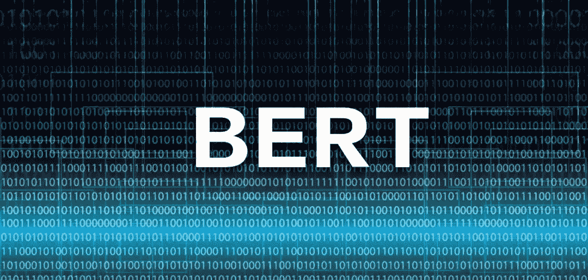

# 5 个最佳机器学习 GitHub 知识库和 Reddit 讨论(2018 年 11 月)

> 原文：<https://medium.com/analytics-vidhya/5-best-machine-learning-github-repositories-reddit-discussions-november-2018-1dad04d1ae66?source=collection_archive---------1----------------------->

编码是成为数据科学家最棒的事情之一。经常有那么几天，我发现自己沉浸在从零开始编写一些东西的过程中。当你看到自己的努力最终换来一个成功的模特时，那种兴奋的感觉？令人振奋，无与伦比！

但是作为一名数据科学家(或程序员)，在不同的时间间隔创建代码检查点同样重要。知道上次从哪里开始是非常有帮助的，所以如果你必须回滚你的代码或者简单地分支到不同的路径，总有一个后备选项。这就是为什么 GitHub 是一个如此优秀的平台。

本月系列的前几篇文章已经阐述了为什么每个数据科学家都应该有一个活跃的 GitHub 帐户。无论是为了协作、简历/作品集还是教育目的，它都是增强您的编码技能和知识的最佳场所。

现在让我们进入文章的核心——机器学习代码！我挑选了一些非常有趣的存储库，我觉得每个数据科学家都应该自己尝试一下。

除了编码之外，成为一名数据科学家还有很多相关的方面。我们需要了解社区的所有最新发展，其他机器学习专业人士和思想领袖在谈论什么，在一个有争议的项目上工作有什么道德影响，等等。这就是我每个月在 Reddit 上展示的讨论主题。

*为了让你更容易理解，这里是到目前为止我们每个月报道的顶级 GitHub 库和 Reddit 讨论(从 4 月开始)的全部集合:*

*   [*一月*](https://www.analyticsvidhya.com/blog/2018/02/top-5-github-repositories-january-2018/)
*   [*二月*](https://www.analyticsvidhya.com/blog/2018/03/top-5-github-repositories-february-2018/)
*   [*三月*](https://www.analyticsvidhya.com/blog/2018/04/top-7-github-repositories-march-2018/)
*   [*四月*](https://www.analyticsvidhya.com/blog/2018/05/top-5-github-reddit-data-science-machine-learning-april-2018/)
*   [*五月*](https://www.analyticsvidhya.com/blog/2018/06/top-5-github-reddit-data-science-machine-learning-may-2018/)
*   [*六月*](https://www.analyticsvidhya.com/blog/2018/07/top-github-reddit-data-science-machine-learning-june-2018/)
*   [*七月*](https://www.analyticsvidhya.com/blog/2018/08/best-machine-learning-github-repositories-reddit-threads-july-2018/)
*   [T5【八月】T6](https://www.analyticsvidhya.com/blog/2018/09/best-machine-learning-github-repositories-reddit-threads-august-2018/)
*   [*九月*](https://www.analyticsvidhya.com/blog/2018/10/best-machine-learning-github-repositories-reddit-threads-september-2018/)
*   [*十月*](https://www.analyticsvidhya.com/blog/2018/11/best-machine-learning-github-repositories-reddit-threads-october-2018/)

# GitHub 仓库

# [开放 AI 的深度强化学习资源](https://github.com/openai/spinningup)

让我们继续在这个系列中包括强化学习资源，这里是迄今为止最好的一个——open ai 正在运转！这是一个开源的教育资源，目的是让学习深度学习变得更容易。考虑到它对大多数人来说是多么复杂，这是一个非常受欢迎的存储库。

回购包含一些方便的资源:

*   介绍 RL 术语、算法种类和基本理论
*   一篇关于如何成长为研发人员的论文
*   按主题组织的重要论文的精选列表
*   关键算法的简短独立实现的代码报告
*   让你的手变脏的一些练习

# [英伟达的 WaveGlow](https://github.com/NVIDIA/waveglow)

这是给所有音频/语音处理人员的。WaveGlow 是一个基于流的语音合成生成网络。换句话说，就是一个网络(对，单一网络！)可以从 mel 频谱图生成令人印象深刻的高质量语音。

这个 repo 包含 WaveGlow 的 PyTorch 实现和一个预先训练好的模型来帮助您入门。这是一个非常酷的框架，如果你想深入研究，你也可以看看下面的链接:

*   [研究论文](https://arxiv.org/abs/1811.00002)
*   [网站查看音频样本](https://nv-adlr.github.io/WaveGlow)

# [伯特即服务](https://github.com/hanxiao/bert-as-service)

我们在上个月的文章中讨论了 BERT 的 PyTorch 实现，这里有一个不同的观点。对于那些对伯特不熟悉的人来说，它代表**B**I 方向**E**n 编码器 **R** 代表来自 **T** 变压器。这基本上是一种预先训练语言表达的方法。

BERT 的结果让 NLP 世界为之轰动，Google 的人也很友好地发布了一些预训练的模型来帮助你。

这个存储库“使用 BERT 作为句子编码器，并通过 ZeroMQ 将其作为服务托管，允许您仅用两行代码将句子映射为固定长度的表示”。它易于使用，速度极快，并且可以平稳扩展。试试吧！

# [谷歌“快速抽奖”游戏的 Python 实现](https://github.com/1991viet/QuickDraw)

[Quick，Draw](https://quickdraw.withgoogle.com/) 是一款由谷歌开发的流行网络游戏，其中一个神经网络试图猜测你在画什么。神经网络从每幅画中学习，因此增加了它已经令人印象深刻的正确猜测涂鸦的能力。开发人员已经从用户以前绘制的大量图纸中建立了一个庞大的数据集。这是一个开源的数据集，你可以点击查看[。](https://github.com/googlecreativelab/quickdraw-dataset)

现在，您可以使用这个库用 Python 构建自己的快速绘图游戏。有一个如何做到这一点的分步解释。使用这段代码，你可以运行一个应用程序，在电脑的摄像头前或画布上绘图。

# [可视化和理解 GANs](https://github.com/CSAILVision/gandissect)

由麻省理工学院计算机科学与人工智能实验室的研究人员开创的 GAN 解剖是一种可视化和理解生成性对抗网络(GAN)神经元的独特方式。但并不仅限于此——研究人员还创造了 [GANPaint](http://gandissect.res.ibm.com/ganpaint.html?project=churchoutdoor&layer=layer4) 来展示 GAN 解剖是如何工作的。

这有助于您通过检查和操纵特定 GAN 模型的内部神经元来探索它学到了什么。点击这里查看研究论文[和下面的视频演示，然后直接前往 GitHub 库，直接进入代码！](https://arxiv.org/pdf/1811.10597.pdf)

# Reddit 讨论

# [为什么首先需要梯度下降](https://www.reddit.com/r/MachineLearning/comments/9sfv8x/d_a_note_on_why_gradient_descent_is_even_needed/)

在学习基本的机器学习概念时，这个问题有没有闪过你的脑海？这是我们在最初的学习中遇到的基本算法之一，并且已经被证明在 ML 竞赛中非常有效。但是一旦你开始浏览这个主题，就要准备严肃地质疑你以前学过的东西。

一开始是一个直截了当的问题，在 Reddit 上变成了一场顶级头脑之间的全面讨论。我非常喜欢浏览评论，我相信任何对这个领域感兴趣的人(和数学严谨性)都会发现它很有用。

# [逆向工程一个巨大的神经网络](https://www.reddit.com/r/MachineLearning/comments/9symfk/d_reverseengineering_a_massive_neural_network/)

当一个复杂而庞大的神经网络的开发者消失而没有留下理解它所需的文档时，你会怎么做？这不是一个虚构的情节，而是一个相当常见的情况下，该线程的原始发帖人发现自己。

这种情况经常发生在开发人员身上，但是当涉及到深度学习时，就呈现出一种全新的水平。该主题探索了数据科学家可以用来检查深度神经网络模型最初是如何设计的不同方法。这些回答从实际的到荒谬的都有，但每一个都增加了一层视角，如果你有一天面临这种困境，它会帮助你。

# [关于 TensorFlow 2.0 API 的争论](https://www.reddit.com/r/MachineLearning/comments/9ysmtn/d_debate_on_tensorflow_20_api/)

我对这个帖子的关注是由大量的评论引起的(在撰写本文时有 110 条)——这个话题到底有什么争议性？但当你开始向下滚动时，辩论者之间的意见差异之大令人难以置信。除了 TensorFlow 被嘲笑为“不是最好的框架”之外，PyTorch 还受到了很多人的喜爱(如果您使用过 PyTorch，这并不奇怪)。

这一切都始于 Francois Chollet 在 GitHub 上发布他的想法，并在机器学习社区下点燃了一把火。

# [基于预测奖励的强化学习](https://www.reddit.com/r/MachineLearning/comments/9tangi/r_reinforcement_learning_with_predictionbased/)

这篇文章中的另一个 OpenAI 条目——也是他们的又一个巨大突破。标题可能不会像任何特别的东西一样跃出页面，但是理解 OpenAI 团队在这里想出了什么是很重要的。正如一位 Redditors 指出的那样，这让我们离机器模仿人类行为更近了一步。

花了大约一年的总经验才在一个超级人类的水平上击败了蒙特祖马的复仇游戏——相当令人印象深刻！

# [获得第一份数据科学家工作](https://www.reddit.com/r/datascience/comments/9xxm3w/landed_my_first_job_as_a_data_scientist/)

这是写给所有阅读这篇文章的有抱负的数据科学家的。帖子的作者阐述了他是如何得到这份梦寐以求的工作的，他的背景，他在哪里学习数据科学，等等。在回答了这些标准问题后，他实际上写了一篇非常好的帖子，讲述了处于类似位置的其他人可以做些什么来进一步实现他们的抱负。

如果你向下滚动一点，也会有一些有用的评论。当然，你可以在那里向作者提出你自己的问题。

# 结束注释

这个月收集了不少。我发现甘解剖库很吸引人。我目前正在尝试在我自己的机器上复制它——应该会很棒。我也在关注“逆向工程一个巨大的神经网络”这个主题，因为如果我发现自己处于这种情况下，那里产生的想法可能会非常有帮助。

哪个 GitHub 库和 Reddit 线程让你印象深刻？你会先解决哪一个？请在下面的评论区告诉我！

*原载于 2018 年 12 月 3 日*[*【www.analyticsvidhya.com*](https://www.analyticsvidhya.com/blog/2018/12/best-machine-learning-github-repositories-reddit-threads-november-2018/)*。*