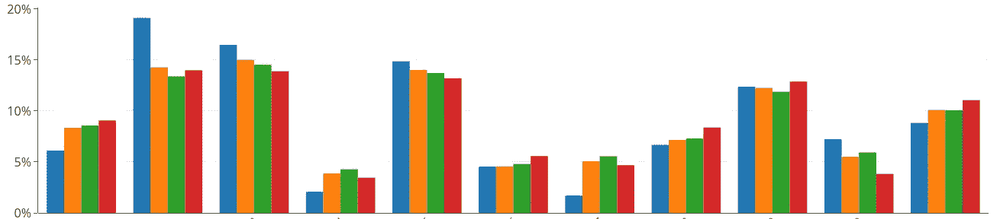

# 将 Plotly Dash 用于网络应用时的 5 大挑战

> 原文：<https://medium.com/analytics-vidhya/5-challenges-when-using-plotly-dash-for-interactive-web-apps-849f442582f7?source=collection_archive---------1----------------------->



我第一次真正遇到 Dash 是在最近。我与一家公司合作，在谷歌云中托管一个 Dash 应用程序。和 Dash 一起工作还可以，但是整体体验并不好。这是我遇到的一些小问题。

## 将信息保存在网页本身中

Dash 应用应该是无状态的，这是有充分理由的。通常情况下，该应用程序将作为一个服务器后面的多个 Python 进程运行，以便同时服务于多个请求。对于任何简单的应用程序来说，使用无状态服务器是最好的起点，因为在这些进程之间共享内存中的状态只是自找麻烦。Dash 通过将数据存储在网页本身的隐藏元素中解决了这个问题，因此一个简单的重新加载就清除了所有关于用户会话的*存储的*信息。客户端的 Dash 似乎使用了一个 Redux 存储，但是没有对它的访问。

如果你所做的只是显示一些图表，这没什么大不了的，但是这对于任何交互式应用程序来说都是一个真正的问题。

## **创造交互性很有挑战性**

Dash 中创建交互性的主要机制是服务器回调。简而言之，浏览器调用服务器，对 DOM 的任何更新都被发送回客户端，这比在浏览器内部执行 Javascript 代码效率更低。最近[客户端回调](https://dash.plotly.com/clientside-callbacks)被添加到 Dash 中，但是我不知道它们是如何被触发的，除非(重新)加载 web 页面。当页面加载时，我使用客户端回调来运行 Javascript 代码。这无疑挽救了局面，但这种方法有其局限性。回调必须在服务器上的 Python 代码中定义，尽管它的执行与服务器无关:

```
# Python client-side callback definition
app.clientside_callback(
    ClientsideFunction(
        namespace='clientside',
        function_name='DoSomething'
    ),
    # the output field must match a property that is already defined
    # Output('div-id', 'style'),
    Output('div-id', 'style'),
    [Input('MyButton', 'none')]
)
```

上面的代码声明了一个名为`DoSomething`的函数将被`MyButton`触发，并更新一个 id 为`div-id`的`div`的`style`属性。

这是客户端相应的 Javascript 代码:

```
# Javascript code
(function(){
  if(!window.dash_clientside) {window.dash_clientside = {};}
  window.dash_clientside.clientside = {

      DoSomething: () => {
        // ADD CODE HERE
        return {display: 'none'}   
      },
  }
 })();
```

这是元素的外观:

```
# Python code defining the page elements
html.Div(className='style-me-with-css', id='DIV-ID', style={'display': 'none'}, children=[
  // DO SOMETHING HERE
])
```

例如，如果上面定义的`Div`没有在 Python 回调中显式引用`style`属性，Javascript 代码将不会在浏览器中执行。迷茫？

**结论:**这是一个非常复杂的方案，试图实现一些应该相当简单的东西。

## 很难定制 API

在我的项目中，Dash 应用程序被托管在一个 API 网关之后，该网关负责用户认证。在这里，我在试图让 Dash 使用网关时碰壁了。原因相当不幸。任何 dash 应用程序的根必须在末尾有正斜杠:[https://my](https://my). dash server . com/app 1**/**

这个网址`htts://my.dashserver.com/app1`不行。

我认为这是一个奇怪的选择，但嘿，嗬。然后我意识到我的网关不能处理以斜杠结尾的 URL！

**解决方案:**黑掉底层 Flask app 添加一个首页路由**，末尾不带**正斜杠。啊啊啊。

是的，它最终确实工作得很好，但这并不容易！对我来说，主要的缺点是缺少扩展 Dash API/功能的内置方法。你得黑掉 Flask 的应用。

## 破折号 HTML 中没有列表

疯了！是的，没有简单的方法来定义一个列表。我是这样做的:

```
# Python server code
html.Div([
# li 1
  html.P([
    html.B('1\. '),
    html.Span('Click here')
  ]),# li 2
  html.P([
    html.B('2\. '),
    html.Span('Click here')
  ]),
...
])
```

再说一次，它确实能完成任务，尤其是在与 CSS 结合使用的时候，但是看起来并不怎么样！

*这让我想到了最后一点:*用破折号编写普通的 HTML 是不可能的。对于上述情况，一个简单的解决方法是使用一个 Python 组件，它可以呈现任何 HTML。然后，我可以轻松地呈现文本、列表等。看上面的代码！用一点文本格式写一个简单的段落需要奉献精神！

**更新【11/05/2020】:**事实证明，使用`Markdown`组件可以获得列表和原始 HTML:

```
dcc.Markdown('''
* list item A
* list item B
* ...<ol>
  <li>item one</li>
  <li>item two</li>
  <li>...</li>
</ol>
''')
```

`dcc.Markdown`接受一个名为`dangerously_allow_html`的布尔标志，使得编写原始 HTML 成为可能。

我通过随机浏览最新的 Dash 文档发现了这一切。

## 哦，最后一件事

那是我最喜欢的！**两个 Python 回调更新同一个元素是不可能的！我知道！这太有趣了。不允许您这样做:**

```
[@app](http://twitter.com/app).callback([**Output('target-div', 'children')**],
              [Input('upload-data', 'contents')])
def callback1(contents, filename):
    return PreventUpdate[@app](http://twitter.com/app).callback([**Output('target-div', 'children')**],
              [Input('upload-data-two', 'contents')])
def callback1(contents, filename2):
    return PreventUpdate
```

我发现解决这个问题是 2018 年以来的一个功能请求:[https://community . plotly . com/t/why-can-a-output-only-have-a-single-callback-function/14691](https://community.plotly.com/t/why-can-an-output-only-have-a-single-callback-function/14691)

因此，开发人员可能会尝试创建一个全能的回调函数，它接受所有可能的输入和输出，并基于一些复杂的逻辑发回“正确的”响应。

该项目的一位同事确实提出了一个优雅的解决方案。因为对输入没有限制，所以可以向一些回调函数添加额外的输入，以便根据输入的组合触发不同的响应。上面的例子变成了这样:

```
[@app](http://twitter.com/app).callback([Output('target-div', 'children')],
              [Input('upload-data', 'contents'), 
               Input('upload-data-two', 'contents')])
def callback1(contents, filename):
    ctx = dash.callback_context
    source = ctx.triggered[0]['prop_id'].split('.')[0]
    if source == 'upload-data':
        return 'happy days'
    elif source == 'upload-data-two':
        return 'this is another way of updating the same element'
```

# 结论

当您想要创建一个简单的仪表板并在您的笔记本电脑上托管它时，Dash 确实工作正常。对于任何其他情况，你要么需要付钱让他们为你托管并利用他们的企业功能，要么就自己动手。

此外，不建议创建需要复杂 UI 的交互式应用程序。在我的下一个项目中，我想尝试一下散景。他们的文档看起来更有意义！

*我叫尼克·瓦克莱夫，是*[*Techccino Ltd*](https://techccino.com/?utm_source=medium.com&utm_medium=tech-blog&utm_content=five-dash-challenges)*|数据可视化和无服务器应用的创始人。如果你有兴趣构建自己的网络应用* [*联系*](https://techccino.com/about) *。*