# 5 个 CSS 片段，让熊猫数据框看起来更好

> 原文：<https://medium.com/analytics-vidhya/5-css-snippets-for-better-looking-pandas-dataframes-ad808e407894?source=collection_archive---------6----------------------->

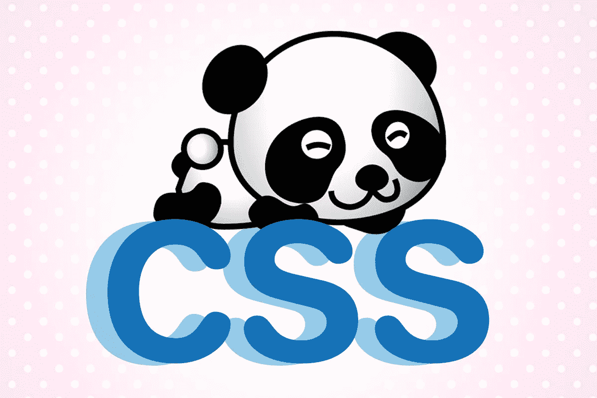

如果你经常在 Jupyter 笔记本上处理熊猫，你会发现数据框架的默认外观和风格并没有在索引和数据本身之间提供太多的对比

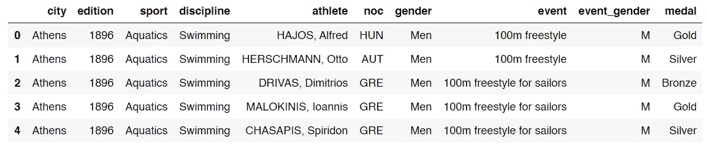

当你不得不通过对两个或更多变量进行**分组或者使用**分级索引**时，情况会变得更糟:**

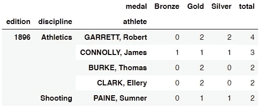

幸运的是，你可以在笔记本中使用 CSS 来使数据框看起来更好，即使你根本不知道任何 CSS。你所要做的就是复制/粘贴我将与你分享的代码片段，然后在笔记本单元中运行它们。

# 工作原理:

有许多方法可以自定义笔记本的外观。对我来说，最简单的方法是使用**魔法函数** `**%%HTML**`，后跟`**<style>**`和`**</style>**`标签，如下所示:

```
%%HTML
<style>.dataframe th{
background:#3f577c; 
font-family:monospace; 
color:white; 
border:3px solid white; 
text-align:left !important;}
</style>
```

一旦运行此单元格，您的数据框架将如下所示:

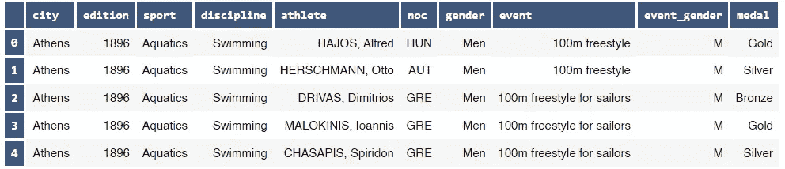

像这样的分级索引:

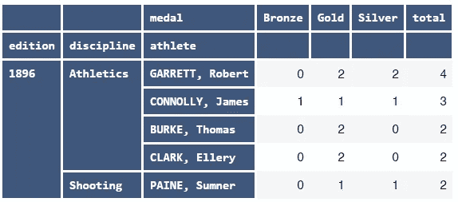

如果您想**回到默认样式**，只需注释掉整个 CSS 单元格(选择全部，然后执行`CTRL+/`)并再次运行该单元格。

这是我经常采用的风格，因为:

*   这种颜色很悦目
*   它有助于区分索引和数据本身
*   索引所用的字体(等宽)使得识别大写字母和区分容易混淆的字符(例如 0 和 O)变得很容易。

接下来，我会给你 5 个不同的 CSS 片段，你可以从中选择你喜欢的样式。你也可以随意混合搭配这些风格的不同方面；您所要做的就是更改您想要更改的属性值。

注意 1: *在本文中，我们将只涉及索引。我认为改变数据本身的外观对我们没有任何好处。*

**NB 2** : *如果你认为 CSS 代码单元格占用了你笔记本的大量空间，你可以删除代码中的所有空格，样式应该仍然有效(在神奇的功能* `%%HTML` *之后总是有一个换行符)。缩小后的 CSS 代码将如下所示:*

```
%%HTML
<style>.dataframe th{background:#3f577c;font-family:monospace;color:white;border:3px solid white;text-align:left!important;}</style>
```

# 1.醒目的橙色:

外观:

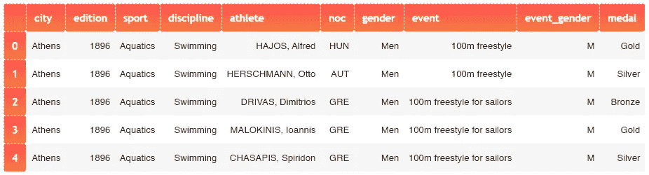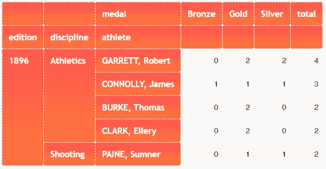

CSS 代码:

```
%%HTML
<style>.dataframe th{
background: rgb(255,122,56);
background: linear-gradient(0deg, rgba(255,122,56,1) 0%, rgba(255,83,83,1) 100%);
padding: 10px;
font-family: trebuchet ms;
font-size: 110%;
color: white;
border:1px dashed white;
text-align:left !important;
-moz-border-radius: 3x;
-webkit-border-radius: 3px;
}.dataframe thead{border:none; !important;}</style>
```

这种风格使用**橙色渐变**和单元格之间的**虚线白色边框**。字体为**投石机 MS** ，字体大小为 **110%** 。这款的边框**略圆**。

# 2.绿色虚线:

外观:

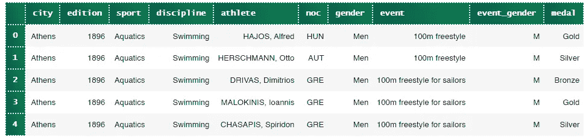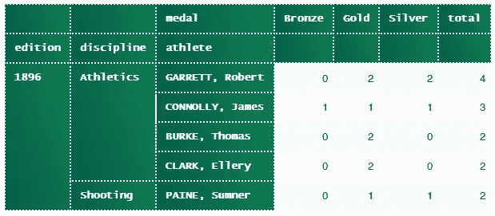

CSS 代码:

```
%%HTML
<style>.dataframe th{
background: rgb(0,94,73);
background: linear-gradient(71deg, rgba(0,94,73,1) 0%, rgba(18,126,80,1) 100%);
padding: 10px;
font-family: lucida console;
color: #343434;
border:2px dotted;
text-align:left !important;
}</style>
```

这种风格使用暗绿色渐变和**虚线边框**。这里使用的字体是 **Ludica 控制台**。

# 3.紧凑型银色:

外观:

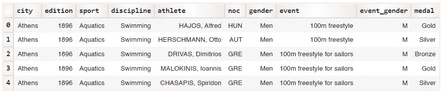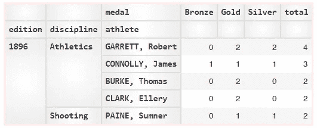

CSS 代码:

```
%%HTML
<style>.dataframe th{
background: rgb(255,255,255);
background: radial-gradient(circle, rgba(255,255,255,1) 0%, rgba(236,236,236,1) 100%);
padding: 5px;
color: #343434;
font-family: monospace;
font-size: 110%;
border:2px solid #e0e0e0;
text-align:left !important;
}.dataframe{border: 3px solid #ffebeb !important;}</style>
```

我喜欢这个，因为它简单。它使用了轻微的灰白色渐变和灰色实心边框**。整个数据帧有一个**淡粉色边框**。这里用的字体是**等宽**。**

# **4.蓝绿色渐变:**

**外观:**

**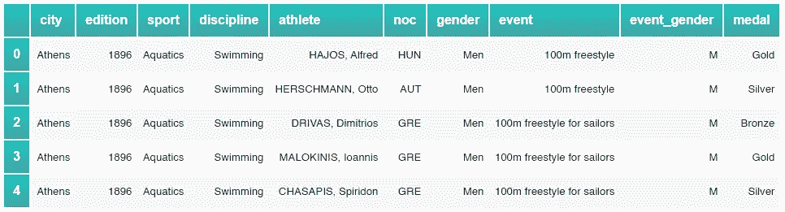****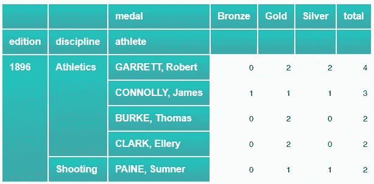**

**CSS 代码:**

```
%%HTML
<style>.dataframe th{
background: rgb(61,164,166);
background: linear-gradient(0deg, rgba(61,164,166,1) 0%, rgba(31,198,190,1) 100%);
padding: 10px;
font-family: arial;
font-size: 120%;
color: white;
border:2px solid white;
text-align:left !important;}
</style>
```

**这种风格使用浅青色渐变**、 **Arial** 作为字体选择，字体大小使用 **120%** 。****

# **5.金色薄雾:**

**外观:**

**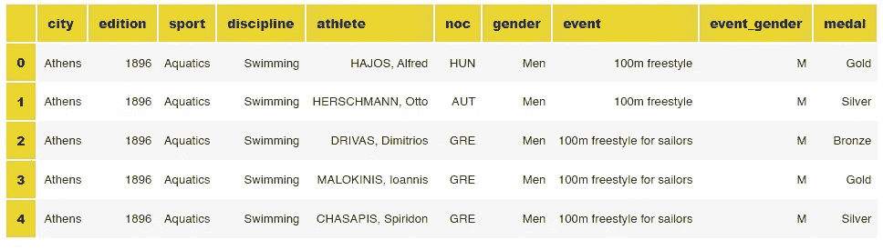****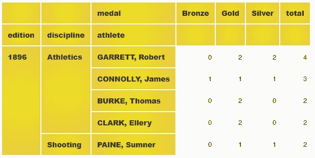**

**CSS 代码:**

```
%%HTML
<style>.dataframe th{
background: rgb(237,225,32);
background: radial-gradient(circle, rgba(237,225,32,1) 0%, rgba(233,202,60,1) 100%);
padding: 10px;
font-family: arial black;
font-size: 105%;
color: #313131;
border:2px solid white;
text-align:left !important;
}</style>
```

**这种风格使用**金色径向渐变**， **Arial 黑色**作为字体选择，字体大小使用 **105%** 。**

**如果想生成自己的颜色和渐变，可以去 [cssgradient.io](https://cssgradient.io/) 生成背景属性需要的 CSS 代码。**

**你喜欢哪一个？**