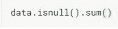
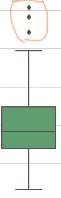
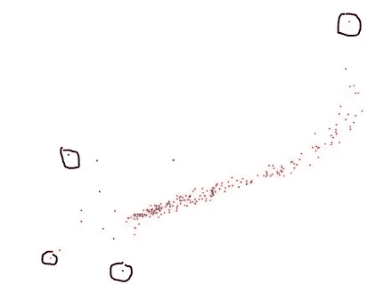
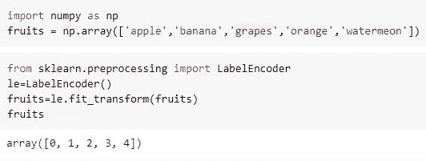
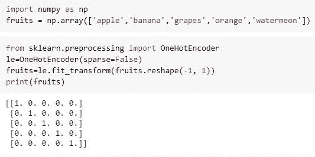
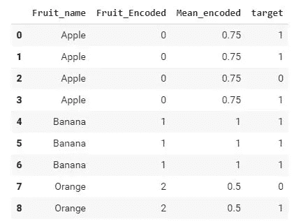

# 对您的 ML 模型至关重要的 5 种数据预处理技术

> 原文：<https://medium.com/analytics-vidhya/5-data-pre-processing-techniques-essential-for-your-ml-model-fb0096015128?source=collection_archive---------23----------------------->

弗兰基·查马基在 [Unsplash](https://unsplash.com?utm_source=medium&utm_medium=referral) 上拍摄的照片

如果您已经参与了数据科学项目，那么您可能会意识到一件事，即数据挖掘的第一步和主要步骤是数据预处理。在现实生活问题中，我们获得的原始数据非常杂乱，机器学习模型无法识别模式并从中提取信息。因此，让我们逐一看看整理数据的各种方法:

1.  **处理空值**:空值是指任何行或列中的数据缺失的值。出现空值的原因可能是没有记录或数据损坏。在 python 中，它们被标记为“Nan”。您可以通过运行以下代码来检查它-

我们可以用该列的平均值或该列中最频繁出现的项目来填充这些空值。或者我们可以用-999 这样的随机值代替 Nan。我们可以使用 pandas 库中的 *fillna()* 函数用所需的值填充 Nan。但是如果一个列有大量的空值，比如说超过 50%,那么最好将该列从数据帧中删除。您还可以用同一列中不为空的 k 个最近邻的值来填充空值。Sklearn 的 *KNNImputer()* 可以帮你做这个任务。

2.**处理异常值:**异常值是指与数据中的其余值相距较远的数据点。他们从人群中分离出来。我们可以使用可视化工具来检测异常值，如箱线图:

箱线图

并且通过绘制两个特征向量之间的散点图:

散点图中的异常值

如果您知道数据背后的科学事实，例如这些数据点必须位于的范围，您可以丢弃离群值。例如，如果人的年龄是你的数据的一个特征，那么你很清楚它必须在 0-100 岁之间，或者在某些情况下在 0-130 岁之间。但是，如果数据中的年龄值有些荒谬，比如说 300 岁，那么它必须被删除。但是异常值并不总是指向错误，它们有时可以指向一些有意义的现象。如果你的模型的预测很关键，即小的变化很重要，那么你不应该放弃这些。此外，如果异常值大量存在，如 25%或更多，那么它们很可能代表一些有用的东西。在这种情况下，您必须仔细检查那些异常值。

3.**标准化或缩放数据**:如果您正在使用基于距离的机器学习算法，如 K-最近邻、线性回归、K-means 聚类等或神经网络，那么在将数据输入模型之前，最好将数据标准化。归一化是指在不改变数值特征之间相关性的情况下，修改数值特征的值，使其达到一个共同的范围。不同数值要素中的值位于不同的范围内，这可能会降低模型的性能，因此归一化可确保在进行预测时为要素正确分配权重。一些流行的标准化技术有:

a) *最小-最大归一化* -它将特征缩放到最小值和最大值之间的给定范围。它被表述为:

> X(缩放)=a+ (b-a)(X - Xmin)/(Xmax - Xmin)

其中 a 是最小值，b 是最大值。

b) *Z 分数归一化* -我们从每个特征中减去平均值，然后除以其标准偏差，这样得到的缩放特征具有零平均值和单位方差。它被表述为:

> X(缩放)=(X 均值(X)) /σ

通过这样做，您可以将数据的分布更改为正态分布。

4.**编码分类特征-** 分类特征是包含离散数据值的特征。如果分类特征具有字符或单词或符号或日期作为数据值，那么这些必须被编码成数字，以便机器学习模型能够理解，因为它们只处理数字数据。有 3 种方法对数据进行编码:

a) *标签编码-*中的*这种编码类型根据字母顺序为分类特征中的每个离散值分配一个唯一的整数。在下面的例子中，你可以看到每个水果都被分配了一个相应的整数标签:*

**

*编码水果名称数组的标签*

*标签编码通常适用于线性模型，如线性回归、逻辑回归以及神经网络。*

*b) *独热编码-* 在中，这种类型的编码为分类特征中的每个离散值分配一个唯一的独热向量或由 1 和 0 组成的二进制向量。在独热向量中，只有离散值的索引标记为 1，其余所有值标记为 0。在下面的例子中，你可以看到每个水果都被分配了相应的长度为 5 的独热向量:*

**

*一键编码水果名称数组*

*一键编码通常适用于基于树的模型，如随机森林和梯度增强机器。*

*c)均值编码-在中，这种类型的编码使用相应的均值目标标签对分类特征中的每个离散值进行编码。为了更好地理解，让我们看看下面的例子:*

**

*由平均编码特征组成数据帧*

*我们有三种水果标签['苹果'，'香蕉'，'桔子']。每个水果标签的平均编码公式如下:*

> *编码特征=真实目标/总目标*

*对于苹果，真实目标是 3，总目标是 4，因此苹果的平均编码将是 3/4 =0.75。类似地，对于橙色，平均编码将是 1/2=0.5。对于香蕉，它将是 3/3 =1。均值编码是标签编码的扩展版本，与它相比更符合逻辑，因为它考虑了目标标签。*

*5.**离散化:**这也是一种很好的预处理技术，有时可以通过减少数据的大小来提高我们模型的性能。它主要用于数字特征。在离散化过程中，数字特征被划分为仓/区间。每个容器包含在某个范围内数值。bin 中值的数量可以相同，也可以不同。然后，每个容器被视为一个分类值。因此，我们可以使用离散化将数字特征转换为分类特征。*

*因此，在实施 ML 模型时，您可以利用这些不同的方法来预处理您的数据。希望这篇文章对你有用。*