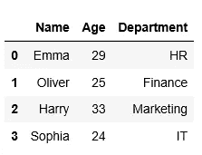

# 用 Python 创建熊猫数据框架的 5 种方法

> 原文：<https://medium.com/analytics-vidhya/5-different-ways-to-create-pandas-dataframe-in-python-aa2a037d9c03?source=collection_archive---------5----------------------->

## 提高您的 Python 技能，并学习如何以不同的方式创建数据框


ataFrame 是一种二维的带标签的数据结构，其中包含潜在不同类型的列。一般来说，DataFrame 像一个电子表格，它包含三个组成部分:索引、列和数据。数据帧可以通过不同的方式创建。

这篇博客向你展示了创建熊猫数据框架的五种不同方法。让我们开始…

如果要创建下图中的数据框，可使用以下方法之一。



## 1.从列表字典创建熊猫数据框架

字典键代表列名，每个列表代表一个列内容。

```
# Import pandas library
import pandas as pd# Create a dictionary of list
dictionary_of_lists = {
    'Name': ['Emma', 'Oliver', 'Harry', 'Sophia'], 
    'Age': [29, 25, 33, 24],
    'Department': ['HR', 'Finance', 'Marketing', 'IT']}# Create the DataFrame
df1 = pd.DataFrame(dictionary_of_lists)
df1
```

## 2.从 numpy 数组的字典创建熊猫数据帧。

字典键代表列名，每个数组元素代表一列内容。

```
# Import pandas and numpy libraries
import pandas as pd
import numpy as np# Create a numpy array
nparray = np.array(
    [['Emma', 'Oliver', 'Harry', 'Sophia'],
     [29, 25, 33, 24],
     ['HR', 'Finance', 'Marketing', 'IT']])# Create a dictionary of nparray
dictionary_of_nparray = {
    'Name': nparray[0],
    'Age': nparray[1],
    'Department': nparray[2]}# Create the DataFrame
df2 = pd.DataFrame(dictionary_of_nparray)
df2
```

## 3.从列表列表创建熊猫数据框架

每个内部列表代表一行。

```
# Import pandas library
import pandas as pd# Create a list of lists
list_of_lists = [
    ['Emma', 29, 'HR'],
    ['Oliver', 25, 'Finance'],
    ['Harry', 33, 'Marketing'],
    ['Sophia', 24, 'IT']]# Create the DataFrame
df3 = pd.DataFrame(list_of_lists, columns = ['Name', 'Age', 'Department'])
df3
```

## 4.从字典列表创建熊猫数据框架

每个字典代表一行，键是列名。

```
# Import pandas library
import pandas as pd# Create a list of dictionaries
list_of_dictionaries = [
    {'Name': 'Emma', 'Age': 29, 'Department': 'HR'},
    {'Name': 'Oliver', 'Age': 25, 'Department': 'Finance'},
    {'Name': 'Harry', 'Age': 33, 'Department': 'Marketing'},
    {'Name': 'Sophia', 'Age': 24, 'Department': 'IT'}]# Create the DataFrame
df4 = pd.DataFrame(list_of_dictionaries)
df4
```

## 5.从熊猫字典系列创建熊猫数据框架

字典键代表列名，每个系列代表一列内容。

```
# Import pandas library
import pandas as pd# Create Series
series1 = pd.Series(['Emma', 'Oliver', 'Harry', 'Sophia'])
series2 = pd.Series([29, 25, 33, 24])
series3 = pd.Series(['HR', 'Finance', 'Marketing', 'IT'])# Create a dictionary of Series
dictionary_of_nparray = {'Name': series1, 'Age': series2, 'Department':series3}# Create the DataFrame
df5 = pd.DataFrame(dictionary_of_nparray)
df5
```

我希望这个博客对你有用。感谢您的阅读:)