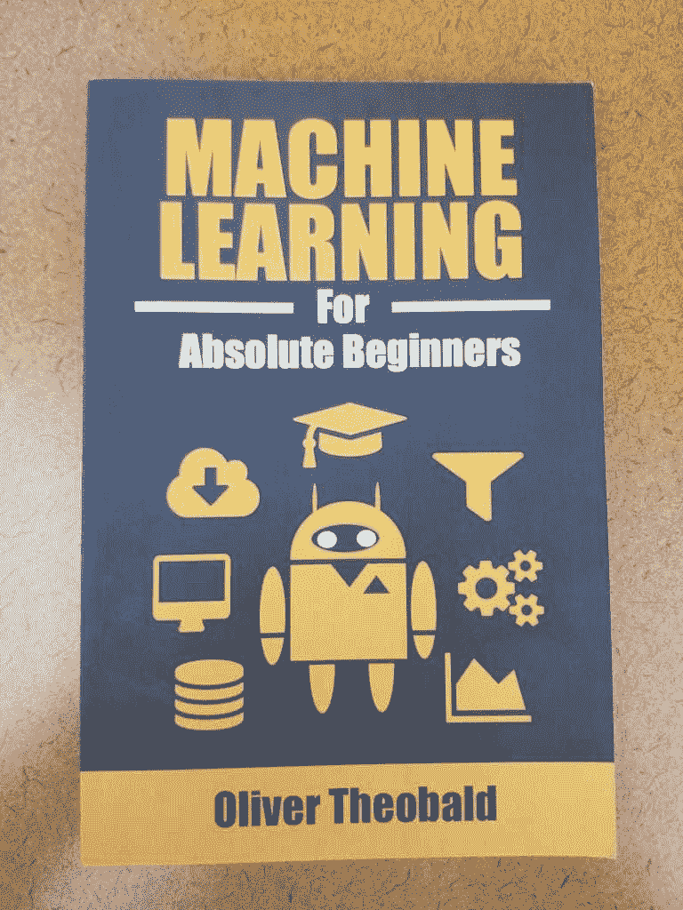
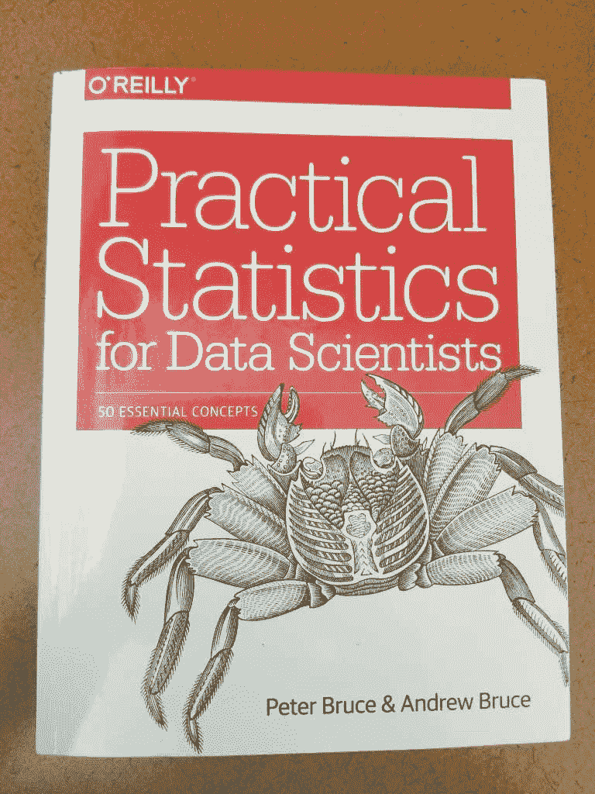
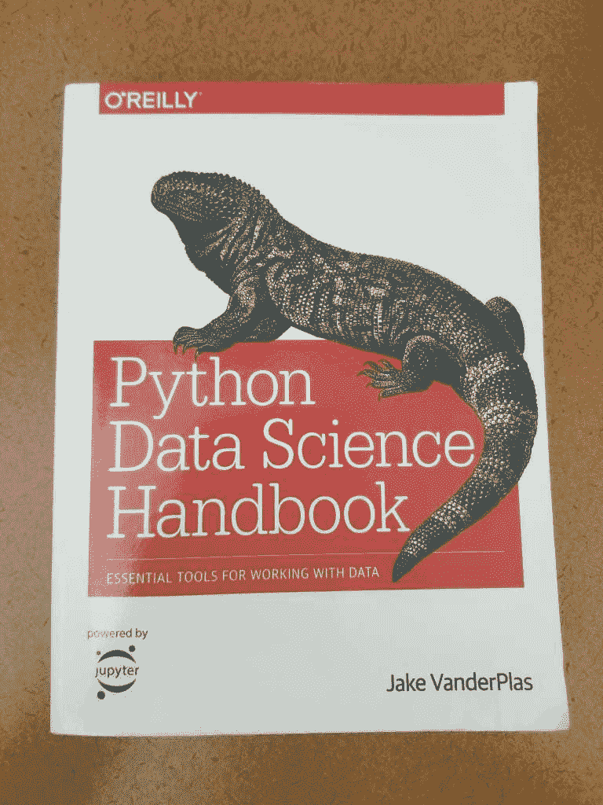
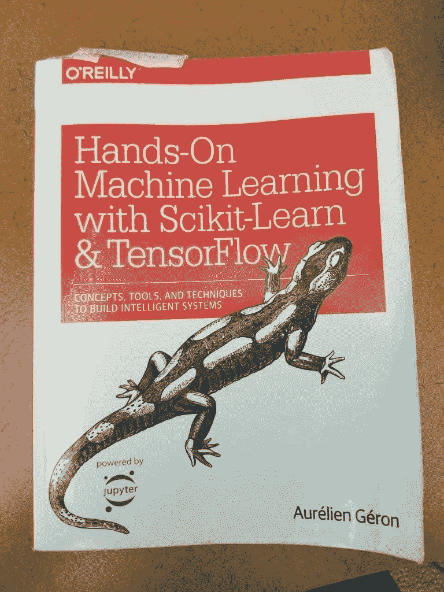
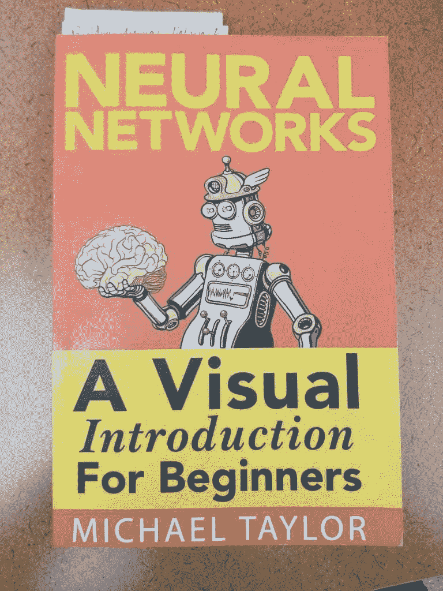

# 学习机器学习的 5 个简单步骤

> 原文：<https://medium.com/analytics-vidhya/5-easy-steps-to-master-machine-learning-18621ac795d7?source=collection_archive---------3----------------------->

我已经在我的机器学习之旅上走了将近 2 年，我对 ML 的理解有了很大的飞跃。然而，在解决如何学习这一广泛课题的过程中，有很多成长的烦恼。这篇文章将会让你以一种我艰难发现的方式来学习机器学习。所以这里是我的免责声明:每个人都有自己的学习技巧。这是我在旅途中发现的有益之处，我希望你会发现这对你有好处。也就是说，下面是学习 ML 的 5 个步骤:

## 1)学习 Python 或 R 以及机器学习概念

这一步可能会令人困惑(这只是第一步！)，但是会有意义的。陪着我。如果你以前从未用 Python 或 R 编写过代码，并且在过去的 4 年里一直用 java 或 C#编写，那么花时间去理解这种语言的语法将会让你受益匪浅。习惯不在每一行的末尾插入分号或者如何创建一个方法需要时间和一些习惯。如果你和我一样，是动手的，那么下载 Anaconda 将是你最好的朋友。Anaconda 改变了我与不同编码环境交互的方式，许多开发人员使用这个接口在他们需要的东西之间来回跳转。每个人都有自己喜欢的环境(Spyder😊)，所以直接跳到每一个来形成自己的观点。

当您在探索 Python 并掌握它的时候，同时学习 ML 概念将会使您受益。我说的不是编码部分，而是理解它的历史，不同的类型，可供学习的资源，它在当今世界的应用，以及我们可以看到它带来的破坏。了解成本函数、sigmoids、thetas 和导数。**此时不要用 AI 或 ML 做任何编码！**相信我，学习一门新的语言和这样一个复杂的话题会有点让人不知所措。一次一块垫脚石。

这里有一个列表，它确实帮助我加深了对 ML 的理解:

*   **奥利佛·西奥博尔德为绝对初学者设计的机器学习**

*   **安德烈·布尔科夫的百页机器学习书**
*   Coursera 上吴恩达机器学习课程第 1–3 周&6&8
*   **线性代数与微积分的精髓**YouTube 上由 **3Blue1Brown** 制作的播放列表
*   *线性:*[*https://www.youtube.com/watch?v=fNk_zzaMoSs&list = plzhqobowt qdpd 3 mizm 2 xvfitgf 8 he _ ab*](https://www.youtube.com/watch?v=fNk_zzaMoSs&list=PLZHQObOWTQDPD3MizzM2xVFitgF8hE_ab)
*   *演算:*【https://www.youtube.com/playlist?】[*list = plzhqobowt qdmsr 9k-rj 53 dwvrmyo 3t 5 yr*](https://www.youtube.com/playlist?list=PLZHQObOWTQDMsr9K-rj53DwVRMYO3t5Yr)
*   **Python.org 页面，其中包括他们推荐给 Python 初学者的** [**书籍参考。**](https://wiki.python.org/moin/IntroductoryBooks)

## 2)理解使用 numpy、panda 和 matplotlib 的数据操作、数据分析和可视化

如果你正在阅读这篇文章，我相信你已经听说过 numpy、panda 和 matplotlib。这三件事是机器学习的圣杯，理解这些 python 库将会让你受益匪浅。数据操作、分析和可视化是机器学习的一大块内容。这些技能将帮助您在较高的层次上理解数据发生了什么，以便您(开发人员)可以看到不同功能之间的任何相关性，以及您应该使用什么来训练您的模型。在这一点上磨练技能会让你在学习训练你的模型时有优势。尤其是因为在数据科学家训练一个模型之前，数据清理占用了他们 80%的时间。

以下是我推荐的资源列表:

*   **彼得·布鲁斯的《数据科学家实用统计学》&安德鲁·布鲁斯**

*   **杰克·范德普拉斯的 Python 数据科学手册**

*   在 Kaggle 你可以找到一些令人惊奇的数据集来玩。

## 3) Scikit-Learn 和 Tensorflow 时间！

Sci-kit learn 是一个令人惊叹的 python 包，它可以完成如此多不同的功能，以至于它需要一些自己的时间。这是一个强大的软件包，几乎每个程序都有某种 sci-kit 用法。

Tensorflow 是一个开源库，用于创建和训练模型。当谈到决定使用 TensorFlow 2.0 或其前身时，这取决于您。2.0 版本有很多变化，但是很多程序都是用 1.0 版本编写的，这真的很重要，你可以选择你喜欢的项目。请在下面留下你的评论，告诉我们你认为应该关注的版本。主要有一本书，我强烈建议你在这一步检查。这就是 Aurelien Geron 的 Scikit-Learn & Tensorflow 的**动手机器学习。这本书有一个 2.0 版本。无论你选择哪一个版本，都要买一本适合你学习的书。**

## 4)在不是神经网络的模型中开始编码

你知道那句话，在你会走路之前，你需要学会如何爬行？它适用于这里。我知道你迫不及待地想开始学习神经网络，但你需要将你到目前为止学到的东西应用到机器学习的其他模型中。支持向量机、随机森林和线性/逻辑回归是应用你目前所学知识的良好起点。你将开始应用你在前三步中学到的知识，以及所有的东西是如何一起工作的。神经网络是他们自己的野兽。一旦你觉得清理数据、操作数据、进行特征工程，然后转向神经网络是正确的做法。如果距离你上一堂微积分课已经有一段时间了，那么现在是时候掸掉这些神经元的灰尘，如果你轻松地完成了第一步，就可以让它们重新活跃起来。

这一步需要你对你所面临的问题进行研究。不要害怕在任何论坛上寻求帮助，甚至向我寻求帮助:

*   谷歌是你最好的朋友。现在不要试图重新发明轮子。您遇到的问题很可能已经解决。快速搜索一下，我肯定会有所发现。
*   **GitHub**

## 5)神经网络和深度学习

现在是我建议你学习神经网络的时候了。神经网络和深度学习携手并进，将它们聚集在一起才有意义(现在是两年后)。在这里，您可以了解单个感知器如何工作，然后逐渐了解矩阵以及权重、偏差和输入如何共同帮助神经网络“思考”。我犯了一个错误，先跳到这一步，老实说，我不应该这样做。我对其他性能更好的型号视而不见(喘气！我知道有)。支持向量机、随机森林，是的，甚至线性回归对项目来说也很棒。神经网络并不是机器学习的终结，也不是机器学习的灵丹妙药。这就是为什么在神经网络之前接触大多数模型将有助于你理解神经网络擅长什么问题以及它们缺乏什么。

以下是一些帮助理解神经网络和深度学习的来源:

*   **神经网络:初学者的直观介绍**迈克尔·泰勒著

*   但是什么是神经网络呢？深度学习，第一章 YouTube 上的 3Blue1Brown
*   [*https://www.youtube.com/watch?v=aircAruvnKk*](https://www.youtube.com/watch?v=aircAruvnKk)

## 奖金)学习如何将模型应用于某些项目，然后部署它们

全栈开发人员正在快速进入。如果你不知道什么是全栈开发人员，他们可以从头到尾做一个项目。他们可以收集、查询、操作、训练和部署数据和模型。随着初创公司的崛起，全栈将更有可能成为需求。我强烈建议你戴上数据分析师、数据科学家和机器学习工程师的帽子。每个人都有不同的职责，但他们都有相同的目标。训练并安全发布模型。

希望这些步骤能帮助你理解并给你学习机器学习所需要的东西。这只是我在 AI/ML 的旅程中使用并发现有益的概述。让我知道在评论中，如果你会建议另一个步骤或重新安排！也许你有其他的来源可以加入，在下面的评论中留下吧！每个人都有不同的学习方式，我很好奇你是如何做到的，甚至是如何解决的。

在我们重新学习之前，

ReginaOfTech

*   *原载于 www.reginaoftech.com 理工大学*