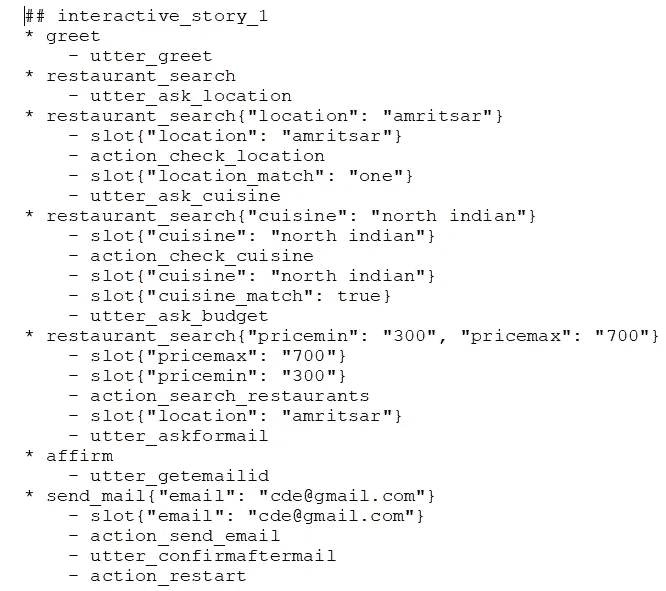

# 构建高度成功的聊天机器人(对话式人工智能)的 5 个基本要素

> 原文：<https://medium.com/analytics-vidhya/5-essential-elements-to-build-highly-successful-chatbot-conversational-ai-bd0eba4b549c?source=collection_archive---------8----------------------->

> 谈话应该触及一切，但不应该专注于任何事情。奥斯卡·王尔德

使用人工智能提供更个性化的大规模客户体验是全球公司(产品、服务)的首要任务之一，对话式人工智能在这一领域发挥着关键作用。

在日常生活中，我们与技术接触点的互动呈指数级增长。它从获取早间新闻更新开始，最后通过向谷歌助手发出语音命令来设置第二天早上的闹钟和提醒。同样地，对于 ex 来说，白天有更多这样的例子。预订出租车、查询天气、与银行互动或通过语音命令呼叫某人等..这都是通过各种移动应用程序或网站完成的。每个技术点都是与虚拟助理的对话，虚拟助理会根据您的使用历史、可用选项等，尝试为您提供个性化体验

虽然机器或应用程序能够像著名的漫威电影系列中的人工智能助手“贾维斯”一样流利和智能地进行对话，仍然是未来几年要实现的目标，但这种现象正在增加。

交谈是人类的一项基本素质，伴随着一千年的进化而产生和发展。能够与其他人交谈并交流想法、交换想法、表达情感、信息等是人类的基本要求。

这种自然需求正在催生虚拟助手的许多新用例。随着技术的进步，虚拟助理主要发展为两类:

1.  通用虚拟助手，如谷歌助手、亚马逊 Alexa、微软 Cortana、苹果 Siri 等..它可以响应各种输入并采取一些行动。
2.  特定领域的虚拟助手或聊天机器人。银行聊天机器人、餐厅或送餐聊天机器人、客户服务、提高工作效率(人力资源助理)、订票代理、游戏专家、天气预报员、新闻记者、求职者、营销人员、财务顾问、教师、法律顾问等

为了理解聊天机器人如何真正工作并能够模仿人类对话能力，我们需要关注几个基本要素。在本文的其余部分，我将使用特定领域的聊天机器人作为例子来解释创建聊天机器人的过程。

> 上下文聊天机器人通过观察自身和用户之间的通信模式来理解对话的上下文。它不仅记录了对话的当前状态，还记录了之前说过的话，这让他们可以建议下一步的反应或行动。

这种能力不同于传统的编程方法，因为它使用 ML 模型而不是依赖于一系列 if/else 语句。

聊天机器人的整个功能依赖于以下因素

1.  结构
2.  自然语言理解(NLU)层及其训练
3.  NLU 培训的管道选择
4.  对话管理(聊天机器人的核心或大脑)及其训练
5.  域配置
6.  **框架—** 对于每一个对话型聊天机器人，基本要求是首先选择一个对话框架作为基础。有许多选项可用，如谷歌对话流，亚马逊 Lex，微软 Azure bot 服务等..在本文中，使用一个名为 Rasa 的开源框架解释了为一家虚拟的食品配送初创企业构建餐馆搜索聊天机器人的步骤和示例。

每个对话框架(Rasa、Lex、Dialogflow 等..)有两个主要元素

*   自然语言理解，或 NLU 层
*   对话管理系统层或核心

当人类进行对话时，主要涉及到这些身体部位和感官——耳朵(倾听)、说话能力(回应)和人脑(决定行动或回应，记录上下文、正在进行的对话的历史)。

类似地，在对话框架方面，NLU 层管理听说能力，对话管理系统是聊天机器人的大脑。

在 Rasa 中，这两个组件分别被称为 Rasa NLU 和 Rasa 核心。

**2。自然语言理解层(拉沙·NLU)——会话系统的第一层。它负责意图分类和实体提取。它解释用户提供的自由文本。它基本上采用非结构化的文本短语或句子，理解用户可能想要说什么，从文本短语或句子中提取实体，并将其转换为结构化数据。为了前任。如果用户向聊天机器人提出一个查询——“搜索那格浦尔的一家餐馆。”**

> 意图:餐厅搜索；实体:[位置=那格浦尔]

上面解释的 NLU 层将能够基于从训练数据的学习来执行它的任务。一般来说，NLU Rasa 的培训数据分为三个部分:

1.  示例数据-最重要的组件，因为它包含所有训练示例。NLU 层的性能取决于训练样本的数量和种类。每个例子都有三个组成部分——文本、意图和实体。

*   **文本**:这是一个提交解析的例子。为了前任。港铁 JP Nagar 两人平均预算是多少？
*   **意图**是应该与文本相关联的目标。为了前任。在上面的查询中，目的是“餐馆搜索”。
*   **实体**是文本中需要识别的特定部分。为了前任。在上述查询中，确定了以下实体。餐厅—地铁，位置— JP Nagar

2.同义词——这有助于添加那些指代一个常用术语的术语，通常用作对话的一部分。为了前任。城市——班加罗尔被称为 Bengaluru 或拼错为 Bangaluru。同义词字段允许捕获可能的组合来指代实体。

3.Regex 特性——使用正则表达式，您可以覆盖更大范围的值，其中有许多独特的元素可用，并遵循特定的模式。为了前任。城市 Pin 码是唯一的，并且值很大。

**3。为 NLU 选择管道—** Rasa 框架允许通过配置特定管道来定制 NLU 模型。

*   监督嵌入
*   预训练 _ 嵌入 _ 空间

最大的区别是 pretrained_embeddings_spacy 管道使用预训练的词向量，而 supervised_embeddings 管道专门基于您的数据集，不使用任何预训练的词向量。如果您的总训练示例少于 1，000 个，并且有针对您的语言的空间模型，通常建议您使用 pretrained_embeddings_spacy 管道。您需要在 config.yml 中指定管道，如下所示:

**4。Rasa 核心对话管理—** 对话框架的下一个重要方面是对话管理模型。对话管理模型将根据对话的阶段预测聊天机器人应该采取的响应或行动。这些动作/响应可以是获取数据、向用户发送邮件或简单地说“再见”。为了前任。如果一个用户问“孟加拉鲁鲁现在的温度是多少？”。在这种情况下，机器人应该从天气数据库获取结果，并显示在屏幕上。

Rasa 核心接受意图和实体形式的结构化输入(即 NLU Rasa 的输出),并决定下一步行动。它完成了学习根据对话的阶段采取正确行动的任务。

然而，正确的行动或反应高度依赖于提供给 Rasa 核心(对话管理)的培训数据。训练数据中的这些输入以“对话故事”的形式提供。一个故事代表一个训练示例，它只是用户和人工智能助手之间的对话，以特定的格式表达。Rasa core 根据故事训练神经网络模型。Rasa Core 在后端使用 Tensorflow，这是一个用于训练神经网络的库。更具体地说，它使用在 Keras 中实现的 LSTM 神经网络。

在故事示例中，用户输入被表达为相应的意图(以及必要时的实体)，而助手的响应被表达为相应的动作名称。

**5。Domain.yml —** 域定义了您的助手的工作领域。它指定了你的机器人应该知道的意图、实体、插槽、模板和动作。

*   **Slots** :这些是你想在对话中“跟踪”的“对象”。假设用户说“在 MTR Lalbagh 预订一张两人桌。”在整个对话过程中，机器人需要记住“MTR”是实体 restaurant_name 的值，而“2”是实体 number_of_seats 的值，因此它可以用于查询 Zomato 这样的数据库。

domain.yml 中的插槽

*   **Intents (NLU 层)**:这些是字符串(比如‘greet’，‘restaurant _ search’)，描述用户想要说的话。
*   **实体(NLU 层):**作为自然语言处理的一部分，实体是使用 CRF、spaCy 等模型提取的。在大多数情况下，实体存储在槽中；在实体与对话流无关的情况下，您不需要为它分配一个槽。
*   模板:模板定义了机器人说话的方式。例如，如果机器人想要询问烹饪偏好，那么可以定义一个模板，以便机器人可以询问:“您想要哪种烹饪？”、“请说明您的美食偏好”等。所有这些都可以在域文件的模板部分指定。从模板中随机选择一个响应，这样你的机器人听起来就不会像机器人或者静态的。

domain.yml 中的模板

*   **动作:**“动作”组件列出了机器人可以执行的所有动作——说出诸如“嗨”的文本消息、查找数据库、进行 API 调用、向用户提问等。例如，名为“action_check_cuisine”的操作可以检查特定菜肴的有效性和可用性。

domain.yml 中的操作模块

bot 可以采取两种类型的操作:

*   **发声动作:**机器人只是给用户发一条短信。例如:回复问候信息、询问位置等
*   **自定义动作**:查询数据库、给用户发邮件等动作。如果您希望 bot 执行自定义操作，您需要将该操作添加到您的操作文件中。为了前任。下面发送电子邮件的自定义操作包含在 action.py 文件中。

前面提到的所有组件一起完成了对话聊天机器人的功能。

> 关于天气的谈话是缺乏想象力的人最后的避难所。——奥斯卡·王尔德

在建造聊天机器人的情况下，人类的想象力是没有边界的。有多种可能性仍未被探索，人工智能的技术进步(特别是在机器学习和自然语言处理方面)正在允许进入那些未知的领域，如医疗保健聊天机器人，保险聊天机器人等…

聊天愉快！！