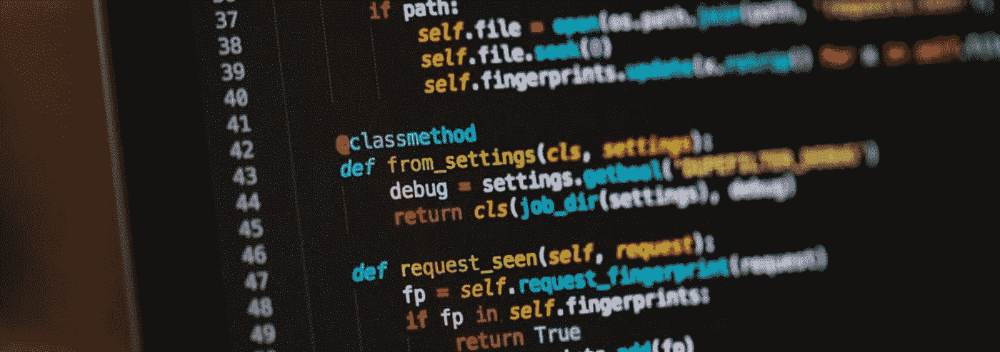

# 5 个重要的 Python 技巧，让你的代码更加整洁、易读和优雅

> 原文：<https://medium.com/analytics-vidhya/5-essential-python-tricks-to-make-your-code-more-clean-readable-elegant-33db96d99e84?source=collection_archive---------0----------------------->

[去飞溅](https://unsplash.com/photos/ieic5Tq8YMk)

## 增强您的 Python 编程

Python 是一种非常有表现力的语言，因为有很多不同的方式来表达同一个想法。因此，虽然 Python 代码可能非常混乱，但编写漂亮的代码并不难。使用这五个技巧将有助于使您的 Python 代码更加整洁、可读性更好，并且…