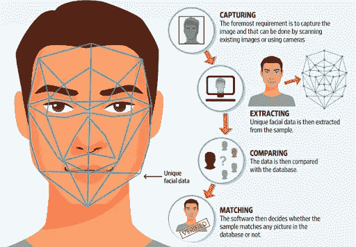
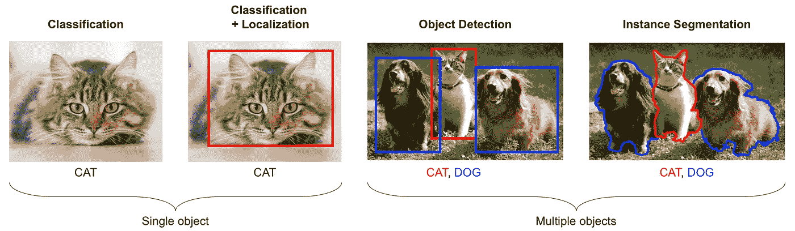
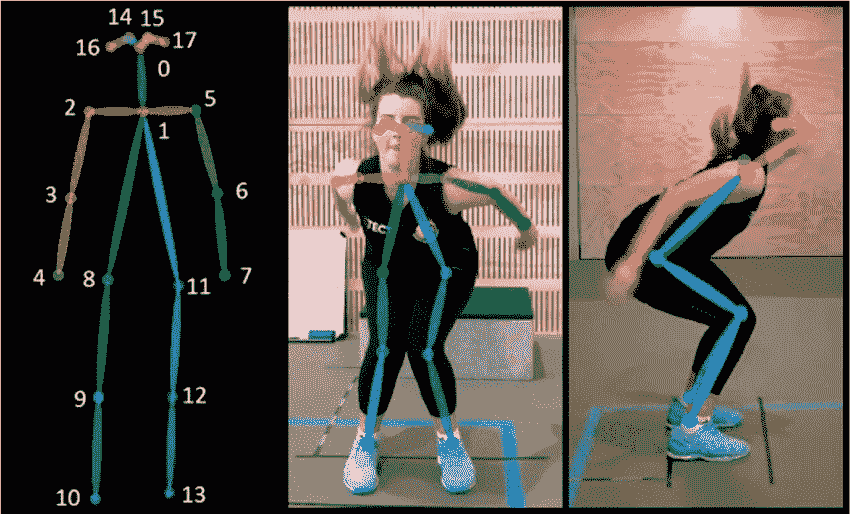
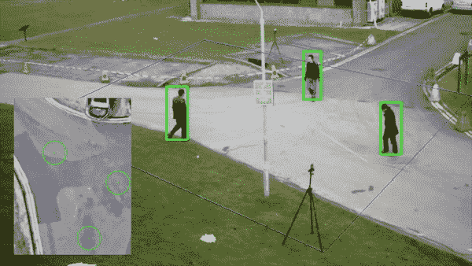
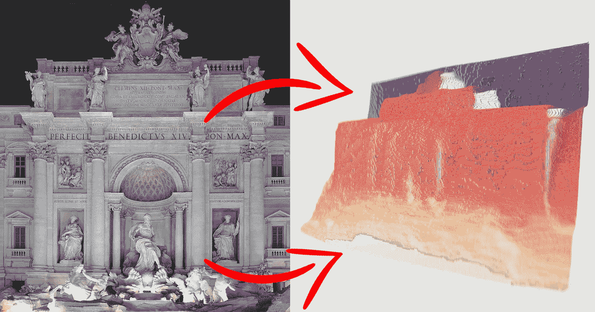
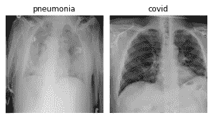

# 5 个激动人心的计算机视觉应用和相关数据集！

> 原文：<https://medium.com/analytics-vidhya/5-exciting-computer-vision-applications-with-relevant-datasets-2fffba71dce2?source=collection_archive---------29----------------------->

## 这里我们有 5 个非常有趣的计算机视觉应用，你一定要知道！

# 概观

*   计算机视觉是允许数字世界与现实世界互动的技术。
*   探索计算机视觉的 5 个最热门的应用

# 介绍

我 10 年前开始使用脸书。同样，如果你很久以前用过，你一定记得照片的手动标记。但是现在我们不必手动标记这些图片。脸书认出了上传图片中的大多数人，并提供了标记他们的建议。类似地，你一定在 Snapchat 上看到过那些搞笑的滤镜，人们使用狗滤镜，得到一张狗脸。你有没有想过这一切是如何实现的？我们的手机是如何检测我们的面部并添加滤镜的？这些是计算机视觉的一些应用。

计算机视觉是数据科学领域最热门的研究领域之一。此外，它已经成为我们个人生活的一部分。有意或无意地，我们都在使用各种在后端运行计算机视觉技术的功能。例如，我们在智能手机中使用面部解锁。下图有效地解释了人脸检测的工作原理。

*来源:*[*【https://www.pinterest.com】*](https://www.pinterest.com)

我选择人脸检测开始这篇文章，因为这是计算机视觉的一个应用，我们都见过。但是相信我，计算机视觉不仅限于此。在本文中，您将探索计算机视觉更有趣的应用。

如果你想掌握计算机视觉，请查看我们的课程[使用深度学习 2.0 的计算机视觉](https://courses.analyticsvidhya.com/courses/computer-vision-using-deep-learning-version2?utm_source=blog&utm_medium=top_5_applications_of_computer_vision)

# 目录

*   什么是计算机视觉？
*   使用计算机视觉的姿态估计
*   使用 Gans 的图像变换
*   开发社交距离工具的计算机视觉
*   将 2D 图像转换为 3D 模型
*   医学图像分析

# 什么是计算机视觉？

在进入计算机视觉应用的世界之前，首先，让我们了解什么是计算机视觉？简而言之，计算机视觉是人工智能的一个多学科分支，试图复制人类视觉的强大能力。

如果我们仔细阅读正式的定义，

> *“计算机视觉是一种基于感应图像对真实物理对象和场景做出有用决策的工具”(*[*Sockman&Shapiro*](https://www.amazon.com/Computer-Vision-Linda-G-Shapiro/dp/0130307963)*，2001)*

计算机视觉通过视觉识别技术工作，如图像分类、对象检测、图像分割、对象跟踪、光学字符识别、图像字幕等。我知道这些是很多技术术语，但是理解它们并不困难。只要看看下面的图片，你就会明白其中的许多术语。

来源:https://www . or eilly . com/library/view/python-advanced-guide

让我们从第一张图片开始。如果我问你照片里有什么？你的答案会是，它是一只猫。这就是分类。这意味着根据图像的分类来标记图像。这里的类是“猫”。

现在你知道图像的类别了。下一个问题是物体在图像中的位置。当我们确定对象在帧中的位置并围绕它创建一个边界框时，这就是所谓的定位。在第二个图像中，我们已经确定了对象的位置，并将其标记为一只猫。

下一个术语是目标检测。在前两种情况下，我们在图像中有一个对象，但是如果有多个对象存在呢？在这里，我们通过边界框来识别存在的实例及其位置。

在对象检测中，我们使用方形或矩形的边界框，但它不能说明对象的任何形状。实例分割在每个对象周围创建一个像素级遮罩。因此，实例分割可以更深入地理解图像。

如果您想了解更多关于计算机视觉的信息，请查看以下资源-

*   [*计算机视觉使用深度学习 2.0 课程*](https://courses.analyticsvidhya.com/courses/computer-vision-using-deep-learning-version2?utm_source=blog&utm_medium=image-segmentation-article)
*   [*认证项目:计算机视觉初学者*](https://courses.analyticsvidhya.com/bundles/computer-vision-combo?utm_source=blog&utm_medium=image-segmentation-article)
*   [神经网络入门](https://courses.analyticsvidhya.com/courses/getting-started-with-neural-networks)(免费)
*   [卷积神经网络(CNN)从无到有](https://courses.analyticsvidhya.com/courses/convolutional-neural-networks-cnn-from-scratch)(免费)

深度学习方法的最新发展和技术的进步极大地提高了视觉识别系统的能力。因此，计算机视觉已经被公司迅速采用。计算机视觉的成功使用案例在工业领域随处可见，从而拓宽了计算机视觉工具的应用范围，增加了对计算机视觉工具的需求。

现在，不浪费更多的时间，让我们进入计算机视觉的 5 个令人兴奋的应用。

# 人体姿态估计

人体姿态估计是计算机视觉的一个有趣的应用。你一定听说过 [Posenet](https://github.com/tensorflow/tfjs-models/tree/master/posenet) ，这是一个用于人体姿态估计的开源模型。简而言之，姿态估计是一种推断图像/视频中存在的人或物体的姿态的计算机视觉技术。

在讨论姿态估计的工作之前，让我们先了解“人体姿态骨架”。它是定义一个人的姿势的一组坐标。一对坐标称为肢。此外，通过识别、定位和跟踪图像或视频中的人体姿态骨架的关键点来执行姿态估计。

来源:https://www . research gate . net/publication/338905462 _ The _ ' DEEP ' _ Landing _ Error _ Scoring _ System

以下是人体姿态估计的一些应用-

*   用于实时运动分析或监视系统的活动识别。
*   增强现实体验
*   在训练机器人时
*   动画和游戏

以下是一些数据集，如果你想自己开发一个姿态估计模型-

*   [MPII](http://human-pose.mpi-inf.mpg.de/)
*   [可可关键点挑战](https://cocodataset.org/#download)
*   [HUMANEVA](http://humaneva.is.tue.mpg.de/)

我发现谷歌的 [DeepPose](https://static.googleusercontent.com/media/research.google.com/en//pubs/archive/42237.pdf) 是一篇非常有趣的研究论文，使用深度学习模型进行姿态估计。为了更深入地挖掘，你可以访问多个关于姿势估计的研究论文

# 使用 GANs 的图像转换:

Faceapp 是一款非常有趣的热门应用。这是一个图像处理工具，使用过滤器转换输入图像。过滤器可能包括老化或最近一次性别互换过滤器。

来源:https://comic book . com/marvel/news/marvel-men-face app-gender-swap/# 18

看上面的图片，搞笑吧？几个月前，这是互联网上的热门话题。人们在交换性别后分享图片。但是这类应用背后的技术是什么呢？是的，你猜对了，它是计算机视觉，更具体地说，它是深度卷积生成对抗网络。

生成对抗网络俗称[甘](https://arxiv.org/abs/1406.2661)是计算机视觉领域一项令人兴奋的创新。虽然 GANs 是一个老概念，但目前的形式是由 Ian Goodfellow 在 2014 年提出的。从那以后，它有了很大的发展。

GANs 的训练包括两个神经网络相互竞争，以便根据给定训练数据的分布产生新数据。尽管最初是作为一种无监督学习机制提出的，但 GANs 已经证明了自己是监督和半监督学习的良好候选。

要了解更多关于 Gans 的工作，请查看下面的文章。

[什么是生成模型和 gan？计算机视觉的魔力](https://www.analyticsvidhya.com/blog/2020/01/generative-models-gans-computer-vision/)

以下是我个人推荐的一些关于 GANs 的必读研究论文——

*   [基于风格的生成对抗网络生成器架构](https://arxiv.org/abs/1812.04948)
*   [深度卷积生成对抗网络的无监督表示学习](https://arxiv.org/abs/1511.06434)
*   [条件生成对抗网](https://arxiv.org/abs/1411.1784)
*   [使用循环一致对抗网络的不成对图像到图像翻译](https://arxiv.org/abs/1703.10593)

以下是一些数据集，将有助于您获得 GANs 的实践经验

*   [CelebA](http://mmlab.ie.cuhk.edu.hk/projects/CelebA.html)
*   [闪烁人脸数据集](https://github.com/NVlabs/ffhq-dataset)
*   [卡通造型](https://google.github.io/cartoonset/)

# 应用程序

当讨论使用 Gans 生成的图像的应用时，我们有很多。以下是它的一些应用-

*   风格转换和照片修复中的图像到图像转换
*   图像超分辨率
*   文本到图像生成
*   图像编辑
*   语义图像到照片的翻译

如果你发现了更有趣的东西，请在评论区告诉我。

# 开发社交距离工具的计算机视觉

在过去的几个月里，世界正遭受着疫情·新冠肺炎的折磨。研究发现，在没有疫苗之前，我们都必须采取预防措施，使用洗手液、口罩，最重要的是保持社交距离。

计算机视觉技术可以在这一关键场景中发挥重要作用。它可以用来跟踪某个场所或特定区域的人，以了解他们是否遵守社交距离规范。

社交距离工具是实时对象检测和跟踪的应用。在这种情况下，为了检查社交距离违规，我们使用边界框检测视频中出现的每个人。稍后，我们跟踪帧中每个盒子的运动，并计算它们之间的距离。如果它检测到任何违反社交距离规范的行为，它就会突出显示这些边界框。

此外，为了使这些工具更加先进和准确，你可以使用迁移学习技术。像 [YOLO](https://pjreddie.com/darknet/yolo/) 或[面具 R-CNN](https://arxiv.org/abs/1703.06870) 这样的各种预训练的物体检测模型也在那里。

*下面这篇文章帮助你自己创造一个社交距离工具-*

*   [*你的社交区分检测工具:如何利用你的深度学习技能建立一个*](https://www.analyticsvidhya.com/blog/2020/05/social-distancing-detection-tool-deep-learning/?utm_source=blog&utm_medium=top_5_applications_of_computer_vision)

# 从 2D 图像创建 3D 模型

这是计算机视觉的另一个非常有趣的应用。它将二维图像转换成三维模型。例如，想象你有一张旧收藏的照片，并能够将其转换成 3d 模型，然后像身临其境一样进行观察。

来源:https://petapixel . com/2020/02/28/Facebook-now-let-you-turn-any-2d-photo-a-3d-image-using-ai

Deep Mind 的研究人员提出了一个类似的人工智能系统。它被称为生成查询网络，可以像人类一样从不同角度感知图像。

此外，英伟达开发了一种人工智能架构，可以从图像中预测 3D 属性。同样，脸书人工智能也提供了一个类似的工具，名为 [3D 照片功能](https://ai.facebook.com/blog/powered-by-ai-turning-any-2d-photo-into-3d-using-convolutional-neural-nets/)。

以下是一些相关的数据集供你试验-

*   [宜家](http://ikea.csail.mit.edu/)数据集
*   [Opensurface](http://opensurfaces.cs.cornell.edu/) 数据集
*   [NYU 深度](https://cs.nyu.edu/~silberman/datasets/nyu_depth_v2.html)数据集
*   [ObjectNet3D](https://cvgl.stanford.edu/projects/objectnet3d/)

此外，请查看这些有趣的论文，以了解更多关于该应用程序的信息。

现在你一定在想这项技术的用例。以下是它的应用-

*   动画和游戏
*   机器人学
*   无人驾驶汽车
*   医疗诊断和外科手术

# 医疗保健中的计算机视觉:医学图像分析

很长一段时间以来，计算机支持的医学图像被用于诊断，如 CT 扫描、X 射线等。此外，计算机视觉技术的最新发展允许医生通过转换成 3d 交互模型来更好地理解它们，并使它们的解释变得容易。

如果我们看看计算机视觉的最新使用案例，我们会发现它正在使用胸部 x 光检测新冠肺炎病例。此外，根据武汉 T2 放射科的一项研究，深度学习方法可以有效地用于区分新冠肺炎和社区获得性肺炎。

查看 Kaggle 的[新冠肺炎胸部 x 射线](https://www.kaggle.com/bachrr/covid-chest-xray)数据集，并亲自动手实施。

与此同时，如果你想在另一个数据集上工作，那么 Kaggle 本身也有 [CT 医学图像](https://www.kaggle.com/kmader/siim-medical-images)。此外，如果您期待了解更多关于医学图像处理及其在医疗保健中的应用，请阅读[这些](https://www.engpaper.com/cse/medical-image-processing.html)研究论文及其实现。

# 结束注释

总而言之，计算机视觉是人工智能的一个迷人领域。你给字段命名，你将在那里得到一个 CV 的应用。在本文中，我讨论了几个我觉得有趣的例子。但这只是冰山一角。

如果你有兴趣知道如何从事计算机视觉方面的职业，请阅读以下内容

现在轮到你自己开始实现计算机视觉了。别忘了在评论框里分享你最喜欢的机器视觉应用。

*原载于 2020 年 7 月 21 日 https://www.analyticsvidhya.com***。**