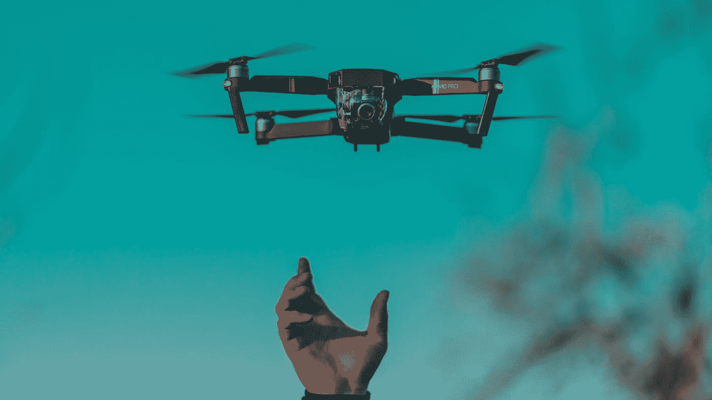

# 你可以从编程中学到的过上成功生活的 5 课

> 原文：<https://medium.com/analytics-vidhya/5-lessons-you-can-learn-from-programming-to-live-a-successful-life-a8de0e6c4864?source=collection_archive---------15----------------------->

## 你不需要成为一名程序员来学习这些课程

戴安娜·姆塞萨努在 [Unsplash](https://unsplash.com?utm_source=medium&utm_medium=referral) 上的照片

你需要这五课来过成功的生活。

听着，在学习这些课程之前，你不必成为一名程序员。你只需要知道并把它们应用到你的生活中。

# 1.为了成功，你…