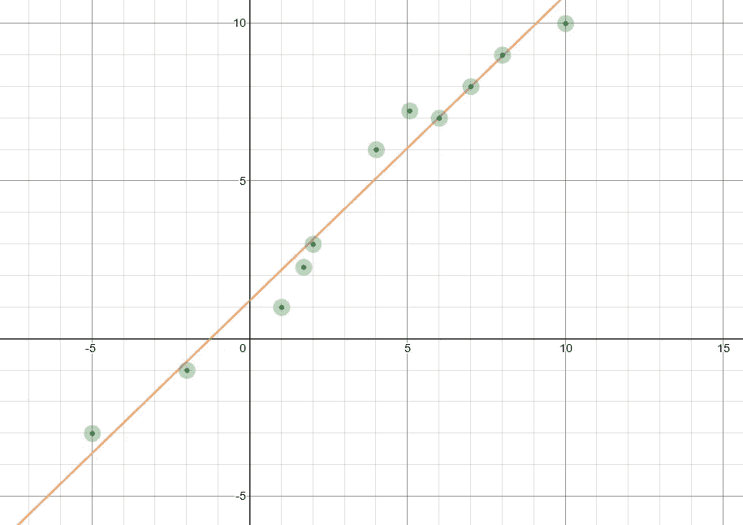
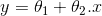
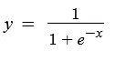
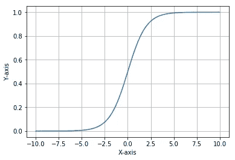
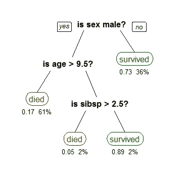
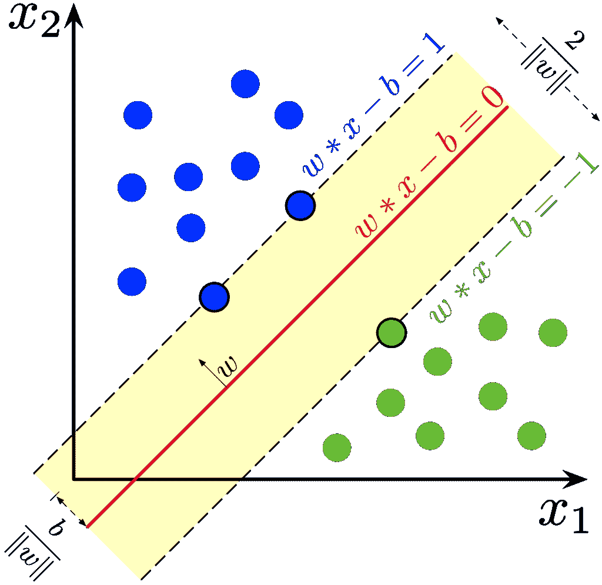

# 面向初学者的 5 种机器学习算法

> 原文：<https://medium.com/analytics-vidhya/5-machine-learning-algorithms-for-beginners-67e8b95d1e2a?source=collection_archive---------22----------------------->

机器学习！如果你对计算机世界有所了解，你会经常听到这个术语。但是机器学习到底是什么？

# 什么是机器学习？

机器学习这个术语是由亚瑟·塞缪尔推广开来的。

> 1959 年，Arthur Samuel 将机器学习定义为“在没有明确编程的情况下赋予计算机学习能力的研究领域”

汤姆·米切尔将机器学习定义为:

> 如果一个计算机程序在某类任务 T 和性能测量 P 上的性能(由 P 测量)随着经验 E 而提高，则称它从经验 E 中学习。

这些是一些正式的定义。那么，这些定义意味着什么呢？我给你举个例子。

在传统的编程范式中，要创建一个应用程序，需要编写一些算法来执行某项任务。为了简单起见，假设一个程序计算一个给定数字的平方。您向它提供数据(例如，2 作为输入)。程序给出了输出，在本例中是 4。这是我们通常编写程序的方式。但是在机器学习中，我们为我们的程序提供数据和输出，程序自动学习算法。太神奇了！

现在你对什么是机器学习有了一些概念，你可能想知道机器学习中使用的一些算法。从我作为初学者的经验来看，如何开始是令人困惑的。机器学习的世界如此广阔，以至于你在搜索这些东西时会迷失方向。这就像在一个随意摆放书籍的图书馆里寻找一本书一样。

为了帮助你们应对这种情况，本文讨论了每个初学者都应该知道的 5 种算法，排名不分先后:

# 线性回归

给定点的线性回归线

线性回归是一种基于监督学习的机器学习算法。它执行回归任务。回归模型化目标预测值，即基于独立变量的因变量的值。

线性回归方程，其中 y 是因变量，x 是自变量。θ1 和θ2 是等式的参数。

线性回归方程

当因变量和一个或多个自变量之间存在线性关系时，使用线性回归。自变量用于预测因变量的值。

## **申请:**

1.  洞察消费者行为，了解影响利润的业务和因素
2.  评估金融服务的风险
3.  OLS 回归可用于天气数据分析。(更多关于这个 [*这里*](https://ui.adsabs.harvard.edu/abs/1990ApJ...364..104I/abstract) )
4.  了解市场趋势
5.  它用于观测天文学。

# 逻辑回归

逻辑回归几乎类似于线性回归。当因变量为二元时，使用逻辑回归；当因变量为连续变量时，使用线性回归。

逻辑回归方程，其中 y 是因变量，x 是自变量，e 是欧拉数。

逻辑回归方程

上述方程被称为逻辑函数或 sigmoid 函数。这是一条 S 形曲线，它接受任何实数值(在本例中为 x ),并将其映射为 0 到 1 之间的值，但永远不会精确到这些极限值。我们来看看 sigmoid 函数的图形。

Sigmoid 函数

请注意图表中的以下内容

1.  如果曲线趋向正无穷大，y 变成 1。
2.  如果曲线走向负无穷大，y 变成 0。
3.  所有其他值都介于 0 和 1 之间。

逻辑回归使用 sigmoid 函数预测二元事件的发生概率。

## 应用

1.  性别分类
2.  预测受伤患者的死亡率
3.  根据观察到的患者特征，预测患特定疾病(例如糖尿病、冠心病)的风险
4.  预测客户购买产品或停止订阅的倾向
5.  预测房主拖欠抵押贷款的可能性。

# 决策树

决策图表

决策树是倒置的树，根节点在顶部。它有三个关键部分:根节点、叶节点和分支。

根据维基百科对决策树的定义

> 决策树是一种类似流程图的结构，其中每个内部节点代表对一个属性的“测试”(例如，掷硬币是正面还是反面)，每个分支代表测试的结果，每个叶节点代表一个类标签(在计算所有属性后做出的决定)。从根到叶的路径代表分类规则。

决策树是用于分类和回归任务的简单而强大的机器学习算法。决策树也可以用于多输出问题，参数之间的非线性关系不会影响树的性能。

为了了解更多关于决策树的知识，我推荐你们观看这段来自 [StatQuest 和 Josh Starmer](https://www.youtube.com/channel/UCtYLUTtgS3k1Fg4y5tAhLbw) 的关于[决策树](https://www.youtube.com/watch?v=7VeUPuFGJHk&t=877s)的视频。

## 应用

1.  根据给定的特征集(如年龄、身高、体重、体型等)进行性别分类。)
2.  良性和恶性癌细胞的识别。
3.  确定动物的种类
4.  根据给定的特征(如位置、大小等)预测房价。)
5.  识别用于植入式设备的特征

# 随机森林

随机森林分类器

随机森林或随机决策森林是一种用于分类、回归和其他任务的集成学习方法，它通过在训练时构建大量决策树并输出作为各个树的类(分类)或均值预测(回归)的模式的类来操作。它们快速、灵活，代表了一种挖掘高维数据的健壮方法。

随机森林本质上是许多决策树的集合。随机森林通常有 30-130 棵树，但这取决于数据类型和问题陈述。

随机森林运行时间非常快，在处理缺失和不正确的数据时非常有效。这是 kaggle 比赛中最常用的算法之一(如果不了解 kaggle，搜索一下)。不利的一面是，它们可能会过度适应特别嘈杂的数据集。

# 应用

1.  银行账户、信用卡欺诈检测。
2.  异常检测
3.  通过分析患者病历来识别患者的特定疾病
4.  给定一组特征，预测房价

# 支持向量机(SVM)

SVM 线性分类法

在机器学习中，支持向量机(SVM，也称为支持向量网络)是具有相关学习算法的监督学习模型，这些算法分析用于分类和回归分析的数据。给定一组训练样本，每个样本被标记为属于两个类别中的一个或另一个，SVM 训练算法建立一个模型，将新样本分配给一个类别或另一个类别，使其成为非概率二元线性分类器。

SVM 的想法很简单:创建一条线或一个超平面，将数据分成多个类。虽然它可以用于回归问题，但它主要用于分类技术。

支持向量机通过找到最大化两个类之间的间隔的超平面来执行分类。定义超平面的向量被称为*支持向量*。

SVM 的优势之一是除了执行线性分类之外，它还可以通过将输入映射到高维特征空间，使用核技巧高效地执行非线性分类。

## 应用

1.  对文本和超文本分类
2.  对图像进行分类
3.  为了识别手写数字
4.  对蛋白质进行分类。
5.  地理空间和时空环境数据分析和建模系列。

你可以从 Josh Starmer 的 [StatQuest 中了解这些算法。](https://www.youtube.com/channel/UCtYLUTtgS3k1Fg4y5tAhLbw)

感谢您的阅读！我希望你喜欢这篇文章。如果你有任何疑问，一定要让我知道。机器学习快乐！