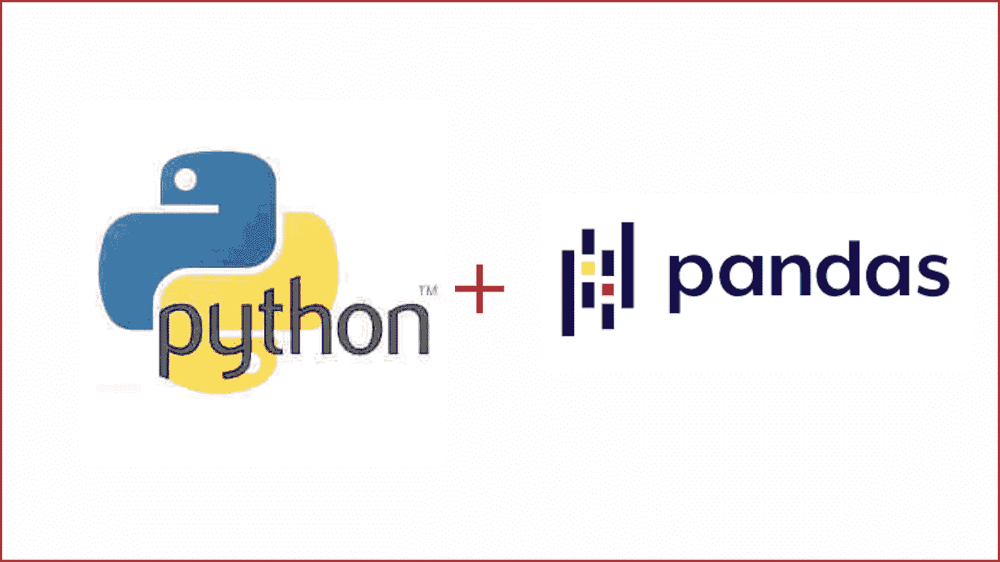

# 5 熊猫基础| Python

> 原文：<https://medium.com/analytics-vidhya/5-pandas-fundamentals-python-35ef065e19b3?source=collection_archive---------13----------------------->

毫无疑问，构建在 Python 语言之上的 Pandas 库是目前最强大的数据操作和分析工具。因此，很好地理解这个库是朝着成为更好的数据科学家、统计学家、分析师等正确方向迈出的一步。

在这篇文章中，我们将涵盖熊猫的 5 个基本要素。

# 1.合并/加入