# C++中强制使用初始化列表的 5 个地方

> 原文：<https://medium.com/analytics-vidhya/5-places-where-initializer-list-is-a-compulsion-in-c-7b0417d927d1?source=collection_archive---------20----------------------->

**初始化列表**

初始化列表用于初始化一个类的数据成员。要初始化的成员列表用 constructor 表示为逗号分隔的列表，后跟一个冒号。

语法以冒号(:)开头，然后是用逗号分隔的每个变量及其值。初始化列表不以分号结束。

**语法:**
`Constructorname(datatype value1, datatype value2):datamember{value1},datamember{value2}
{
...
}`

这里有 5 个地方，初始化列表在 c++中是强制的，你不能直接赋值给成员变量

1.  没有初始化列表，你不能初始化你的类的非静态常量数据成员

当你的类有一个常量数据成员 **_x，**时，它必须使用初始化列表来初始化，你不能在构造函数中给它赋值

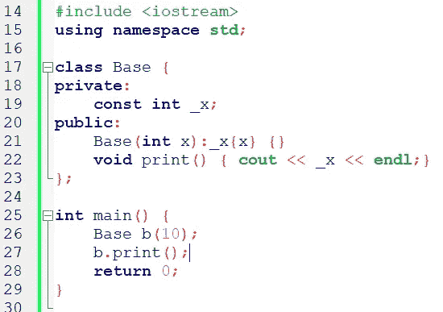

**【正确】工作正常**

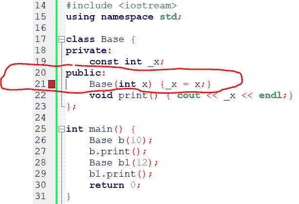

**错误:**“const int”[-fpermissive]|
|**【错误】错误:**只读成员“Base::_x”的赋值

**2。没有初始化列表**你不能初始化你的类的引用变量

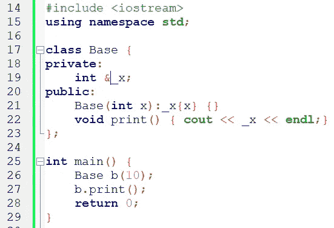

**【正确】工作正常**

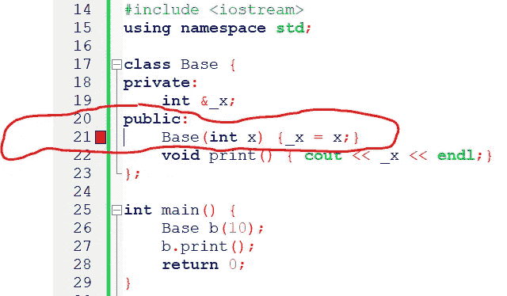

**错误:**在“int&”[-fpermissive]|

**3。如果第一个类(类一)没有自己的默认构造函数，则不能在另一个类(类二)中初始化一个类数据成员。**

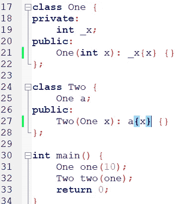

**【正确】工作正常**

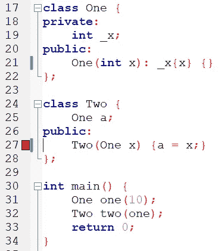

**错误:**没有用于调用“One::One()”的匹配函数|

所以在这里，当在 main()函数中调用 **Two two(one)** 时，在第 27 行:当 one 作为 class 2 构造函数的参数 x (One x)传递时，我们预计调用的是 class 1 的默认构造函数。

因为我们还没有为类一定义默认的构造函数，它抛出一个错误。

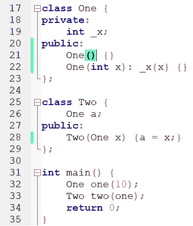

**【正确】工作正常。**像我们为类一()添加默认构造函数一样工作

**4。不使用初始化列表**就不能从子类初始化基类数据成员

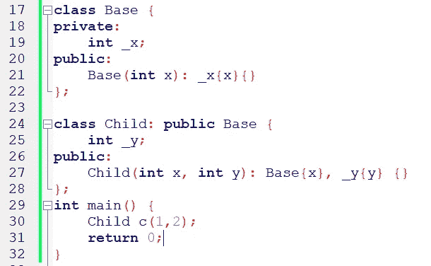

**【正确】工作正常**

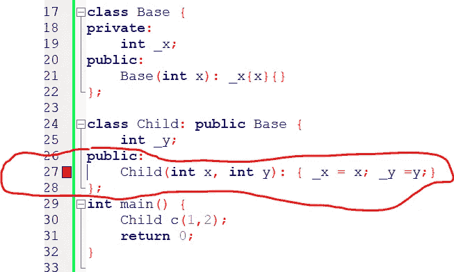

**错误:**“int Base::_ x”在此上下文中是私有的

**5。当你有与数据成员名完全相似的临时变量时，你必须使用一个初始化列表**

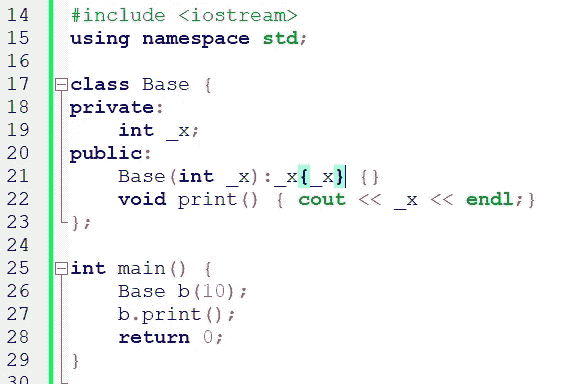

**【正确】工作正常**

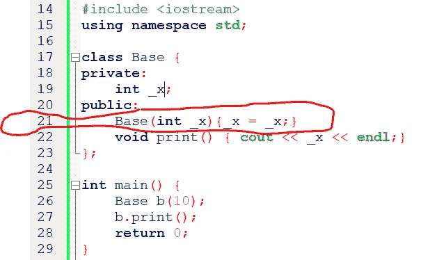

**【错误】**打印变量 _x 的随机值

感谢阅读，将相关代码上传到我的 Github 页面
[【https://github.com/MaajidKhan】](https://github.com/MaajidKhan)