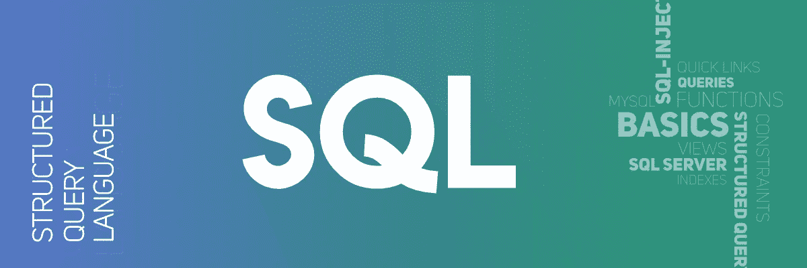

# 每个有抱负的数据科学家必须学习 SQL 的 5 个理由

> 原文：<https://medium.com/analytics-vidhya/5-reasons-every-aspiring-data-scientist-must-learn-sql-2bab007a8d76?source=collection_archive---------0----------------------->

*Francis 参加了针对数据科学的*[*SQL*](https://courses.analyticsvidhya.com/courses/structured-query-language-sql-for-data-science)*课程，并阐述了他对 SQL 在数据科学中的重要性的看法。*

随着海量数据的出现，企业和行业每天都在收集和产生数十亿的数据。大数据现象需要适当的技能组合才能理解它的意义，无论是在医疗领域、教育领域…