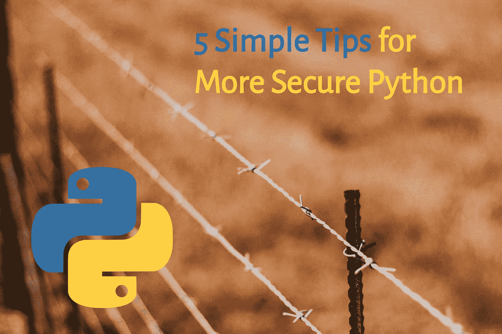

# 提高 Python 安全性的 5 个简单技巧

> 原文：<https://medium.com/analytics-vidhya/5-simple-tips-for-more-secure-python-8f116bbe4e5?source=collection_archive---------3----------------------->

## 提高 Python 安全性不一定需要大量的努力或专业知识。

韦德·兰伯特在 [Unsplash](https://unsplash.com/s/photos/security-fence?utm_source=unsplash&utm_medium=referral&utm_content=creditCopyText) 上的照片

Python 是一种非常流行的编程语言。如果你正在阅读这篇文章，很可能你已经在使用它，或者在将来的某个时候会使用它。 [Stack Overflow 的年度开发者调查](https://insights.stackoverflow.com/survey/2019#technology)发现 Python 是增长最快的主要语言…