# 5 个步骤:在 Spyder IDE 中设置 Python 虚拟环境

> 原文：<https://medium.com/analytics-vidhya/5-steps-setup-python-virtual-environment-in-spyder-ide-da151bafa337?source=collection_archive---------1----------------------->

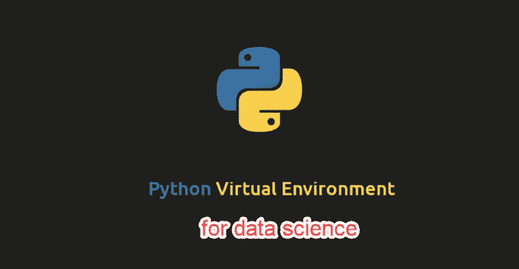

# 1.使用 pip 安装 virtualenv 包

我已经在我的机器上设置了 python 3 环境。对于 python 3，让我们用 pip 命令安装 virtualenv 包，如下所示。

*pip 安装 virtualenv*

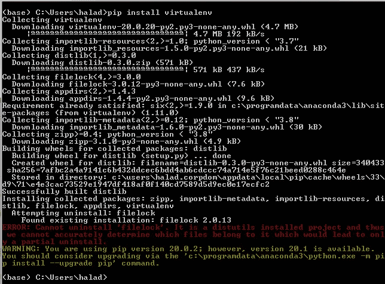

我通过使用以下不同选项重新运行相同的 pip 命令解决了上述错误:

*pip install virtualenv-ignore-installed filelock*

# 2.为您的项目创建虚拟环境

**答**安装了 virtualenv 之后，是时候为我们的项目创建一个新环境了，我们称之为“project-arima-env”

我正在使用 windows，首先让我们转到必须创建虚拟环境目录的目录。

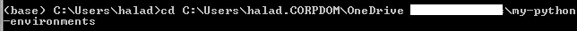

现在让我们创建一个名为“project-arima-env”的虚拟环境

*virtualenv 项目-arima-env*

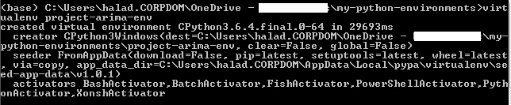

# 3.激活您的虚拟环境

创建虚拟环境后，将在运行上述 *"virtualenv"* 命令的目录下创建一个与您的虚拟环境名称相同的目录。现在是时候激活你的环境了。

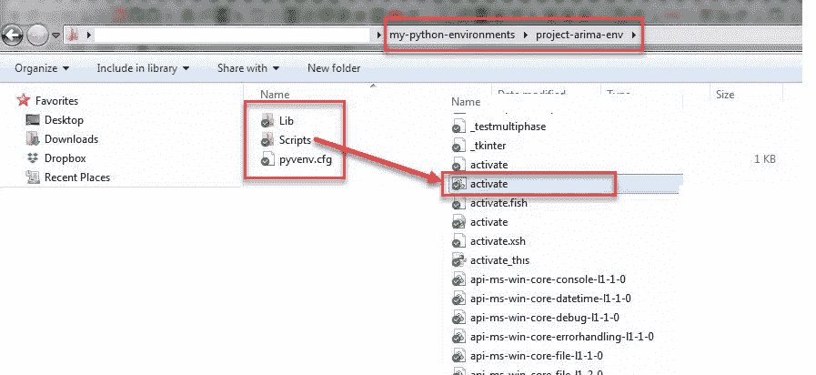

在脚本目录下，会有一个激活批处理脚本，如上图所示。运行激活批处理脚本来激活虚拟环境。

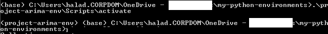

现在我的环境“project-arima-env”被激活了。

# 4.在您的环境中执行操作

你的新环境是活跃的，你可以做任何你想做的事情，去安装那些疯狂的 python 库吧，不用害怕！

我正在研究数据科学中的时间序列建模，我想执行 Auto。python 中类似于 R 包的 Arima 函数。为此，让我们在当前环境中安装**金字塔-arima** :

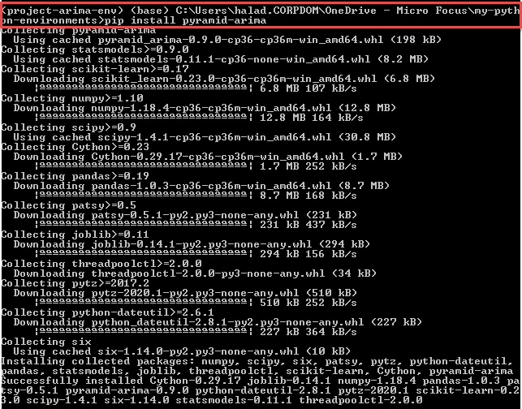

所需的包安装在我的环境中，并允许在 Spyder IDE 中执行时间序列分析。

# 5.为您的环境配置 Spyder

Spyder 是一个开源的跨平台 IDE。Python Spyder IDE 完全是用 Python 写的。它由科学家设计，专供科学家、数据分析师和工程师使用。它也被称为科学 Python 开发 IDE，具有大量显著的特性，这些特性将在本[链接](https://www.edureka.co/blog/spyder-ide/)中讨论。

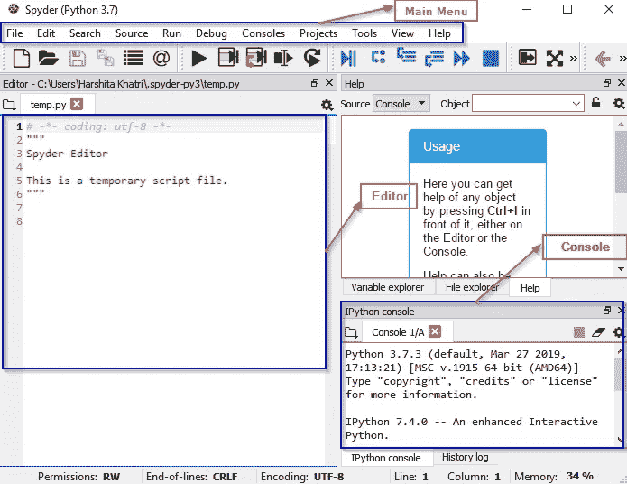

现在，我想用这个 IDE 配置我们新创建的虚拟环境。为此，在 Spyder 的顶部菜单上，单击工具→首选项

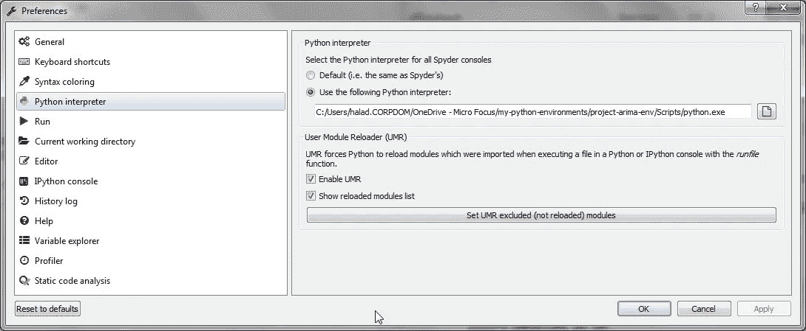

在首选项窗口中，选择 Python 解释器。现在点击“使用下面的 Python 解释器”单选按钮。

提供新创建的环境中可用的 python.exe 的路径。然后单击确定。

让我们通过导入在上一步中安装的包来测试环境。导入库之后，我们将使用 auto.arima 函数来查找最适合所选数据集的模型。在这个例子中，我们选择了澳大利亚葡萄酒制造商在 1980 年 1 月到 1994 年 8 月之间的葡萄酒销售时间序列记录。

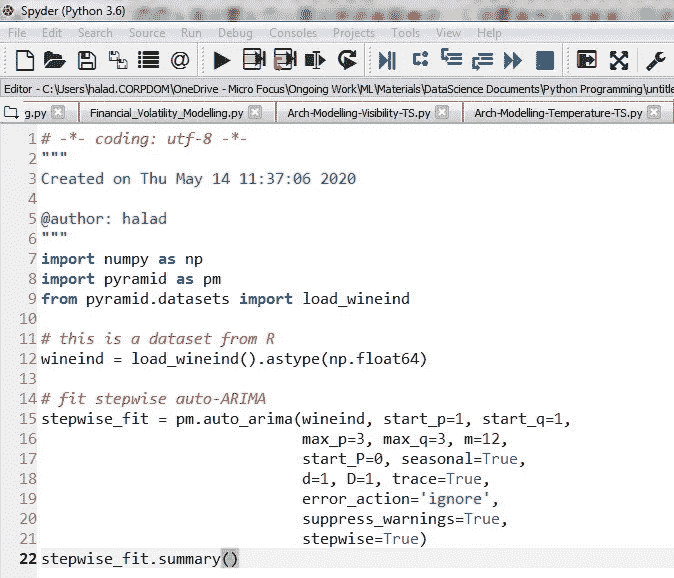

上述代码的输出如下所示。auto.arima 已尝试拟合 p=1 范围内的各种模型..3，q=1..3 和 d=1。它还考虑了季节性和非季节性因素。

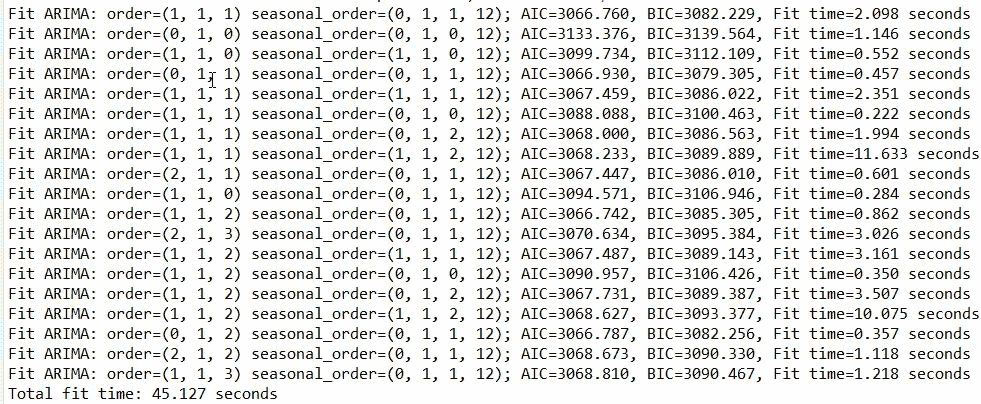

最终模型被选为该数据集的最佳模型。

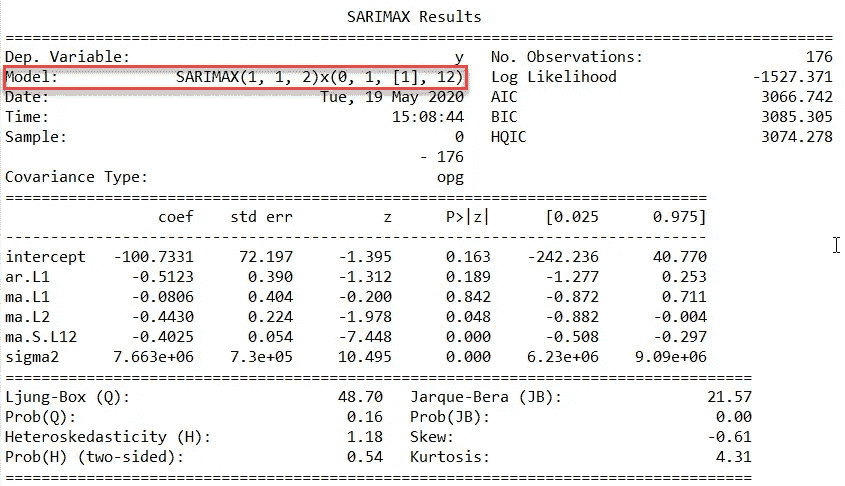

从这 5 个步骤可以清楚地看出，我们可以在 python 中为每种类型的作业创建多个虚拟环境。继续探索事物。

感谢阅读…