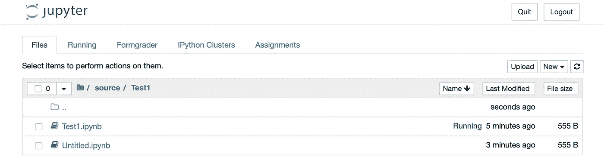

# 为您的 Jupyter 笔记本电脑自动评分的 5 个步骤

> 原文：<https://medium.com/analytics-vidhya/5-steps-to-auto-grade-your-jupyter-notebooks-nbgrader-simplified-4cbebf8943ef?source=collection_archive---------2----------------------->

比方说，你班上有 200 名学生，有 10 份试卷，每份试卷有 10 个问题。所以，20000 道题需要评分。您想要一根魔棒在一瞬间生成一个包含所有学生成绩的. csv 文件。` nbgrader `有那根魔杖'(抄袭自本文的`步骤 5 ')。

[nbgradier](https://nbgrader.readthedocs.io/en/stable/)便于在 Jupyter 笔记本上创建和评分作业。这个工具是使用笔记本的讲师的必备工具。一旦你习惯了“nbgrader ”,没有它你永远也写不出测试。然而，事实证明，如果使用不当，它会增加而不是减少你的工作量。具体来说，

*   对于初学者来说，nbgrader 可能很快变得不必要的复杂——官方文档对快速入门没有太大的启发。在下面的“步骤 2”中有更多的信息。
*   例如，如果您有 n 个以上的学生(对我来说，n=3)，那么在 nbgrader 中手动输入学生 id 会变得很乏味。

如果你以前从未听说过 nbgrader，或者你想知道自动给 jupyter 笔记本评分意味着什么，你可能会发现先看看这个介绍 nbgrader 核心功能的[官方视频](https://youtu.be/5WUm0QuJdFw)会很有用。

> *在这里，我将更多地关注如何快速上手 nbgrader，并尽可能多地实现自动化。*

对于一个 150 人的班级来说，以下 5 个步骤对我来说是最有效的——最省时省力。但是，我经历了惨痛的教训。

# 第一步:

## 安装 nbgrader(最好在虚拟环境中)

假设你已经安装了 jupyter。

*   使用 conda(推荐):

“康达安装-康达锻造分级器”

*   或者使用画中画:

` pip 安装 nbgrader

成功安装后，当您从该虚拟环境启动任何笔记本电脑时,“Formgrader”的扩展将出现在顶部。



# 第二步

## 创建您的课程

1.  您在终端中的当前路径应该是您想要存储课程材料的位置。然后，在终端/cmd 中运行以下命令:

` nb 年级快速入门课程 _id

上面的命令将为您创建一个名为‘course _ id’的课程目录以及其他必要的文件。

2.现在，将路径设置为新创建的目录“course_id”。通过以下方式发布 jupyter 笔记本:

jupyter 笔记本

事实证明，对于它的大部分功能，nbgrader 在很大程度上依赖于某种层次结构(见下图)。错过第一步(例如，从任意目录启动笔记本会带来不必要的复杂性)将违反该结构，并且你将浪费数小时来弄清楚为什么使用“Formgrader”创建的作业没有保存在例如“course_id/source”目录中。

## “步骤 2”的成就:

通过执行步骤 2，将自动创建以下分层结构。花一些时间来理解这种结构是值得的。并不是这个结构中的所有文件都与我们有关。官方哲学中有更多关于这方面的内容。


# 第三步

## 在数据库中自动添加学生 id

用 student _ ids 填充数据库(也可以选择姓名)。假设所有学生的 id 都在一个. txt 文件中。确保你的。txt 文件包含唯一的学生 id。

```
import pandas as pd
from nbgrader.api import Gradebook# Create the connection to the database
with Gradebook('sqlite:///gradebook.db') as gb:
    path_of_file_holding_student_ids =  '../student_ids.txt'
    # read the txt file
    with open(path_of_file_holding_student_ids) as f:
        # extract ids in a list.
        student_ids = [word.strip() for line in f.readlines() for          word in line.split(',') if word.strip()]
        # populate database with ids
        for _id in student_ids:
            gb.add_student(_id)
```

**自定义文件读取:**

下面的代码部分(从上面复制的)只是将 students _ ids 从 txt 文件读入一个列表。为了满足您的需求，您可以对其进行相应的修改。例如，如果您的文件是不同的格式/样式。

```
with open(path_of_file_holding_student_ids) as f:
        # extract ids in a list.
        student_ids = [word.strip() for line in f.readlines() for word in line.split(',') if word.strip()]
```

现在，从您的笔记本中，单击“form graderer ”,然后单击“Manage Students ”,您新添加的学生应该会出现在那里，如下所示:


暂时忽略“总分”。在底部，注意手动“+添加新学生…”如果你有很多学生，这将很快变得乏味。

***`本笔记本中的所有代码都应在“course_id”目录下执行。`***

# 第四步

## 创建分配:

安装后，可使用“formgrader”扩展。点击它，然后点击`+添加新任务`。说出你的作业。在其中创建一个新笔记本。然后，笔记本打开后，在工具栏顶部点击“查看”->“单元格工具栏”->“创建作业”(见下图)。关于介绍“nbgrader”核心功能的[官方视频](https://youtu.be/5WUm0QuJdFwhttps://youtu.be/5WUm0QuJdFw)和[文档](https://nbgrader.readthedocs.io/en/stable/index.html)已经用具体的例子很好地向您介绍了这一点，所以我不会进一步展开。


# 第五步

## 亲笔签名的作业

比方说，你的班上有 200 名学生，有 10 个测试，每个测试有 10 个问题。所以，20000 道题需要评分。你想用魔法棒为所有学生生成一个. csv 文件，这是你如何使用它:

***将学生提交的内容放在一个名为“已提交:*** 的目录中

```
import shutil
import os"Move submissions to a dir called `submitted` directory. So, nbgrader can recognize them for grading."# Path of directory containing students submissions initially (arbitrary dir)
arbit_dir = 'arbitrary/'### First Create a dir called 'submitted` in course_id dir
os.mkdir('submitted')
subm_dir = 'submitted/'# Get files in arbitrary dir containing students submissions
files = os.listdir(arbit_dir)# Move all files (submissions) from arbitrary directory to submitted dir
for f in files:
    shutil.move(arbit_dir+f, subm_dir)
```

***对每个作业评分，生成一个包含所有评分的. csv 文件:***

```
import os## Grading the whole course work i.e. all assignments released.
from nbgrader.apps import NbGraderAPIapi = NbGraderAPI()
# Get names of all assignments (e.g. if 5 assignments were released so far, return 5 names)
all_assignments_names = api.get_source_assignments()# Grade each assignment
for assignment_name in all_assignments_names:
    command = "nbgrader autograde '%s'" % assignment_name
    os.system(command)# Get grades in a csv file 
os.system("nbgrader export")
```

如果使用不当，你可能会浪费更多的能量。

(以下。csv 文件将在“眨眼之间”创建。我没有为亲笔签名写任何“提交文件”,所以你通常会看到 0 分。但是，这说明了一点。)


## 关于“提交目录”和层次结构的更多信息:

你将在一个任意的目录中收集学生提交的材料(以某种方式使用 LMS 或通过电子邮件等)，但 nbgrader 无法在那里找到它们。观察下面的层次结构:


`nbgrader`将只检测那些提交的内容，如果它们在`submitted`目录中，最终对它们进行评分，而这个目录本身应该在`course_id`目录中。这就是为什么在`step5`中的第一个 snipped 会移动`submitted`目录中的文件。此外，假设每个学生提交的内容都是这样组织的:

``{student_id}**/**{assignment_id}**/**{notebook_id}.ipynb`

其中:

*   student_id(一个目录)对应于学生的唯一 id，例如 studendid1(与数据库- `Step3`中的相同)。
*   assignment_id(目录)对应于分配的唯一名称，例如 Test1。
*   notebook_id (an。ipynb 文件)对应于任务中笔记本的名称，例如 logistic_reg.ipynb。

*这是包括在内的最少电池，您需要使用* `*nbgrader*` *来增强您的学习和教学体验。* `*nbgrader*` *提供了更多的功能——例如，可以选择进行* [*手动评分*](https://nbgrader.readthedocs.io/en/stable/user_guide/creating_and_grading_assignments.html?highlight=manual%20grading#manual-grading) *，如何编写* [*好的测试*](https://nbgrader.readthedocs.io/en/stable/user_guide/autograding_resources.html?highlight=good%20test#tips-for-writing-good-test-cases) *，以及*[*JupyterHub*](https://jupyter.org/hub)*(如果您在本地机器上使用 nbgrader，我认为这些功能在本文中是多余的。)*