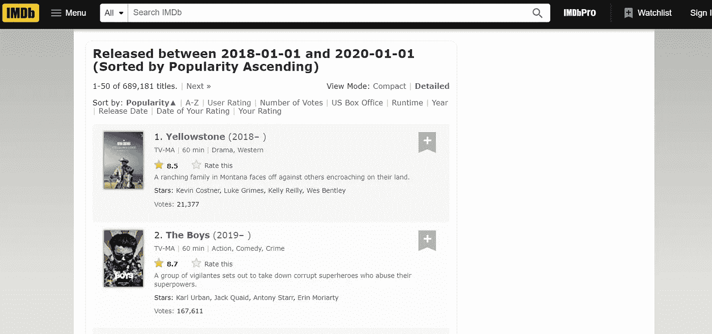
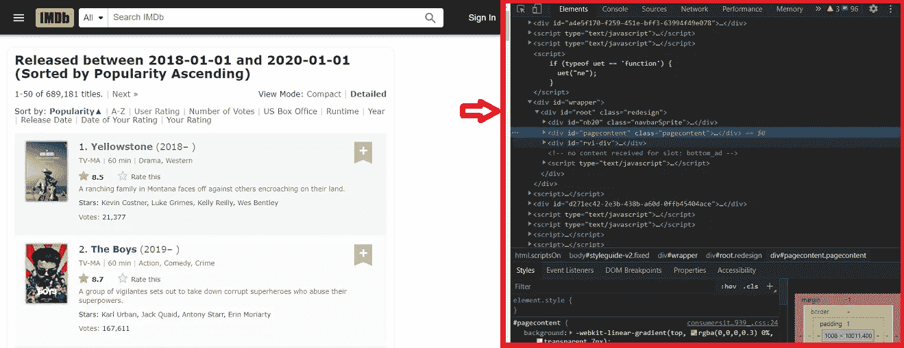
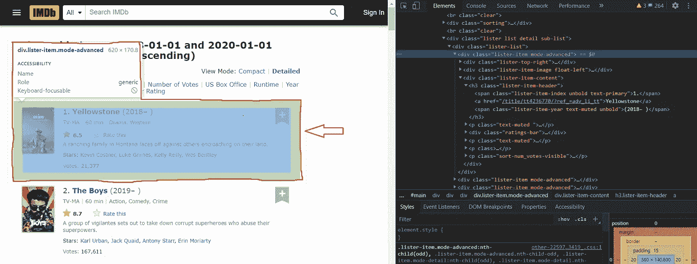
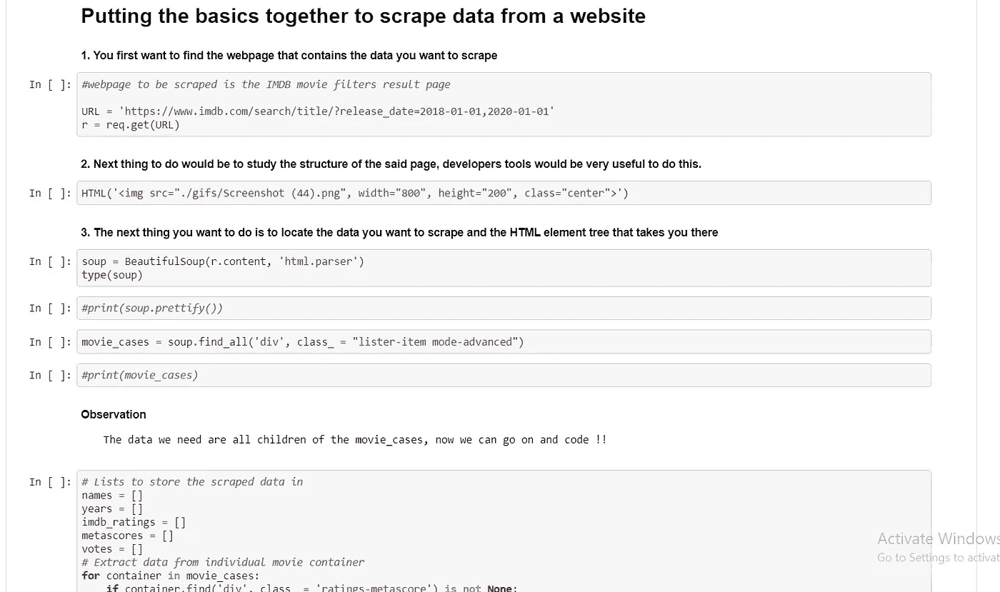

# 轻松抓取网页的 5 个步骤

> 原文：<https://medium.com/analytics-vidhya/5-steps-to-easy-web-scraping-17d063824c41?source=collection_archive---------17----------------------->

托马斯·毕晓普在 [Unsplash](https://unsplash.com?utm_source=medium&utm_medium=referral) 上的照片

什么是网页抓取？我如何抓取网页？抓取网页用的工具有哪些？这些是有抱负的数据分析师、数据科学家、数据工程师和数据从业者一直在问的问题。这篇文章将提供简单、实用和可行的解释，解释什么是 web scraping，以及如何在 python 中通过 5 个简单的步骤执行 web scraping。

让我们开始吧:

# 什么是网页抓取？

网络抓取是指检索存储在网站上的数据的过程。如果你曾经去过一个网站收集关于某个特定主题的数据，你就已经浏览过了。然而，手动去搜索引擎下载你从“猫的图像”查询中得到的所有结果是非常乏味和耗时的。当您需要收集大量数据时，您用来收集这些数据的过程可以自动化，例如您的“猫的图像”查询的结果。

网络抓取是一个从网站上自动获取信息的过程的名称。Web 抓取被认为是一项令人生畏的任务，只能由高级程序员通过无数行代码来完成，这种假设是不准确的。虽然，抓取一个网站需要你有一个编码背景，但使用 python、request、BeautifulSoup、selenium 和许多其他工具，这项任务相对容易。文本数据、图像文件、视频文件都可以通过网络抓取来检索。

现在我们知道了什么是网络抓取，那么我们到底是如何抓取网页的呢？

注意，本文中使用的代码由[在此](https://github.com/josephdickson11/web_scrapers.git)提供

 [## josephdickson11/web_scrapers

### 一个在网上抓取数据的 repo。通过在…上创建帐户，为 josephdickson11/web_scrapers 的发展做出贡献

github.com](https://github.com/josephdickson11/web_scrapers.git) 

# 如何抓取网页？

以下是使用 python 抓取网页的 5 个简单步骤:

**1 —识别想要的网页**:识别包含想要检索的数据的网页是 web 抓取的第一步。例如，如果您想要检索 2018 年至 2020 年发行的电影的评级和流派，您可以从 IMDB [网站](https://www.imdb.com/search/title/?release_date=2018-01-01,2020-01-01)获取这些数据。直接进入网站，将搜索查询上的过滤器设置为所需的输出，web 引擎将显示所有需要的数据。你从这里去哪里？

**2 —研究网页的结构:**这一步，你需要查看页面的源代码，研究 html 元素。现代网络浏览器中有内置工具，使用户能够与网页的后端进行交互。在 Chrome 中，你只需右击网页上的任何地方，然后点击“查看网页源代码”或“检查”,这将启动开发者控制台，让你访问网页后端。

**3 —定位数据和 HTML 元素树**:在仔细研究了网页的结构之后，你应该能够确定你想要检索的实际数据的位置。另一种方法是简单地移动光标到你想要的数据的位置，右击并点击“inspect ”,这将把你直接带到包含 html 元素的标签。现在我们已经找到了想要的数据，我们可以继续编写有效的代码来获取数据。

**4 —编写检索数据的代码**:你差不多完成了，现在自动化从一到三的所有步骤，在其他方面要做到这一点，你必须熟悉用于网页抓取的工具；

**网页抓取工具**

有几个 python 模块可以用来抓取网站。这些模块包括 Request、BeautifulSoup、Selenium、Scrapy 和许多其他模块。就本课程而言，重点将放在“要求”和“美丽的组合”上，因为它们都足以实现我们的目标。

1.  **Request:** Request 是一个 python 模块，支持用户使用 python 代码发送 GET、POST 等 HTTP 请求。该模块预装在 python 基本环境中，并提供了诸如 cookies 会话、多部分文件上传、流式下载、连接超时等功能。
2.  **beautiful soup:**beautiful soup 一个本机模块，使 python 能够解析通过 request get 方法检索的 HTML 和 XML 文档。该模块需要用 pip install beautifulsoup4 命令安装后才能使用。[这里可以看到一些提供的功能](https://github.com/josephdickson11/web_scrapers.git)

现在我们有了工具，我们可以使用它们并编写代码了！

**5。存储检索到的数据:**现在已经有了数据，可以用任何想要的格式存储数据。出于本文的目的，数据将存储在 pandas 数据框架中。

请随时对文章提出反馈。对模糊的概念提出问题，我们将非常感谢您的建议