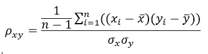
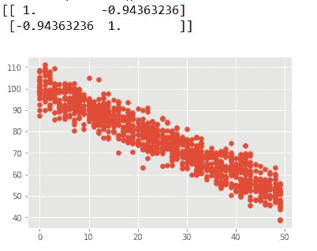

# 5 个步骤:了解协变和相关性

> 原文：<https://medium.com/analytics-vidhya/5-steps-to-get-an-understanding-on-co-variance-and-correlation-60c94f19a556?source=collection_archive---------4----------------------->


***随着树木数量的减少，全球变暖加剧。*** 在这个说法中，有 2 个变量，一个是树木的数量，另一个是全球变暖。它们相互关联，使得它们在统计上相互依赖。为了测量这些统计变量之间的关联，我们需要数学工具。

有了这个介绍，我在这里写一个小故事，以获得对协变和相关性的理解。

# 1.我们开始吧

让我从一个简单的问题开始，两个数字 5 和 6 有什么相似之处。为了回答这个问题，即使这两个数在数轴上是连续的，我们也必须研究它们的性质。数字 5 是奇数和质数，而数字 6 是偶数，因数是 2 和 3。这得出结论，这两个数字彼此不相似。

现在让我在上面的情况上再加 2 个数字。那么[5，3]和[6，2]有什么相似之处呢。现在它们不仅仅是数字，而是列表。我在讨论中必须考虑的性质是均值、方差和标准差。

```
import numpy as npx = np.array([5,3])
y = np.array([6,2])print("Mean(x)=",x.mean(), "Mean(y)=",y.mean())
print("Variance(x)=",x.var(), "Variance(y)=",y.var())
print("SD(x)=",x.std(), "SD(y)=",y.std())
```

下面是代码的输出:

均值(x)= 4.0 均值(y)= 4.0
方差(x)= 1.0 方差(y)= 4.0
SD(x)= 1.0 SD(y)= 2.0

这些列表中的每一个都具有相同的平均值，即 4.0。然而，他们有不同的偏离标准。随着标准差越大，数据越分散。在这种情况下，第二个列表数据比第一个更分散。

# 2.理解线性关系

等式 **y=2x+c** 是线性的，x 和 y 变量之间的关系也是线性的。线性关系是指一个变量增加或减少 n 倍会导致另一个变量相应增加或减少 n 倍。简单地说，如果你将一个变量加倍，另一个也会加倍。

协方差决定了两个变量之间线性关系的方向。所以方向可以是正的，负的和零。


在下面的例子中，有 6 个数据点，并以表格形式计算协方差。结果是 130.2，表明正线性关系。


下图是上述数据点的散点图。它表明了线性关系及其正方向。


# 3.比较协方差

以上面的例子为例，再增加一个特性。让我们计算(x，y)和(x，z)的协方差。


协方差(x，z) = 5910.8，这是一个比协方差(x，y) = 130.2 大得多的值。

这是否意味着，两个属性 x 和 z 比 x 和 y 有更好的线性关系？

为了回答这个问题，让我列出几点—

*   协方差是 2 个单位的乘积，因此，它的单位变成了单位的乘积。(x，y)和(x，z)的协方差有不同的单位。所以两者对比没有意义。这就像比较两个以英里和公里为单位的距离。当然，在比较之前，他们需要一个转换。
*   我们怎样才能把两个单位的产品提高到同样的规模？。我们可以通过将它们除以 2 个单位的相同乘积，很容易地使它们的单位变小。这可以通过将协方差除以标准差来实现。例如，协方差(x，y)除以 sd(x)和 sd(y)，如下所示。sd(x)和(xi-x_bar)有相同的单位。sd(y)和(yi-y_bar)具有相同的单位。


让我们回到我们的例子，计算 x，y 和 z 的标准偏差。


现在将(x，y)和(x，z)的协方差除以标准偏差，如下所示。


现在结果回答了我们之前的问题。属性对(x，y)比属性对(x，z)具有更好的正线性关系。与其说更好，不如说更强。

*将数据集标准化，然后只比较协方差，以了解线性关系的强度和方向，这样如何？。*

请评论你的想法。

# 4.相互关系

在数据科学的大部分时间里，相关系数默认取为皮尔逊积矩相关系数。通常，在统计学中，有四种相关类型:皮尔逊相关、肯德尔秩相关、斯皮尔曼相关和点双列相关。在这个故事中，我们只讨论皮尔逊相关性。

相关性是协变的标准化形式，用每个变量的标准差除以协变。在上一步中，我们将协方差(x，y)除以 sd(x)和 sd(y)得到**相关系数**。



如上所述，相关系数是无单位的，其范围在 1 至+1 之间。它用于发现属性之间的关系有多强。这些公式返回一个介于-1 和 1 之间的值，其中:

*   +1 表示强正相关。
*   -1 表示强烈的负面关系。
*   0 表示完全没有关系。


值为 1 表示两个变量之间的完美关联程度。随着相关系数值趋向于 0，两个变量之间的关系将变弱。

# 5.Python 中相关性的实现

让我们举几个例子来加深理解。在下面的代码中，我生成两个随机数组并计算相关系数。

```
import numpy as np
import matplotlib
import matplotlib.pyplot as plt
matplotlib.style.use('ggplot')np.random.seed(1)x = np.random.randint(0,50,1000)
y = x + np.random.normal(0,10,1000)print(np.corrcoef(x,y))plt.scatter(x, y)
plt.show()
```

输出显示 x 和 y 之间的线性关系更强，并且是正向的。


在下面的代码中，我生成了随机数组，一个增加，另一个减少。

```
import numpy as np
import matplotlib
import matplotlib.pyplot as plt
matplotlib.style.use('ggplot')np.random.seed(1)x = np.random.randint(0, 50, 1000)
y = 100 - x + np.random.normal(0, 5, 1000)print(np.corrcoef(x,y))plt.scatter(x, y)
plt.show()
```

输出显示 x 和 y 之间的线性关系更强，并且是负向的。



在下面的代码中，我生成了随机数组，因为两者之间没有线性关系。

```
import numpy as np
import matplotlib
import matplotlib.pyplot as plt
matplotlib.style.use('ggplot')np.random.seed(1)x = np.random.randint(0, 50, 1000)
y = np.random.randint(0, 50, 1000)np.corrcoef(x, y)print(np.corrcoef(x,y))plt.scatter(x, y)
plt.show()
```

输出显示 x 和 y 之间没有线性关系。


## 相关矩阵

相关矩阵是显示变量之间相关系数的表格。相关矩阵用于汇总数据，作为更高级分析的输入，以及作为高级分析的诊断。

让我们计算上述数据集的相关矩阵，该数据集具有 3 个属性，即 x、y 和 z。

```
import pandas as pd
dataframe = pd.DataFrame({'X' : [192, 218, 197, 192, 198, 191],
                          'Y' : [218, 251, 221, 219, 223, 218],
                          'Z' : [6200, 5777, 4888, 4983, 5888, 2000]})
print(dataframe.corr())
```

相关矩阵打印如下:


我们还可以绘制相关矩阵如下:

```
import pandas as pd
dataframe = pd.DataFrame({'X' : [192, 218, 197, 192, 198, 191],
                          'Y' : [218, 251, 221, 219, 223, 218],
                          'Z' : [6200, 5777, 4888, 4983, 5888, 2000]})
plt.matshow(dataframe.corr())
plt.xticks(range(len(dataframe.columns)), dataframe.columns)
plt.yticks(range(len(dataframe.columns)), dataframe.columns)
plt.colorbar()
plt.show()
```

这是输出—


# 结论

在数据分析中，尤其是在回归分析中，相关性是最有用和最广泛使用的统计概念。相关性只解释了线性关系的强度和方向，并没有解释变量之间的因果关系。它没有解释哪个变量是原因，哪个是结果。
关联提供数据汇总统计，从这里开始了解数据中关系的完整故事。

> 如果你喜欢这篇文章，请跟我来鼓励我，不要忘记鼓掌。如果你有任何问题，请在此之前写下评论，祝你学习愉快。