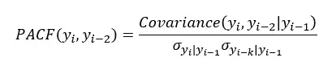

# 5 个步骤:了解相关、自相关和部分自相关

> 原文：<https://medium.com/analytics-vidhya/5-steps-to-get-an-understanding-on-correlation-auto-correlation-and-partial-auto-correlation-e71f6b4bba81?source=collection_archive---------3----------------------->


在我的上一个[故事](/analytics-vidhya/5-steps-to-get-an-understanding-on-co-variance-and-correlation-60c94f19a556)中，我试图解释协方差和相关性的概念。在这个故事中，让我们理解自相关和偏相关的概念。

我们将相关性定义为确定两个变量之间关系方向的标准版本的协方差。**到目前为止，相关性在双变量分析中增加了一个分析值，那么当我们有单变量数据时呢？**

# 1.单变量描述统计

描述性统计提供了样本中数据的汇总视图或描述。在单变量描述性统计中，我们对数据集中单个变量的描述性统计更感兴趣。描述性统计使用集中趋势度量和分散度量来提供数据集的描述。

让我们考虑一个样本温度数据集，每个数据样本以规则的时间间隔收集。这种数据集是单变量时间序列数据。以下屏幕截图显示了 eviews 软件工具中导入的数据集及其描述性统计数据。


在图中，您可以观察到，一个变量有 10 个观察值，它提供了集中趋势统计的度量，如平均值、中值、最大值、最小值等。它还提供了离差的标准，偏差，偏度和峰度的措施。偏度和峰度是解释数据分布的重要描述性统计量。偏度衡量分布的“侧面性”或对称性，峰度衡量分布的“尾部性”。

*当我们有上述单变量时间序列数据时，描述性统计不会给出我们在时间 t 观察到的值如何依赖于过去观察到的或没有观察到的数据的想法。所以我们需要一些更特殊的统计数据来理解现在和过去的观察值之间的依赖关系。*

# 2.ACF —自相关函数

自相关也被称为序列相关。这种类型的相关性用于理解时间序列观测值如何依赖于先前时间的相同序列的值。序列中过去的观测值称为滞后。


在上述数据集中，第一列是原始数据时间序列，第二列是一个一步移位的原始数据时间序列，称为原始数据的滞后 1 时间序列数据。这个 Lag-1 序列的长度将比原始时间序列少 1。

让我们看看计算 ACF 的数学公式。首先计算 X 和 Y 时间序列之间的相关系数，然后将其扩展到计算同一时间序列之间的相关性。


现在，我们计算滞后 1 的 ACF，我们可以同样扩展相同的公式来推广滞后项。


ACF(Lk)的值称为滞后 k 时的自相关系数。样本自相关 ACF(Lk)与 k(时滞)的关系图称为相关图或自相关图。

相关图是检查数据集中随机性的常用工具。这种随机性是通过计算不同时间滞后的数据值的自相关来确定的。如果是随机的，这种自相关对于任何和所有的时滞分离应该接近于零。如果是非随机的，那么一个或多个自相关将明显非零。

# 3.计算 ACF

让我们为上述温度数据集计算滞后 1 的 ACF。我用下面的步骤来计算 ACF。


**ACF(滞后 K = 1)**
1。计算原始数据时间序列的平均值
2。计算所有观察值的原始数据和平均值之间的差异
3。平方(2)步骤
4 的输出。计算所有观察值的原始数据和平均值之间的平方差总和
5。计算滞后 1 系列和(n-k)个观察值的平均值之间的差异
6。计算(2)和(5)的输出之间的乘积
7。计算步骤(6)
8 的输出总和。滞后 1 的 ACF =输出(6) /输出(4)

让我们比较一下用 Eviews 软件对滞后 1 的输出的 ACF 计算。下面的屏幕截图显示了上述时间序列数据的相关图。


我们计算的滞后 1 的 ACF 值为 0.4099，Eviews 输出为 0.410。

# 4.ACVF —自协方差函数

对于给定的随机过程，自协方差是一个函数，它给出了该过程在成对时间点上与其自身的协方差。设 Y 为数据序列，每隔一定时间收集一次观察值。Y 的期望值为μ=E[Y]。从 Y 的每个观测值中减去μ，得到 z。


将向量 Z 乘以 Z 转置，得到如下的(N×N)矩阵。


所以上面矩阵的期望给出了协方差矩阵。


E[Z Tran(Z)]矩阵是一个方差-协方差矩阵，它是一个包含与几个变量相关的方差和协方差的方阵。矩阵的对角线元素包含变量的方差，非对角线元素包含所有可能的变量对之间的协方差。

时间序列在滞后 k 处的自协方差函数(ACVF)定义如下


很容易从方差-协方差矩阵中计算出各种滞后的 ACVF。在矩阵中，主对角线上的值是 *s* 0，主对角线上下对角线上的值是 *s* 1。两个单位之外的对角线上的值是 *s* 2 等等。

让我们计算温度数据集的自协方差函数(ACVF)。这里我写了一个简单的 python 代码来计算方差-协方差矩阵。

```
data = [23.2,23.6,25.3,25.2,25.1,25.6,24.6,24.6,23.9,24.1]
# Create a Matrix Z for the data set
Z = np.array(data)# Compute the Mean and substract it from the data
mean = Z.mean()
Z = Z - mean# Transpose the Z matrix and perform the mat multiplication Z and Z_Dash
Z_Dash = np.transpose(Z)R = np.dot(Z[:,None],Z_Dash[None,:])
```

输出如下所示:


从上面的 8×8 矩阵，让我们计算自动协方差函数(ACVF)值。以下简单的 python 代码生成了这些值。

```
l = len(data)
slist = []
for i in range(0,l) :
    s = 0
    for j in range(0,l-i) :
        s = s + R[j+i][j]
    slist.append(s)
```

生成的 ACVF 值存储在`slist`列表中。这里是`slist`的输出。


# 5.PACF —偏自相关函数

我们将自相关函数理解为“当前时间的观测值与之前时间的观测值之间的相关性”。假设我们认为当前时间的观测值和先前时间的观测值都与其他时间的观测值相关，则偏自相关函数 PACF 也是这两个观测值之间的相关。
例如，今天 12 月 31 日的股价可以与 29 日的股价相关，昨天 12 月 30 日的股价也可以与 29 日的股价相关，那么昨天 12 月 30 日股价的 PACF 就是剔除 29 日股价的影响后，今天 12 月 31 日与 12 月 30 日的真实相关性。


再考虑一个例子。假设输入变量为 x1、x2 和 x3，输出变量为 y。y 和 x3 之间的偏自相关函数 PACF 是变量 y 和 x3 之间的相关性，其确定考虑了 y 和 x3 与 x1 和 x2 的关系。

为了理解 y 和 x3 如何与 x1 和 x2 相关，执行如下两个回归—
1。回归-根据 x1 和 x2 预测 y。
2。回归-根据 x1 和 x2 预测 x3

每次回归都有一个残差被遗漏。输入变量 x1 和 x2 不能解释残差。取这两个残差之间的相关将给出 y 和 x3 变量之间的部分相关。


# 6.计算 PACF

对于上面的温度数据集，让我们计算滞后 2 的 PACF。现在我们必须解决下面的方程。



在这里，我按照尤尔-沃克方程的方法来计算 PACF 值。在高层次上，该方法如下所示。


我写了一个简单的 python 代码来计算各种滞后的 PACF。让我们计算 Lag2 的 PACF，并与 eviews 的输出进行比较。

```
lag = 2
acvf_lags = slist[1:lag+1]
mat = np.zeros((lag, lag))for i in range(0,lag) :
    for j in range(0,lag-i) :
        mat[j+i][j] = slist[i]
        mat[j][j+i] = slist[i]

ainv = np.linalg.inv(mat)result = np.matmul(ainv,acvf_lags)
```

在上面的代码中，我正在计算自协方差矩阵的逆矩阵和 acvf 值之间的矩阵乘法。矩阵乘法的输出如下。


最低值-0.289 是 PACF(2)。eviews 的输出也是一样的-0.290。类似地，可以计算各种滞后的 PACF。

# 结论

协方差、相关性、自协方差、自相关和偏相关是数据分析中的重要主题，需要很好地理解。它们在时间序列分析中也起着关键作用。