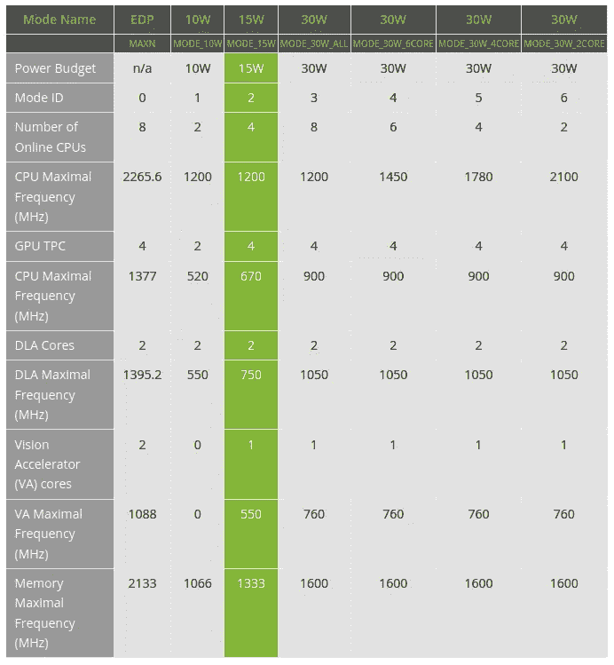

# 在边缘计算机上工作时要知道的 5 件事— NVIDIA Xavier

> 原文：<https://medium.com/analytics-vidhya/5-things-to-know-when-working-on-edge-computer-nvidia-xavier-620bdd5a60bf?source=collection_archive---------16----------------------->

[背包工作室](https://unsplash.com/@backpackstudio?utm_source=medium&utm_medium=referral)在 [Unsplash](https://unsplash.com?utm_source=medium&utm_medium=referral) 拍摄的照片

# **什么是边缘计算？**

**边缘计算**是在数据源或其附近进行的计算，而不是依靠数据中心的云来完成所有工作。

*这并不意味着云会消失。意味着云向你走来。*

# **我们为什么需要边缘计算？**

边缘计算使数据和计算更接近实际需要的地方。目前使用的另一种替代方法是云计算，这种方法不经济，而且可能会有延迟。也总是有安全因素。

**NVIDIA Xavier** 是 NVIDIA Jetson 系列的嵌入式计算板。

*   CPU: Nvidia 定制 Carmel arm 8.2-A(64 位)，8 核 10 宽超标量
*   GPU:基于 Volta 的 512 CUDAcores，1.4 TFLOPS
*   20 TOPS DL 和 160 SPECint @ 20w；
    30 TOPS DL @ 30 W(TOPS DL =深度学习 Tera-Ops)
    ***(我在第 5 点已经提到过关于 TOPS)***
*   1.6 毫米 PVA 单元(可编程视觉加速器，用于立体视差/光流/图像处理)
*   1 和 10 千兆位/秒以太网

以下是使用 NVIDIA XAVIER AGX 开发套件时需要记住的几点。

# 1.安全性和隐私

使用边缘计算机的全部目的是在尽可能靠近源代码的地方运行系统。这使得系统更加安全。

鉴于边缘计算提供的安全优势，它提供更好的可靠性也就不足为奇了。

边缘数据可能会很麻烦，尤其是当它由不同的设备处理时，这些设备可能不如集中式或基于云的系统安全。

随着物联网设备数量的增长，这些设备存在潜在的安全问题。为了确保这一点，我们需要确保数据被加密，正确的访问控制方法，甚至利用 VPN 隧道。

# **2。远程连接**

在某些情况下，我们可能希望远程维护或管理部署的系统，或者在不同的物联网设备使用来自同一边缘设备的数据的情况下拥有边缘分布式数据。

Xavier 没有**内置** **WiFi** 模块。我们可以通过以太网或连接 WiFi 加密狗来连接互联网。除此之外，NVIDIA Xavier 还有用于插入 WiFi 卡的 **M2 连接器**。

# **3。等待时间**

延迟是衡量数据包从起始点到目的地需要多长时间的指标。距离是决定延迟的关键因素之一。

那是因为数据仍然受到物理定律的约束，不能超过光速。无论连接速度有多快，数据仍必须以物理方式传输该距离，这需要时间。

通过将关键处理任务放在离最终用户更近的地方，边缘计算可以提供更快的速度。物联网设备提供了一种将这些任务推到网络边缘的方式。

# **4。冷却**

Xavier AGX 在不同的模式下工作。它支持 10W、15W、30W 等三种不同的电源模式。对于每种模式，都可能有多种配置，包括各种 CPU 和 GPU 频率以及在线内核数量。

电源模式

请注意，通过将电源模式设置为**，MAXN** 会将您的系统使用到**满负荷**。

要更改电源模式:
**$ sudo/usr/sbin/nvp model-m<电源模式 ID >**

显示当前电源模式: **$ sudo/usr/sbin/nvp model-q**

您也可以使用命令 **sudo jetson_clocks** 来启动 fan。请注意，这将使风扇以最大速度运转。

# 5.人工智能性能

人工智能算法需要大量的处理能力，这就是为什么大多数算法都通过云服务运行。能够处理边缘处理的人工智能芯片组的增长将允许在需要即时计算的应用程序中实现更好的实时响应。

Jetson Xavier 提供高达 **21 TOPS** ，是嵌入式和边缘系统中高性能计算和人工智能的理想选择。

**什么是上衣？**

它意味着每秒万亿或万亿次运算。它主要是衡量可实现的最大吞吐量，而不是衡量实际吞吐量。大部分运算都是 MAC(乘/累加)，所以
**TOPS =(MAC 单元数)x(MAC 运算频率)x 2**

凭借超过 51GB/s 的内存带宽、视频编码和解码，这些特性使 Jetson Xavier 成为并行运行多个现代神经网络的首选平台**并同时处理来自多个传感器的高分辨率数据。**

**你可以在这里 找到杰特森泽维尔 [**的规格。**](https://www.nvidia.com/en-in/autonomous-machines/embedded-systems/jetson-xavier-nx/#:~:text=Powerful%2021%20TOPs%20AI%20Performance,Learning%20Accelerators%20(NVDLA)%20engines.)**

> **我是一名电子和电信工程师。我发现数据科学很迷人，这就是为什么我决定学习机器学习和大数据分析，最近开始作为人工智能工程师工作。希望能为这个不断成长的数据科学社会做点贡献。你可以在 [**LinkedIn**](https://www.linkedin.com/in/anuja-ihare-a5b622b7) 上联系我。**