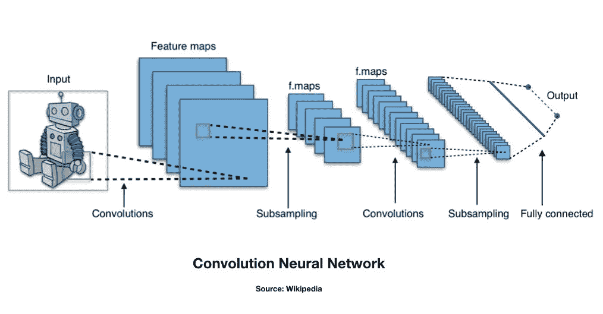

# 使用 Keras 开始第一个深度学习图像分类项目之前的 5 个技巧

> 原文：<https://medium.com/analytics-vidhya/5-tips-before-starting-your-first-deep-learning-image-classification-project-with-keras-f07d2fb13edc?source=collection_archive---------13----------------------->

图像分类中使用的典型 CNN 的图示

近年来，深度学习在图像分类中的应用已经显示出非常令人印象深刻的结果，进步一直在快速发生。它们正被应用于许多领域，例如:安全和面部识别、医学成像中的诊断支持以及无人驾驶汽车技术的开发。这使得深度学习成为数据科学家熟悉的越来越有价值的技能集。如果您已经广泛地处理过数据，特别是如果您以前已经构建过神经网络并且熟悉 keras，但是以前没有尝试过彻底的图像分类项目，那么这篇文章就是为您准备的！

图像分类项目的大部分实施方式类似于我们如何对任何一组特征进行建模以对目标进行分类。但是，如果您没有广泛使用过成像数据，在实际对数据建模之前，请记住以下一些提示，它们可以帮助您的项目更顺利地进行。

**管理您对数据的期望**

微调卷积神经网络中层和超参数的完美组合可能是一个挑战。在开始之前，牢记您预计会在数据中看到什么样的挑战是很有帮助的。例如，你试图识别的类是什么？你自己能很容易地识别课程吗？建立一个模型来识别你可以轻松区分的类别(如狗和猫)之间的差异，可能比必须识别非常微妙的变化(如 x 射线图像中的阳性发现)的模型更具挑战性，因为未经训练的眼睛可能没有资格识别这些变化。这一点点直觉可以帮助你建立一个预期，你的模型可能有多深，训练可能需要多长时间，以及在早期的模型尝试中期望什么样的基准。

**收集大量数据**

如果你的目标是从零开始训练一个可以投入生产的模型，以便在未来对类似的图像进行分类，请准备好收集一个大型的图像库。对于影像分类，5，000 张影像(甚至 50，000 张影像)通常不是训练模型的过大数据集，尤其是在更难识别的类别中。真正全面的训练模型通常在数十万甚至超过一百万的图像上训练，以便找到导致高度准确和可概括结果的权重。这在很多层面上都令人望而生畏。图像采集显然是一项艰巨的任务，但如此大量的文件也将导致在寻找足够的存储、处理能力和训练时间方面的挑战。这种深度学习模型需要几天甚至几周的时间才能正确训练，这并不是没有听说过。说了这么多，如果你发现这太有挑战性了，以你分配给一个项目的资源和时间根本无法完成，不要停止阅读和放弃！还有一些技巧可以让一个好的项目成为可能，即使只有相对少量的数据。

**考虑在你的模型中应用迁移学习**

如果收集大量的图像超出了你的现实预期，迁移学习仍然可以产生良好的效果。 [Keras 应用](https://keras.io/api/applications/)是一系列预先训练好的模型，可以直接导入到您的工作区来实现基础模型。最好的部分是，你可以导入在 [ImageNet](http://www.image-net.org) 上训练的模型权重，ImageNet 已经在数百万张随机图像上预先训练了这些模型。您可以包括密集层，或者只包括卷积层，在末尾为自己添加您自己的密集层(例如，如果您试图预测不同数量的类)。通过冻结导入模型的权重，您可以确保您的项目将使用强特征提取，即使您只能访问少量数据。这在迁移学习中很重要，因为您实际上并不想更新 ImageNet 已经为您创建的权重，而是将它们用于特征提取的目的，以使您的当前模型受益。

**利用 Keras 的图像数据预处理**

[Keras 的图像数据预处理](https://keras.io/api/preprocessing/image/)是一个非常有用的工具，任何计划使用 Keras 进行图像分类的数据科学家都应该熟悉。在您的项目脚本中创建一个包含所有图像的主数组可能是不可能的，因为这种任务的大小和内存有限(或者至少在运行时创建起来非常长)，而这个工具有助于解决这个问题。
通过使用此模块中的 Imagedatagenerator，您可以创建一个生成器对象，该对象将允许您一批一批地读入图像对象，根据您的神经网络输入适当地调整它们的大小(如果需要)，并按类将它们分开(或应用 dataframe 列中的类)。然后，这些生成器可以将您的数据一批一批地传递到您的卷积神经网络中，允许您对大量数据运行模型，即使您没有足够的内存空间来一次保存全部数据。

不仅如此，这个 keras 生成器可以在运行中进行数据扩充。使用影像分类模型进行调整(防止过度拟合)的最佳方法之一是在将影像传递到模型之前对其进行修改，包括调整其亮度、水平或垂直翻转、旋转、放大和缩小等。通过这样做，您的模型不太可能在相同的图像在随后的时期通过模型时过度拟合。通常，您必须创建新文件来改变您的原始图像文件，以实现这一点，但您的 keras 生成器会随机为您这样做，而无需创建新文件。

**利用模型检查点和保存的模型格式**

即使你决定在你的项目中使用迁移学习，现实情况是要达到最佳的准确度仍然需要很多小时，甚至更多的训练时间。如果您的计算机崩溃，或者您的远程内核断开连接，在这个过程中的任何一点，您的整个模型都可能丢失，需要您重新开始。
Keras 的回调模块(允许您实现提前停止的同一个模块)有一个[模型检查点导入](https://www.tensorflow.org/api_docs/python/tf/keras/callbacks/ModelCheckpoint)，允许您在每个时期后保存模型的权重，或者，如果愿意，在每个时期经过一定数量的批次后保存。它还包含一个参数，允许您仅在准确度提高或损失度量减少时保存权重。万一最坏的情况发生，你的电脑在训练过程中崩溃了，一切都还没完！
大多数模型，比如在 sklearn 中构建的模型，都可以被“腌制”，将模型保存为一个文件，该文件可以导入到其他脚本中，或者在 flask、streamline 或其他 web 部署源中使用。这在技术上也可以用于 keras，但是 keras 模型的最佳实践是使用 keras 的[保存的模型格式](https://www.tensorflow.org/guide/keras/save_and_serialize)。一旦您根据自己的喜好对模型进行了优化并准备好进行部署，您就可以将训练好的模型保存为一个文件。

在开始项目之前了解这些工具可以帮助您在开始第一个影像分类项目时省去许多困难、麻烦和挣扎，并帮助您克服错误信息，更快地进行建模，并有望取得更大的成功。试衣愉快！