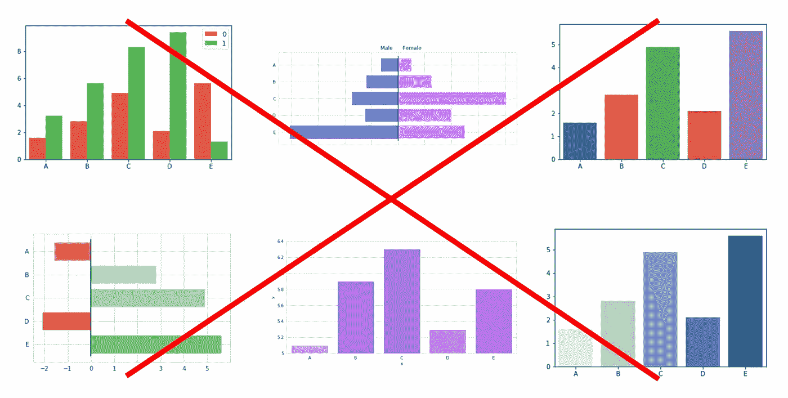

# 5 个简单的技巧来停止制作糟糕的条形图

> 原文：<https://medium.com/analytics-vidhya/5-tips-to-stop-doing-bar-charts-wrong-3aac8e3bfcd6?source=collection_archive---------1----------------------->

## 更有效地交流您的数据

ar 图表可能是你在一年级接触到的第一种图表。它们的简单性使它们成为可视化数据的标准，但正是它的可访问性导致可视化人员经常不注意条形图。