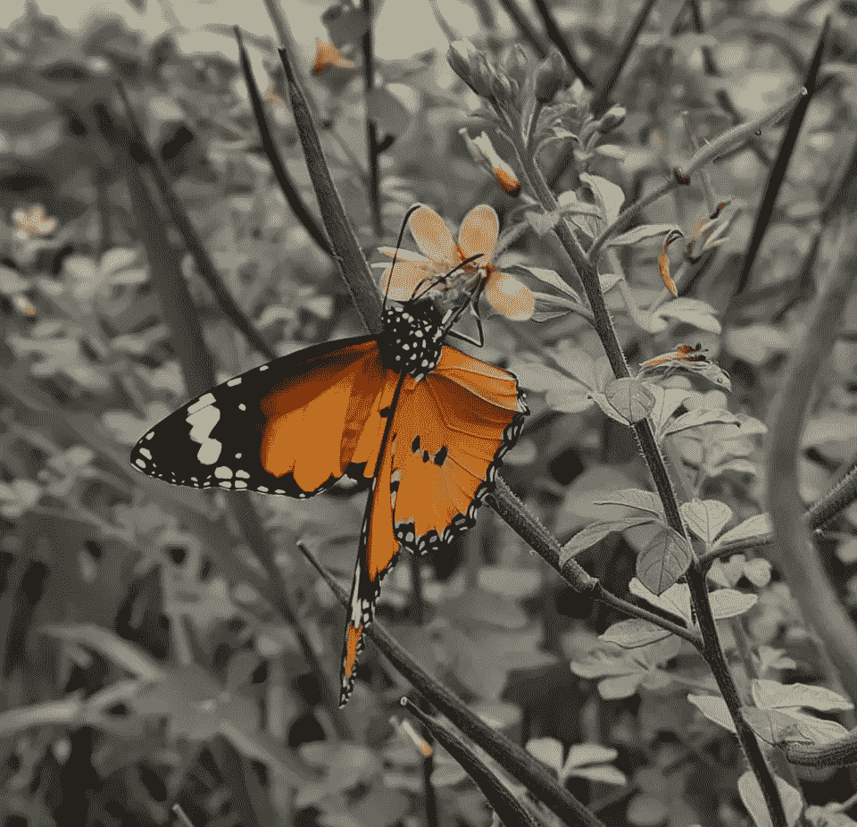
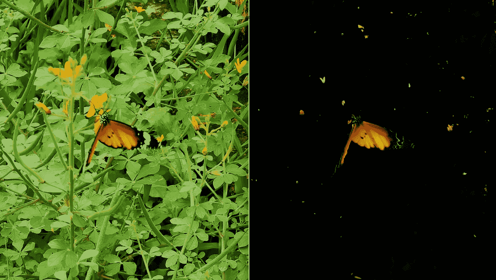
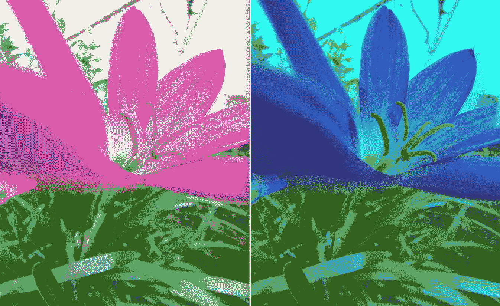
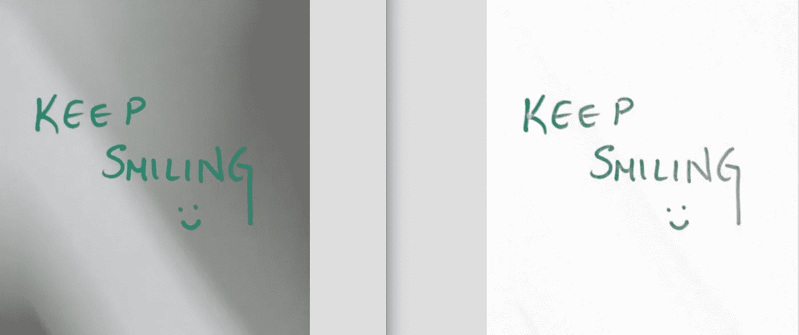
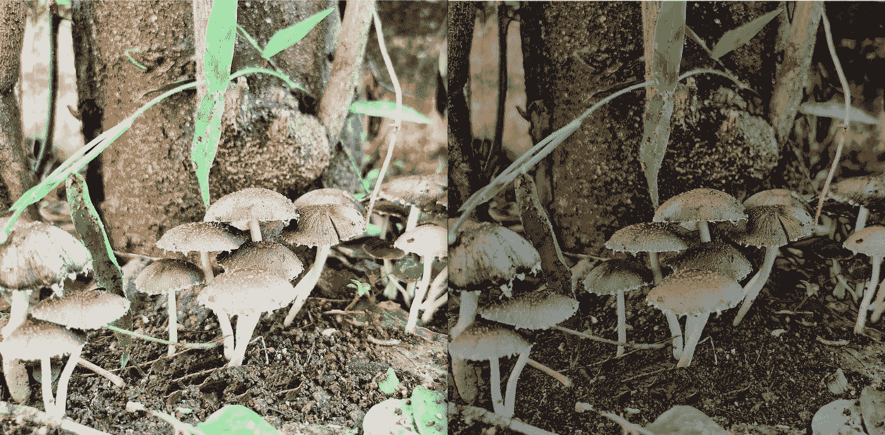
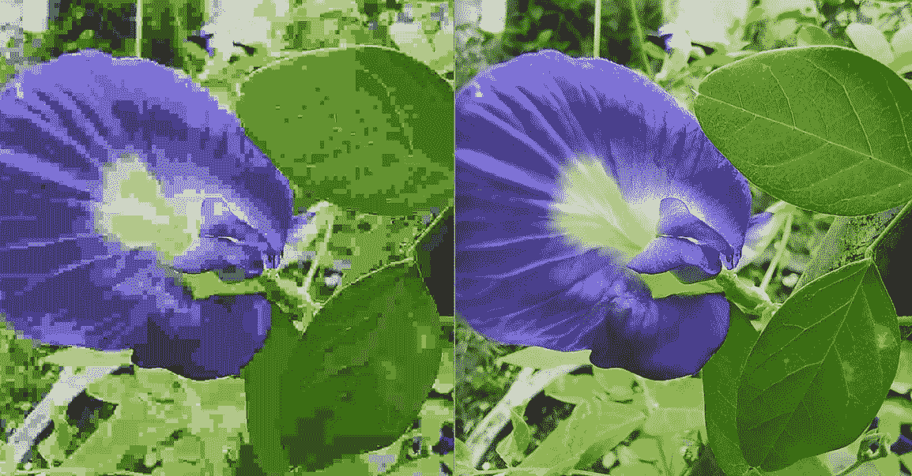

# 用于开放式 CV 图像处理的 5 个有用的 Python 代码片段

> 原文：<https://medium.com/analytics-vidhya/5-useful-python-code-snippets-for-open-cv-image-processing-8f39a6661f09?source=collection_archive---------7----------------------->

我拍的:)

**Open CV** 是 Intel 开发的用于[计算机视觉](https://en.wikipedia.org/wiki/Computer_vision)的库。用 Open CV 开发计算机视觉应用，很有趣，很酷！！！

如果你是学习图像处理的初学者，这 5 个代码片段将对你非常有用。我已经给出了使用从我的花园拍摄的图像输出的代码:)

**1。屏蔽**

蒙版是一个非破坏性的过程，蒙版可以用作彩色滤光片。

左图像:原始|右图像:绿色过滤只有蝴蝶可见

**2。使用 RGB 平面的图像过滤器**

彩色图像可以分成红-绿-蓝通道。使用图像的这些平面，可以用这 3 个平面(RGB)的不同组合来创建有趣的过滤器

左图:原稿|右图:蓝色滤镜效果

**3。图像增强**

当捕捉到带有阴影或非均匀背景的图像时。在读取图像文件时，可以不改变地读取图像 alpha 通道，然后进行标准化。

左侧图像:原始|右侧图像:增强图像

**4。图像对比度和亮度调整**

**对比**通过调整物体的亮度或颜色，有助于使图像中的物体更加清晰可辨。**变亮**有助于提高图像的亮度或(照明)或使图像变暗，如下图蘑菇图像的输出所示。

左图:原稿|右图:变暗的图像

**5。存储指定质量的图像，文件格式**

函数 *imwrite* 用于保存指定文件名、分辨率、压缩级别、质量以及二进制或非二进制格式的图像文件。下面给出了一个片段，其中指定了 100 (质量范围-[0–100])的**质量，图像质量越高越好， **JPEG 是文件格式。**有关 cv2.imwrite()的更多信息，请参考[文档](https://docs.opencv.org/2.4/modules/highgui/doc/reading_and_writing_images_and_video.html?highlight=imwrite#imwrite)。**

左侧图像:质量= 0|右侧图像:质量= 100

这些都是简单的片段，马上尝试一下会很有用也很有趣。

谢谢大家！！