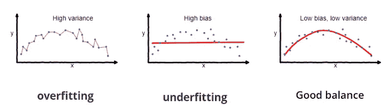
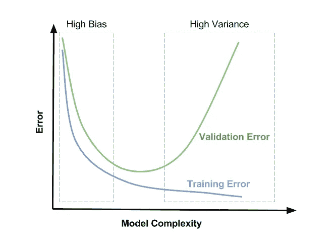
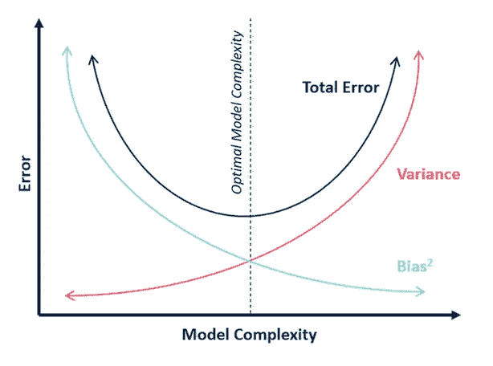

# 在 ML 模型中实现偏倚和方差平衡的 5 种方法

> 原文：<https://medium.com/analytics-vidhya/5-ways-to-achieve-right-balance-of-bias-and-variance-in-ml-model-f734fea6116?source=collection_archive---------11----------------------->

> 机器学习模型的好坏取决于输入的数据。

机器学习领域的普遍真理是，模型的性能严重依赖于提供给它的数据。但是，有些情况下，即使提供了高质量的数据，模型性能也会受到影响。其中一个常见问题是**高偏差和高方差问题(欠拟合与过拟合)。**

当我们拟合系数(也称为参数、权重等)时..)的机器学习模型，通常第一目标是最小化训练误差。然而，仅仅获得低的训练误差并不满足好模型的标准。仅仅因为一个学习算法非常适合一个训练集，并不意味着它是一个好的假设。它可能会过度拟合，结果您对验证和测试集的预测会很差。实际上，拥有一个能够在训练和未知数据上提供低误差的通用模型才是真正想要的模型。

通常，每个模型都会出现这样的情况，第一次尝试时，您可能找不到一个通用的模型。该模型可能受到高偏差或高方差的影响，即欠拟合或过拟合。

# **什么是过度拟合或拟合不足？**

欠拟合和过拟合是监督算法、神经网络等建模过程中常见的问题...

**欠拟合**发生在模型无法从训练数据中学习底层模式的时候。这些模型通常具有高偏差和低方差。一些可能的原因是建立精确模型的数据可用性有限，或者当我们试图用非线性数据建立线性模型时。当低复杂度模型正适合非线性数据集时，也会出现这种情况。为了前任。如果需要使用高次多项式方程，如 W0+W1X1+W2X1 +W3X1，我们将使用直线方程(Y= W0+W1X1)对此进行建模。

**过度拟合**发生在我们的模型学习数据中的噪声和潜在模式时。该模型试图记住训练集中的每个数据点，但它无法预测看不见的数据。当我们在嘈杂的数据集上大量训练我们的模型时，就会发生这种情况。这些模型具有低偏差和高方差。

下面的示例图显示了一个较小数据集的绘图，该数据集包含 1 个输入要素和目标变量(y)。

显示模型拟合度的示例图像——欠拟合、过拟合和良好拟合

## **偏差和方差对模型性能的影响**

如果 ML 模型由于偏差或方差而受到影响，它将倾向于显示关于训练和验证误差的跟随行为。随着多项式次数或模型复杂度的增加，训练误差将趋于减小。与此同时，随着我们将复杂度增加到一定程度，验证误差将趋于减少，然后它将增加，形成一条凸曲线，如下所示。

*   高偏差(欠拟合)-训练和验证误差都很高。
*   高方差(过拟合):训练误差低，验证误差高。

## **检测模型是否存在高偏差或高方差**

学习曲线是验证算法是否正常工作或者您是否想要提高算法性能的有用图表之一。您应该根据训练或验证示例的数量绘制训练集和验证集的成本函数。您将从这些图中发现深刻的观察结果，如下所示:

1.  **高偏差:**低训练集大小导致训练误差低，验证误差高。在很少数量的数据点上训练一个算法将总是找到一个二次曲线，该曲线正好接触这些数量的点。随着训练集变得越来越大，训练集误差也会增加，并且在训练集达到一定大小后会趋于平稳。

高偏差(左图)，高方差(右图)

**2。高方差**:低训练集大小导致训练误差低，验证误差高。随着训练集规模的增大，训练误差会增大，而验证误差会持续减小而不会趋于平稳。

## 如何处理偏差和方差？

在模型的初始运行之后，您会注意到模型在验证集上的表现不如您所希望的那样好。因为模型由于高偏差或高方差而受到影响。换句话说，要么是欠拟合问题，要么是过拟合问题。理想情况下，我们需要在这两者之间找到一个黄金分割点，如下图所示。想法是减少训练误差以及验证和测试误差，使模型能够对看不见的数据进行很好的概括。

## **实现最佳偏差与方差平衡的方法**

*   将给定数据分成 3 组—训练、验证和测试，典型组合为 70%、20%和 10%(这可能是[80%、10%、10%]或[60%、20%、20%])。一个好的做法是在进行分割之前随机打乱数据，这样模型就不会因为数据中的任何排序或历史模式而出现偏差。
*   从一个简单的算法开始，不要在实现上花费太多的时间，并在验证数据上测试它。从构建一个非常简单的算法开始，而不是从构建一个具有许多复杂功能的非常复杂的系统开始，这通常被认为是非常好的实践。
*   从训练集(70%数据)中学习系数，并根据验证数据进行预测。绘制学习曲线，找出模型是否存在高偏差或高方差问题。通过选择以下选项之一来修复问题或转到下一个解决方案，这将成为您进行诊断和尝试错误方法的起点。在下面的所有方法中需要注意的重要一点是，它们不一定需要按照提到的顺序执行。选择一种或多种方法来获得偏倚和方差的正确平衡取决于您的具体要求。

1.  **获得更多的训练样本有助于** **修复高方差。**如果可能的话，尝试获取更多的数据。或者，您需要使用一些数据扩充技术来改变、修改、裁剪现有数据。
2.  **选择较小的功能集，修复高方差。**这是一个棘手的情况，你可能认为所有的功能都很重要，但事实可能并非如此。你需要运用各种数据分析技术来找出输入变量和目标变量之间的相关性和关系。此外，如果您发现输入特性具有同等的重要性，那么最好让业务团队或领域专家来决定哪些特性更重要，应该保留还是删除。
3.  添加更多功能有助于修复高偏差。功能工程是一个宽泛的范畴，它是一种基于需求衍生新功能或修改现有功能的迭代方法。为了前任。如果数据集包含体重和身高作为要素，您可能希望创建身体质量指数作为新要素。在另一种情况下，给定地块的长度和宽度，您可能希望创建地块大小作为新特征。
4.  **添加多项式特征**允许拟合高阶方程，而**修复高偏差。**低阶多项式(模型复杂度低)偏差大，方差小。在这种情况下，模型的一致性很差。而高阶多项式(高模型复杂度)非常适合训练数据，而非常不适合测试数据。这些方法对训练数据的偏差很小，但方差很大。

实际上，我们希望选择一个介于两者之间的模型，既能很好地概括，又能合理地拟合数据。要找到正确的多项式方程和适当次数的多项式特征，请遵循以下步骤

*   创建一个可能的低到高次多项式方程的列表。
*   从每个多项式次数的训练集(70%数据)中学习系数，并找出训练误差。
*   使用验证集找到误差最小的多项式次数。

5.减小λ:固定高偏差；增加λ:修复高方差。

随着 lambda(λ)-正则化参数的增加，模型拟合变得更加严格。另一方面，当λ(λ)接近 0 时，模型倾向于过度拟合数据。现在的问题是，如何决定合适的λ值(λ)。

1.  创建一个λ值列表(即λ ∈{0，0.01，0.03，0.05，0.07，0.15，0.30})。
2.  创建一组不同程度的模型。
3.  迭代 lambda (λ),对于每个 lambda(λ),遍历所有模型以学习一些系数。
4.  使用通过λ)计算的学习系数计算验证误差，并且不进行正则化或λ = 0。选择在验证集上产生最低错误的最佳组合。

最后，当你取得了适当的平衡，并在验证数据集上找到了一个通用的模型时，将预测模型应用到看不见的测试数据集上。

## 摘要

如上所述，每个机器学习模型都受到高偏差或方差的影响。它通过应用一个或多个解决方案来找到偏差和方差的正确平衡，并实现**一般化**。