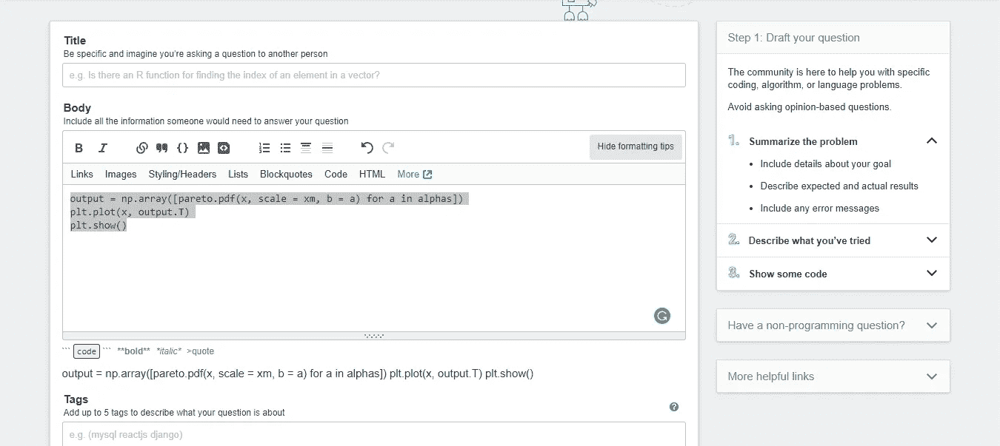
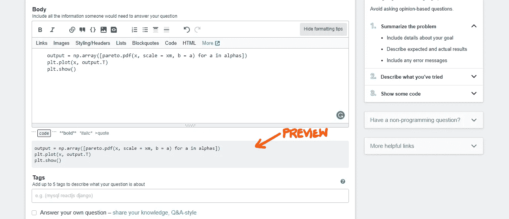
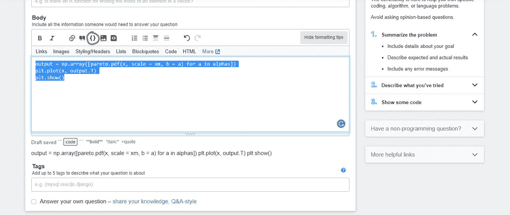
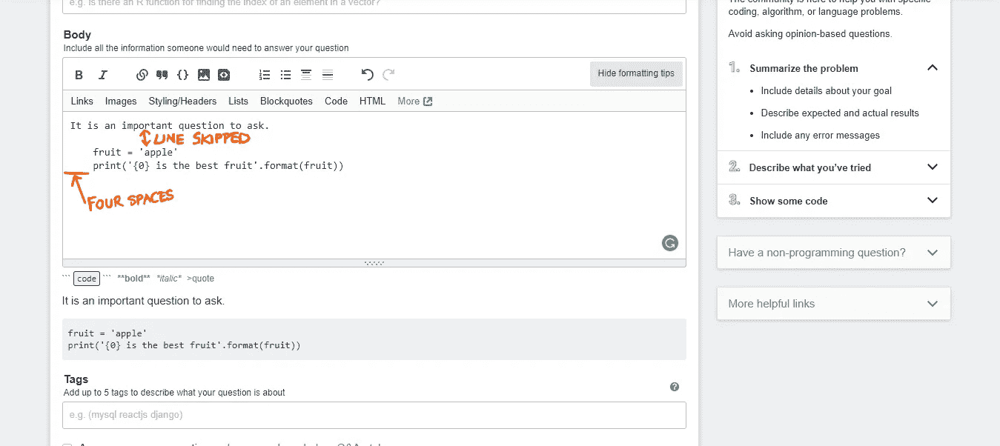
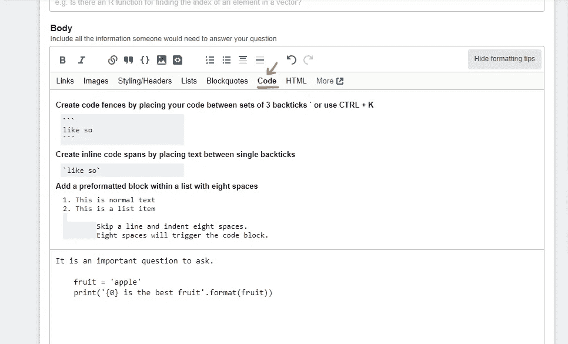

# 在堆栈溢出中嵌入代码的 5 种方法

> 原文：<https://medium.com/analytics-vidhya/5-ways-to-embed-code-in-stack-overflow-8d9f38edf02c?source=collection_archive---------6----------------------->

## 提示和技巧/堆栈溢出

## 在堆栈溢出中嵌入代码的五种简单方法


Stack Overflow 是一个面向专业程序员和程序员爱好者的论坛，这里有大量关于计算机编程的主题。这是一个私有的问答网站，归 Stack Exchange Inc .所有。

当试图在 Stack Overflow 中发布一个问题时，在嵌入代码片段的方式上常常有点混乱(尤其是对初学者而言)。在这篇文章中，我们正在处理将代码嵌入**堆栈溢出**的**五种简单方法**。

## 第一种方式

第一种也是最专业的方法(至少对我来说)是按 Ctrl+K(Windows)和 Cmd+K(Mac)。从复制代码到身体开始。



选择所有代码(如上图所示)，按 Ctrl+K(Windows 中)和 Cmd+K(Mac 中)。然后，文本的预览会立即发生变化，并以#EFF0F1 的背景色出现，如下所示(表示代码片段已被识别为代码):



## 第二种方式

该方法包括选择代码并按下文本区域上方的花括号图标(如下图所示，用橙色圆圈突出显示)。



## 第三条路

第三种方法是通过创建一对三个反勾(一个在代码上方，一个在代码后面)来在代码周围创建代码围栏，如下所示:

```
```
output = np.array([pareto.pdf(x, scale = xm, b = a) for a in alphas])
plt.plot(x, output.T)
plt.show()
```
```

反勾号通常位于数字键 1 的左侧或字母 Z 键的旁边(在 Mac 中)。

## 第四种方式

第四种方法是通过将代码段放在一对反斜线内来创建内联代码段。

```
`print("Hello World")
print('Hello')`
```

## 第五种方式

第五种也是最后一种方法是跳过一行，将代码缩进 8 个空格(甚至 4 个空格也可以)，如下图所示:



您可以单击“格式提示”菜单中的“代码”来获得快速提示。



就这样，伙计们！！！快乐编码