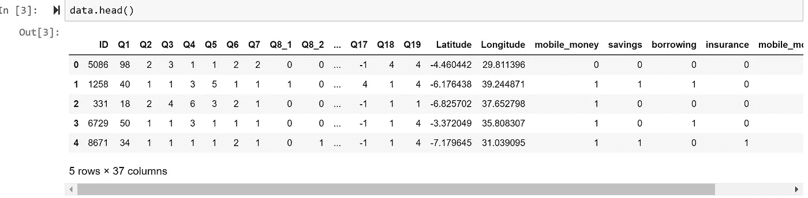
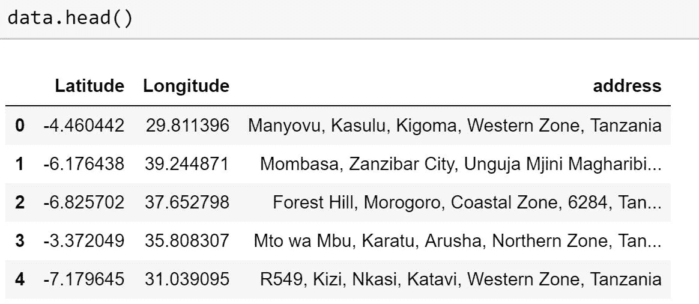
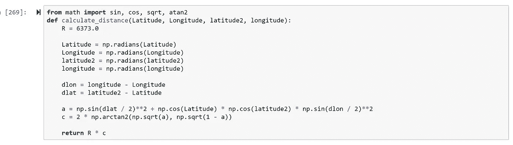
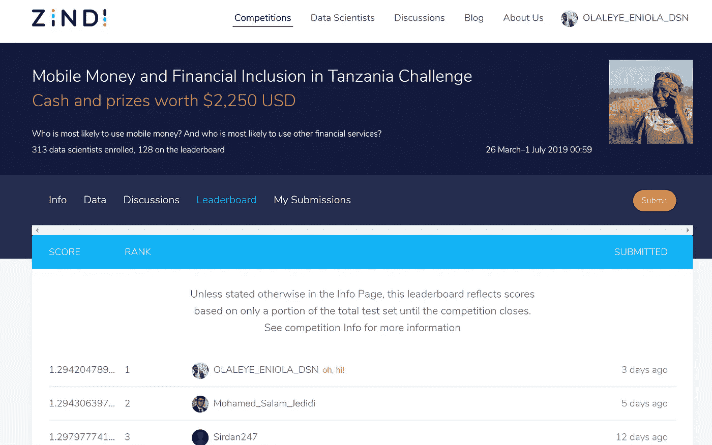

# 我是如何破解数据科学黑客马拉松的

> 原文：<https://medium.com/analytics-vidhya/5th-place-solution-mobile-money-and-financial-inclusion-in-tanzania-challenge-16e43e4d18f8?source=collection_archive---------1----------------------->

你知道竞争是多么令人沮丧和紧张，尤其是在截止日期前一周。你开始每次刷新页面，看你的排名。随着时间的推移，我已经习惯了，最有趣的部分是你可以学到很多东西，除了追逐奖品，我获得了很多知识。

这家伙什么都说了。

最近，我参加了津迪竞赛:

 [## 坦桑尼亚挑战中的移动货币和金融包容性

### 谁最有可能使用移动货币？谁最有可能使用其他金融服务？

津迪.非洲](https://zindi.africa/competitions/mobile-money-and-financial-inclusion-in-tanzania-challenge/leaderboard) 

我名列第五，在排行榜上名列第五(在 164 支队伍中)。

在这篇博文中，我将总结我的解决方案的主要思想。

# 问题描述

本次比赛的目标是创建一个机器学习模型，以预测哪些人最有可能使用移动货币和其他金融服务(储蓄、信贷和保险)。

这种模式可以帮助移动货币提供商更有效地瞄准坦桑尼亚的新客户和市场，还可以帮助金融服务提供商向现有的移动货币客户群交叉销售其他金融服务(储蓄、信贷和保险)。

**有 4 种方法可以改进你的模型:**

1.  利用数据提高性能。
2.  用算法提高性能。
3.  通过调整提高性能。
4.  通过合奏提高性能。

**我决定采用第一种方法，即添加更多数据。**

随着你在列表中的位置越来越靠后，收益往往越来越小。例如，一个新的问题框架或更多的数据通常会比调整最佳算法的参数给你带来更多的 payoff。不总是，但是通常。

T actics:
**获取更多数据:**像深度学习这样的现代非线性机器学习技术，随着数据的增多，性能不断提高。
**发明更多的数据:**如果不能获得更多的数据，可以生成新的数据吗？也许您可以增加或置换现有数据，或者使用概率模型来生成新数据。
**清理你的数据:**你能改善你数据中的信号吗？也许可以修复或删除缺失或损坏的观测值，或者修复或删除合理范围之外的异常值，以提高数据质量。
**改造你的数据:**能否重塑你的数据分布？使输入数据更加高斯化或通过指数函数传递可能会更好地将数据中的特征暴露给学习算法。

**解决方案 1:**

查看数据，我们有纬度和经度特征，所以我用 geopy 对其进行反向地理编码，以获得每个特定 ID 的地区和街道。

data.head()视图。

反向地理编码后，我得到了这个

反向编码

我能够从反向编码中得到 4 个特征，分别是地区、行政区、区域和街道。

**解决方案 2:**

zindi 提供了一个名为 fsdt folder 的文件夹，所以我做了一些工程来获得新的经度和纬度。基于这些值，我计算了哈弗线距离。

哈弗线距离

由于整个代码太长，我将在我的 github 上分享一个链接。

**解决方案三:**

另一种有效的方法是使用 arcgis 用其他一些数据集来丰富我的数据集。

我制作了一个关于如何实现上述目标的视频:

就像我之前说的，比赛不仅仅是为了钱，你还可以学到很多东西。

我的解决方案被放在首位

# **走之前的最后一句话**

如何开始:你不需要什么都做。你只需要一个好主意来提升你的模型的性能。

下面是处理问题语句的方法:
1。选择一组进行工作:a)数据 b)算法 c)调整 d)集成
2。选择一种方法在小组中使用。
3。从选择的方法中选择一种算法进行尝试。
4。比较结果，如果有改进，保留解决方案。
5。重复一遍。

我的代码[https://github . com/Galileo solution/5-place-solution-Mobile-Money-and-Financial-Inclusion-in-Tanzania-Challenge](https://github.com/galileoSolution/5th-place-solution-Mobile-Money-and-Financial-Inclusion-in-Tanzania-Challenge)

“我们正在进入一个数据可能比软件更重要的新世界。”——[*蒂姆·奥莱利*](https://www.oreilly.com/tim/) *，创始人，* [*奥莱利传媒*](https://www.oreilly.com/) *。*