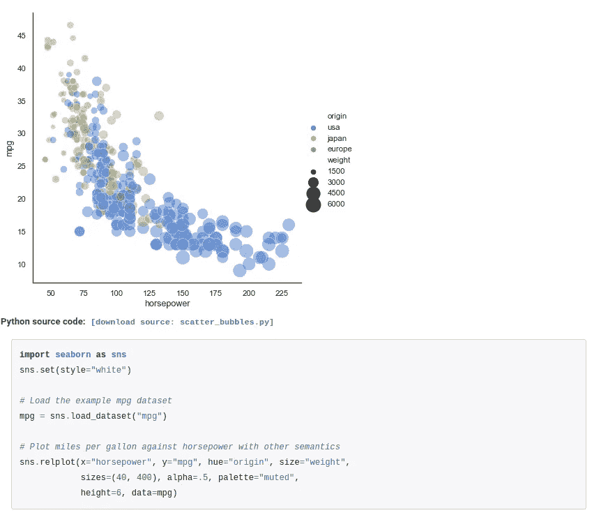

# 6 个基本的数据可视化 Python 库— Matplotlib、Seaborn、Bokeh、Altair、Plotly、GGplot

> 原文：<https://medium.com/analytics-vidhya/6-essential-data-visualization-python-libraries-matplotlib-seaborn-bokeh-altair-plotly-6de45f8a256a?source=collection_archive---------6----------------------->

# 介绍

> 视觉化给了你一些你不知道的问题的答案—本·施奈德曼

作为一名数据科学家，我的日常工作需要大量的实验。这意味着我非常依赖[数据可视化](https://courses.analyticsvidhya.com/courses/tableau-2-0?utm_source=blog&utm_medium=6-data-visualization-python-libraries)来探索我正在处理的数据集。

我非常赞同本·施奈德曼的话！数据可视化给了我以前从未考虑过的问题的答案。毕竟**一张图片抵得上一千个数据点**！

这自然会引出一个价值百万美元的问题——应该使用哪个 [Python](https://courses.analyticsvidhya.com/courses/introduction-to-data-science?utm_source=blog&utm_medium=6-data-visualization-python-libraries) 库进行数据可视化？全线有不少。

即使是经验丰富的数据科学家也会迷失在每个 Python 库提供的无数特性中。

这就是为什么我想写这篇文章来支持不同数据可视化 Python 库的优势和独特特性。

我们将介绍 Python 支持的一些最棒的可视化库。

所以事不宜迟，我们开始吧！

# 我们将讨论的 6 个数据可视化 Python 库

1.  Matplotlib
2.  海生的
3.  散景
4.  阿尔泰尔
5.  Plotly
6.  ggplot

# 1.Matplotlib

您可能已经在数据科学之旅中使用过 matplotlib。

Matplotlib 以其作为 Python 中的二维绘图库所提供的高度灵活性而闻名。

如果你有 MATLAB 编程背景，你会发现 Matplotlib 的 Pyplot 接口非常熟悉。你马上就可以开始你的第一次想象了！

# Matplotlib 的独特功能

Matplotlib 可以在 Python 中以多种方式使用，包括 Python 脚本、Python 和 iPython shells、Jupyter 笔记本等等！

这就是为什么它不仅经常被数据科学家用来创建可视化，也经常被研究人员用来创建具有出版质量的图表。

Matplotlib 支持所有流行的图表(批次、直方图、功率谱、条形图、误差图、散点图等)。)开箱即用。

还有一些扩展，可以用来创建高级的可视化效果，如三维绘图等。

我个人喜欢 matplotlib 的一点是，因为它非常灵活，它允许用户在最细粒度的级别上控制可视化的各个方面，从图形中的一条线或一个点到整个图表。这意味着您可以在最高级别定制它。

# 学习 matplotlib 的教程

下面是一些学习 matplotlib 的有用教程:

*   [用 Python 进行数据可视化和探索的 matplotlib 初学者指南](https://www.analyticsvidhya.com/blog/2020/02/beginner-guide-matplotlib-data-visualization-exploration-python/?utm_source=blog&utm_medium=6-data-visualization-python-libraries)
*   [matplotlib 官方文档](https://matplotlib.org/users/index.html)

下面是 Matplotlib 的创建者给出的入门教程:

# 2.海生的

当我看到 Seaborn 构建的可视化时，脑海中只有一个词——漂亮！

Seaborn 构建在 matplotlib 之上，为构建可视化提供了一个非常简单而直观的界面。

当使用 Seaborn 时，您还会注意到图中的许多默认设置开箱即用。

# Seaborn 的独特之处

Seaborn 的第一个独特之处在于，它的设计方式使得您只需编写很少的代码就能实现高质量的可视化。

下面是这种简单性的一个例子，注意我们如何只用一行绘图代码创建复杂的可视化:

Seaborn 的第二个有用特性是它支持大量的高级绘图，如分类绘图(catplot)、使用 kde 的分布绘图(distplot)、群绘图等。开箱即用。当然，我们在上面看到了一个 **relplot** 的例子。

现在，因为 Seaborn 是建立在 matplotlib 之上的，所以与它高度兼容。

因此，这意味着在构建可视化时，您可以从 seaborn 已经支持的高级绘图开始，然后在 matplotlib 的帮助下尽可能地定制它们。

# 学习 Seaborn 的教程

下面是一些有用的资源，您可以开始使用 seaborn 库进行数据可视化:

*   [通过这本全面的 Python Seaborn 指南成为数据可视化专家](https://www.analyticsvidhya.com/blog/2019/09/comprehensive-data-visualization-guide-seaborn-python/?utm_source=blog&utm_medium=6-data-visualization-python-libraries)
*   [Seaborn 官方文档](https://seaborn.pydata.org/tutorial.html)

# 3.散景

Bokeh 是一个库，用于生成在 web 界面和浏览器上友好的可视化效果。这就是这个可视化库的具体目标。

您还会注意到，从散景生成的可视化效果本质上是交互式的，这基本上意味着您可以通过您的情节以更直观的方式传达信息。

# 散景的独特功能

散景支持独特的可视化，如地理空间图，网络图等。开箱即用。

如果您想在浏览器中显示这些可视化效果，可以选择导出它们，您也可以通过 [JavaScript](https://www.analyticsvidhya.com/blog/2019/06/build-machine-learning-model-in-your-browser-tensorflow-js-deeplearn-js/) 本身来使用它们！

# 学习散景的教程

这里有一个很好的教程来学习用于数据可视化的散景:

*   [使用散景的交互式数据可视化(Python 语言)](https://www.analyticsvidhya.com/blog/2015/08/interactive-data-visualization-library-python-bokeh/?utm_source=blog&utm_medium=6-data-visualization-python-libraries)

# 4.阿尔泰尔

Altair 是一个用于数据可视化的声明性库。它的原则是，与其专注于代码部分，不如专注于可视化部分，编写尽可能少的代码，并且仍然能够创建漂亮和直观的情节。那正合我的胃口！

# 牛郎星的独特之处

因为 Altair 使用声明式风格来创建情节，所以在使用这个库时，快速迭代可视化和实验变得非常容易和快速。

# 学习牛郎星的教程

这里有一个关于 Python 中 Altair 的很好的介绍:

*   [介绍 Altair——Python 中的声明式可视化库](https://www.analyticsvidhya.com/blog/2017/12/introduction-to-altair-a-declarative-visualization-in-python/?utm_source=blog&utm_medium=6-data-visualization-python-libraries)
*   [牛郎星文档](https://altair-viz.github.io/)

# 5.Plotly

想到 Plotly 首先想到的就是交互性！每当我想创建需要与用户高度交互的可视化时，这个数据可视化库是我的首选库。

看看这个用 Plotly 创建的可视化:

# Plotly 的独特功能

Plotly 与 Jupyter 笔记本和网络浏览器高度兼容。这意味着无论你创造什么样的互动情节，你都可以很容易地以同样的方式与你的队友或终端用户分享。

我还想指出的是，Plotly 支持从基本图表类型、Seaborn 式的美丽和高级绘图、3d 绘图、基于地图的可视化、科学绘图等所有绘图。不胜枚举！

Plotly 的情节也可以支持动画功能。所以，如果你想通过可视化来讲故事，这是一个非常有用的库。

# 剧情学习教程

这里有几个教程可以帮助您使用 Plotly 进行数据可视化:

*   如何在 R 和 Python 中使用 Plotly 创建漂亮的交互式数据可视化？
*   [Plotly 文档](https://plot.ly/python/)

# 6.ggplot

ggplot 是 R 著名的 ggplot2 的 Python 版本，是图形语言的 Grammer。如果您以前在 R 中使用过它，您将会知道使用这个库创建绘图是多么简单。

我个人很喜欢 ggplot 的灵活性。我们可以在动态构建图表时轻松地争论数据——这是一个非常有用的概念！

# ggplot 的独特功能

ggplot 也是一个像散景一样的声明式样式库，但也与[熊猫](https://courses.analyticsvidhya.com/courses/pandas-for-data-analysis-in-python)紧密耦合。这意味着你可以很容易地使用你的熊猫数据框架本身来构建可视化！

# 学习 ggplot 的教程

您可以在此了解有关 ggplot 以及如何使用它的更多信息:

*   [R 用户在使用 ggplot2 包时经常问的 10 个问题](https://www.analyticsvidhya.com/blog/2016/03/questions-ggplot2-package-r/?utm_source=blog&utm_medium=6-data-visualization-python-libraries)
*   [ggplot Python 文档](http://ggplot.yhathq.com/how-it-works.html)

# 结束注释

在本文中，我们探索了一些在 Python 中执行数据可视化的必备库。这些库各自都很受欢迎，并在不同的场景中大放异彩。

当你决定下一个项目使用哪个库时，我希望这篇文章会像一块罗塞塔石碑一样。

你认为其他数据可视化库应该在这个列表中吗？你喜欢这篇文章吗？如果有，下面评论！

*原载于 2020 年 3 月 5 日 https://www.analyticsvidhya.com***。**