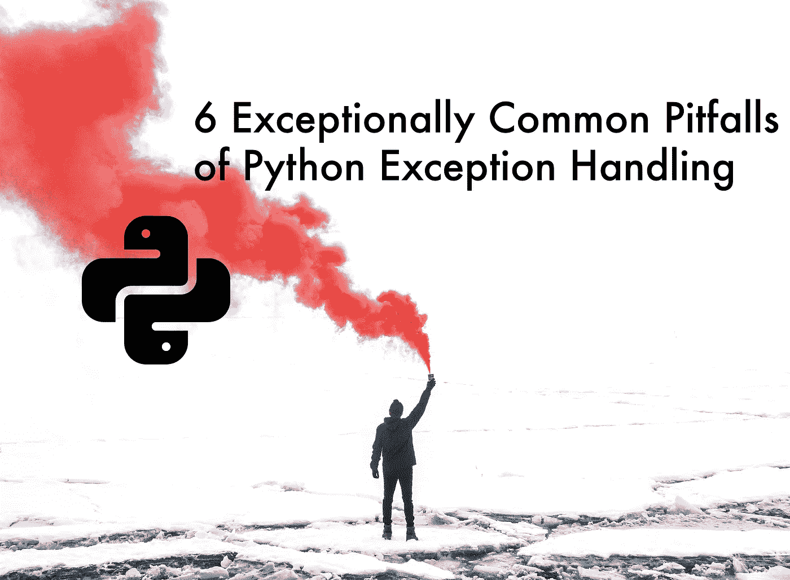

# Python 异常处理的 6 个异常常见的陷阱

> 原文：<https://medium.com/analytics-vidhya/6-exceptionally-common-pitfalls-of-python-exception-handling-44871d6afbc7?source=collection_archive---------1----------------------->

## 除了尝试，还有更多需要记住的..除...之外

基于[雨果·杰汉内](https://unsplash.com/@hugojehanne?utm_source=unsplash&utm_medium=referral&utm_content=creditCopyText)在 [Unsplash](https://unsplash.com/s/photos/alert?utm_source=unsplash&utm_medium=referral&utm_content=creditCopyText) 拍摄的照片

## 1.一般错误捕获

这种情况非常常见，要么是由于开发人员的懒惰，要么是误解。通用的 catch-all 意味着**所有的** python 异常都将被捕获，而不仅仅是那些从`Exception`继承的异常。的…