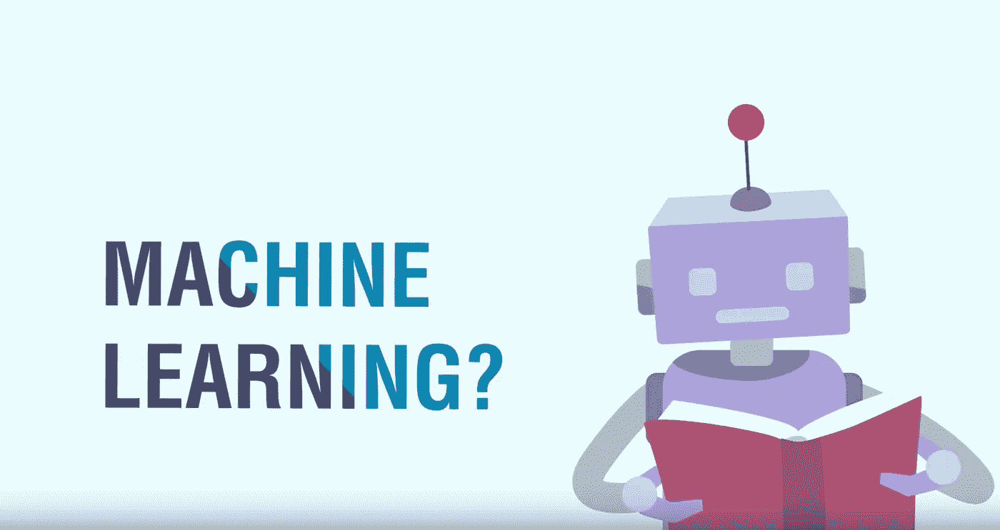

# 你应该阅读的关于机器学习的 6 个深度指南！

> 原文：<https://medium.com/analytics-vidhya/6-in-depth-guides-on-machine-learning-you-should-read-ebb977fa76ab?source=collection_archive---------1----------------------->

以下是我们每周精选的顶级机器学习、深度学习、自然语言处理(NLP)和计算机视觉文章！

每篇文章都深入探讨了不同的主题。所以让我们开始吧！

[**主题建模使用潜在狄利克雷分配(LDA)和吉布斯抽样解释！**T3——作者](/analytics-vidhya/topic-modeling-using-lda-and-gibbs-sampling-explained-49d49b3d1045)[安库尔·托马尔](https://medium.com/u/5761f3ddf243?source=post_page-----ebb977fa76ab--------------------------------)

我们喜欢这篇关于一个流行且关键的 NLP 主题的文章——主题建模！

[**使用 TextBlob**](/analytics-vidhya/sentiment-analysis-on-ellens-degeneres-tweets-using-textblob-ff525ea7c30f) 对艾伦的德杰尼勒斯推文进行情感分析——作者 [Dhilip Subramanian](https://medium.com/u/61418d489e25?source=post_page-----ebb977fa76ab--------------------------------)

使用 TextBlob 库进行情感分析的独特教程。

[**FaceNet 简介:面向人脸识别和聚类的统一嵌入**](/analytics-vidhya/introduction-to-facenet-a-unified-embedding-for-face-recognition-and-clustering-dbdac8e6f02) —作者 [Dhairya Kumar](https://medium.com/u/39186e93c835?source=post_page-----ebb977fa76ab--------------------------------)

对计算机视觉感兴趣？本文深入探讨了面部识别的 FaceNet 框架背后的概念。

[**数据科学如何变革金融行业？**](/analytics-vidhya/how-is-data-science-revolutionizing-the-finance-industry-c0a95368e5bc) —作者[希马尼·班萨尔](https://medium.com/u/486cd8a8961?source=post_page-----ebb977fa76ab--------------------------------)

金融领域对于机器学习来说似乎已经成熟了，对吗？但是它是如何工作的呢？数据科学在哪里颠覆了这个领域？

[**学习特征选择用于建立和改进你的机器学习模型**](/analytics-vidhya/feature-selection-for-building-and-improving-your-machine-learning-model-e3a81b79487)——[Amit Maurya](https://medium.com/u/4c294e64fd70?source=post_page-----ebb977fa76ab--------------------------------)

建立和改进机器学习模型的一个关键方面是——如何挑选最重要的特征？

[**深度学习推荐机——DLRM**](/analytics-vidhya/deep-learning-recommendation-machines-dlrm-4fec2a5e7ef8)——作者[热汗·艾哈迈德](https://medium.com/u/8a906695a064?source=post_page-----ebb977fa76ab--------------------------------)

顾名思义，这是通过深度学习镜头对推荐机的有趣看法。