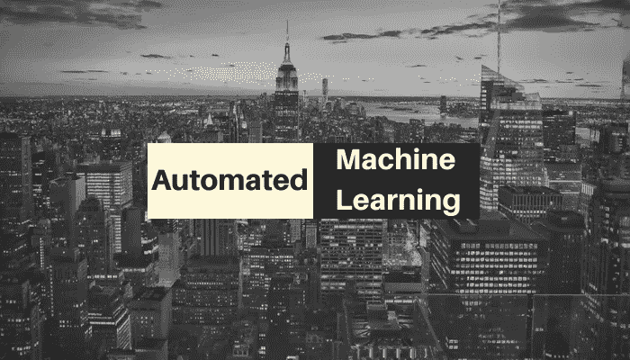
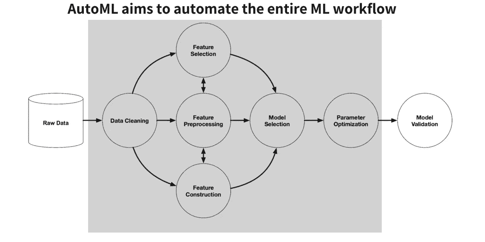
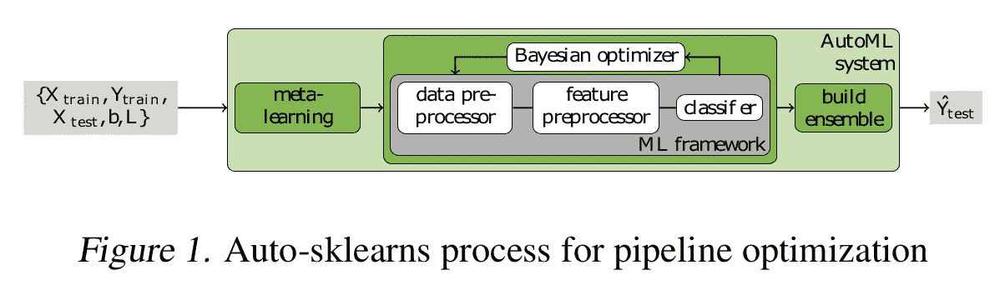
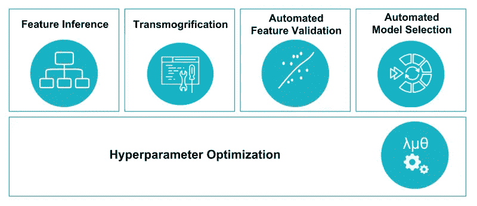

# 每个数据科学家都应该知道的 6 个开源自动化机器学习工具

> 原文：<https://medium.com/analytics-vidhya/6-open-source-automated-machine-learning-tools-every-data-scientist-should-know-49960c1397c9?source=collection_archive---------6----------------------->

近来机器学习应用的快速增长产生了对现成的机器学习方法和开发非专家也能使用的用户友好的机器学习软件的需求。幸运的是，答案已经出来了。

**自动化机器学习** ( **AutoML** )是将机器学习应用于现实世界问题的端到端过程自动化的过程。

在典型的机器学习应用中，实践者必须应用适当的 [**数据预处理**](https://en.wikipedia.org/wiki/Data_pre-processing) 、 [**特征工程**](https://en.wikipedia.org/wiki/Feature_engineering) 、 [**特征提取**](https://en.wikipedia.org/wiki/Feature_extraction) 和 [**特征选择**](https://en.wikipedia.org/wiki/Feature_selection) 方法，使数据集适合于机器学习。在这些预处理步骤之后，从业者必须执行 [**算法选择**](https://en.wikipedia.org/wiki/Algorithm_selection) 和 [**超参数优化**](https://en.wikipedia.org/wiki/Hyperparameter_optimization) ，以最大化他们最终机器学习模型的预测性能。

# AutoML 的优势

*   提高数据科学家的工作效率
*   非专家也可以毫不费力地使用机器学习
*   模型精度和性能与传统方法相当

现在让我们来看看一些开源工具！

## [1 —自动 Weka 2.0](https://www.cs.ubc.ca/labs/beta/Projects/autoweka/)

[**Auto-WEKA**](https://www.cs.ubc.ca/labs/beta/Projects/autoweka/papers/16-599.pdf)*Auto-WEKA 初始版本发布于 2013 年，Auto-WEKA 2.0 发布于 2017 年*。

AutoWeka2.0 工具是为最常见的用例设计的，即**表格数据**(包含行和列的表格)。

面向首次和初级用户的 Weka 数据挖掘教程

# [2—自动 sklearn](https://github.com/automl/auto-sklearn)

***auto-sklearn*** 是一个自动化的机器学习工具包，是 scikit-learn 估计器的替代产品。它利用了最近在*贝叶斯优化*、*元学习*和*集成构建*方面的优势。

自动机器学习框架的基准测试

auto-sklearn 工具是为最常见的用例设计的，即**表格数据**(包含行和列的表格)。 **auto-sklearn 在分类数据集上表现最好**。(详见[基准自动机器学习框架](https://arxiv.org/pdf/1808.06492.pdf)

# [3 —自动角码](https://github.com/jhfjhfj1/autokeras)

Auto-Keras 是一个开源软件库，为数据科学或机器学习背景有限的领域专家提供易于访问的深度学习工具。Auto-Keras 使用完全自动化的方法来实现这一点，利用网络形态有效的神经架构搜索创新**。**

> Auto Keras 是一种新颖的框架，通过引入神经网络内核和树形结构获取函数优化算法，使贝叶斯优化能够指导网络形态，以进行高效的神经架构搜索。

jupyter 笔记本上的 Auto Keras(开源 autoML)实践

**注意** : **基于网络形态的 NAS** 在计算上仍然很昂贵，因为为现有架构选择适当形态操作的过程效率很低。

# [**4 — TPOT**](https://github.com/EpistasisLab/tpot)

**TPOT** 构建于 scikit learn 库之上，并严格遵循 scikit learn API。它可用于回归和分类任务。TPOT 有**遗传搜索算法**来寻找最佳参数和模型集合。

TPOT，你的数据科学助理

TPOT 工具是为最常见的用例设计的，即**表格数据**(包含行和列的表格)。auto-sklearn 在回归数据集上表现最好**。(详见 [*基准自动机器学习框架*](https://arxiv.org/pdf/1808.06492.pdf) )。**

使用 TPOT 的编码会话(17:40)

**注:**它有医学研究的特殊实现。

# [5 —传输格式](https://transmogrif.ai/)

TransmogrifAI 是一个建立在 T2 Scala 和 SparkML T3 基础上的库，可以为 T4 的异构数据 T5 快速生成高效的数据模型。只需几行代码，数据科学家就可以自动进行数据清理、特性工程和模型选择，以获得一个高性能的模型，数据科学家可以在此基础上进一步探索和迭代。

> [变形](https://en.oxforddictionaries.com/definition/transmogrify)作为*转化的过程，通常以令人惊讶或神奇的方式进行*

TransmogrifAI 工作流程(来源: [Salesforce 工程](https://engineering.salesforce.com/))

它以多租户方式为每个 Salesforce 客户自动创建机器学习模型*，以便扩展到数千个客户，而不需要数据科学家来构建和优化每个模型。如果你想了解爱因斯坦如何简化机器学习工作流的创建。*

自动机器学习:爱因斯坦背后的魔法

更多细节参见[开源传输](https://engineering.salesforce.com/open-sourcing-transmogrifai-4e5d0e098da2)

# [6 — H2O 汽车](http://docs.h2o.ai/h2o/latest-stable/h2o-docs/automl.html)

**H2O 的 AutoML** 可用于自动化机器学习工作流程，包括在用户指定的时限内自动训练和调整许多模型。 [**堆叠集成**](http://docs.h2o.ai/h2o/latest-stable/h2o-docs/data-science/stacked-ensembles.html) 将在单个模型的集合上自动训练，以产生高度预测的集成模型，在大多数情况下，这些模型将是 AutoML 排行榜中表现最佳的模型。

> H2O 自动 ML =随机网格搜索+堆叠

AutoML +动手实验室简介— Erin LeDell，机器学习科学家，H2O.ai

# 最后一个音符

这绝不是自动 ML 工具的完整列表(有关自动 ML 工具的更详细列表，请访问 [**自动机器学习**](https://github.com/theainerd/automated-machine-learning/edit/master/README.md) )。我也没有讨论现有搜索算法通常遭受的**性能**和**昂贵的计算成本**。

这就是你的 6 个开源自动化机器学习工具包。