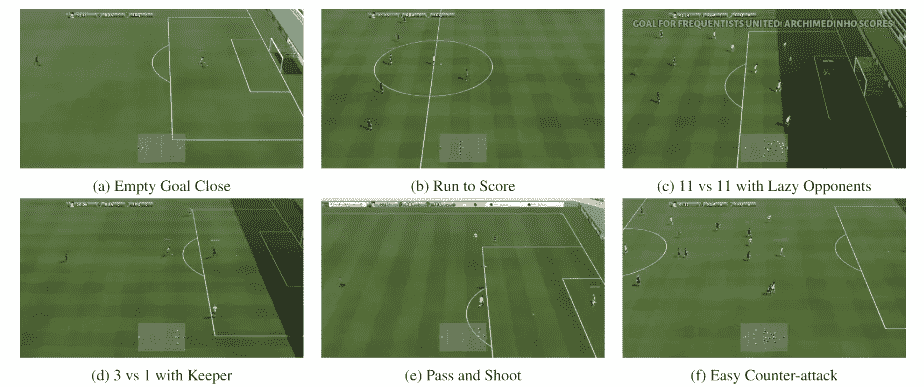
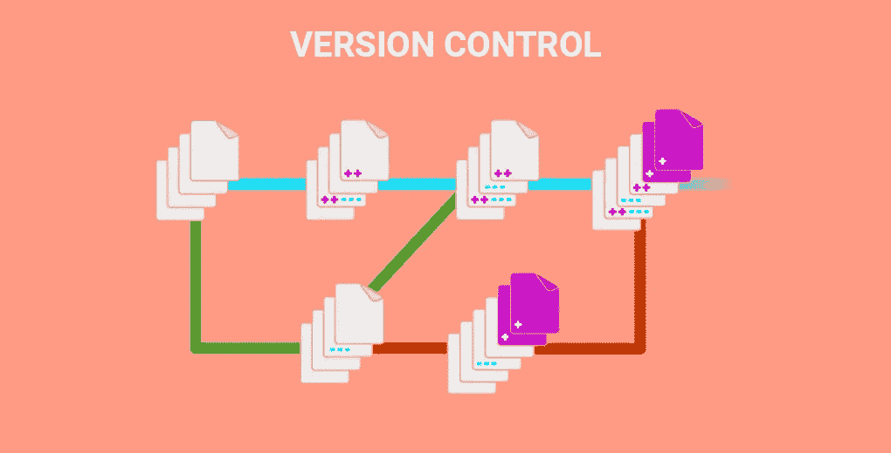

# 6 个强大的机器学习 GitHub 库

> 原文：<https://medium.com/analytics-vidhya/6-powerful-machine-learning-github-repositories-ba02135c4903?source=collection_archive---------1----------------------->

你是不是有时候觉得机器学习太广太浩了，跟不上？我当然有这种感觉。只需查看一下去年自然语言处理(NLP)的主要进展列表:

*   谷歌的伯特
*   OpenAI 的 GPT-2
*   谷歌的 Transformer-XL

作为一名数据科学家，简单地跟踪机器学习中发生的所有事情可能会变得令人不知所措。我从 2018 年 1 月开始运行这个 GitHub 系列的目的是为我们的社区消除这种痛苦。

我们在每个月*的每个*开源[机器学习](https://courses.analyticsvidhya.com/courses/applied-machine-learning-beginner-to-professional?utm_source=blog&utm_medium=6-powerful-open-source-machine-learning-github-repositories-data-scientists)版本中搜寻，并挑选出我们认为你绝对应该知道的顶级发展。这是一个不断发展的领域，数据科学家应该始终站在这些突破的前沿。否则，我们有被落在后面的危险。

本月的机器学习 GitHub 合集范围相当广泛。我已经报道了最近最大的 NLP 版本之一(XLNet)，这是谷歌的一种独特的强化学习方法，理解视频中的动作，以及其他存储库。

有趣的时光就在前方，让我们出发吧！

*你也可以浏览 GitHub 仓库和 Reddit 讨论，我们今年已经讨论过了:*

*   [*一月*](https://www.analyticsvidhya.com/blog/2019/02/top-5-data-science-github-reddit-january-2019/?utm_source=blog&utm_medium=6-powerful-open-source-machine-learning-github-repositories-data-scientists)
*   [*二月*](https://www.analyticsvidhya.com/blog/2019/03/top-5-data-science-github-repositories-reddit-discussions-february-2019/?utm_source=blog&utm_medium=6-powerful-open-source-machine-learning-github-repositories-data-scientists)
*   [*三月*](https://www.analyticsvidhya.com/blog/2019/04/top-5-machine-learning-github-reddit/?utm_source=blog&utm_medium=6-powerful-open-source-machine-learning-github-repositories-data-scientists)
*   [*四月*](https://www.analyticsvidhya.com/blog/2019/05/5-data-science-github-reddit-april/?utm_source=blog&utm_medium=6-powerful-open-source-machine-learning-github-repositories-data-scientists)
*   [*五月*](https://www.analyticsvidhya.com/blog/2019/06/top-7-machine-learning-github-repositories-data-scientists/?utm_source=blog&utm_medium=6-powerful-open-source-machine-learning-github-repositories-data-scientists)

# 顶级机器学习 GitHub 库

# [XLNet:下一个大型 NLP 框架](https://github.com/zihangdai/xlnet)

当然，我们从 NLP 开始。这是目前机器学习中最热门的领域。如果你认为 2018 年是重要的一年(确实如此)，那么 2019 年现在已经接过了衣钵。

最新的 NLP 框架是 XLNet。它席卷了 NLP(和机器学习)社区。XLNet 使用 Transformer-XL 作为其核心。开发人员也发布了一个预训练模型来帮助你开始使用 XLNet。

到目前为止，XLNet 在 20 个 NLP 任务上超过了 Google 的 BERT，并在 18 个这样的任务上实现了最先进的性能。

XLNet，说得委婉一点，非常令人印象深刻。你可以在这里阅读完整的研究论文[。](https://arxiv.org/abs/1906.08237)

# [在 PyTorch 中实现 XLNet](https://github.com/graykode/xlnet-Pytorch)

等等——您想知道如何在您的机器上实现 XLNet 吗？不要再看了，这个存储库可以让您立即开始使用。

如果你很熟悉 NLP 的特性，这将很容易理解。但是如果您是这个领域的新手，请花一些时间浏览我上面提到的文档，然后尝试一下。

开发者还在 [Google Colab](https://colab.research.google.com/github/graykode/xlnet-Pytorch/blob/master/XLNet.ipynb) 中提供了完整的代码，所以你可以免费利用 GPU 的能力！这是一个你不想错过的框架。

# [谷歌研究足球——独特的强化学习环境](https://github.com/google-research/football)

我是一个超级足球迷，所以这个库的名字立刻引起了我的注意。谷歌研究和足球——这两者到底有什么关系？

嗯，这个“知识库包含了一个基于开源游戏玩法足球的强化学习环境”。这个环境是由 Google 研究团队专门为研究目的而创建的。以下是环境中产生的几个场景:

代理人被训练在一个先进的、基于物理学的 3D 模拟器中踢足球。在过去的几年里，我见过一些 RL 环境，但是这个环境最棒。

这篇研究论文读起来很有趣，尤其是如果你是一个足球或强化学习爱好者(或者两者都是！).点击查看[。](https://github.com/google-research/football/blob/master/paper.pdf)

# [实现工艺文本检测器](https://github.com/clovaai/CRAFT-pytorch)

这是一个迷人的概念。CRAFT 代表用于文本检测的字符区域意识。如果你对计算机视觉感兴趣，这应该是你的必读书目。看看这张 GIF:

你能弄清楚算法是如何工作的吗？CRAFT 通过探测图像中出现的每个字符区域来检测文本区域。文本的边框呢？这是通过简单地在二进制地图上找到最小包围矩形而获得的。

如果你熟悉物体探测的概念，你很快就会掌握这门手艺。这个库包括一个预训练的模型，所以你不必从头开始编写这个算法！

你可以在[这篇论文](https://arxiv.org/abs/1904.01941)中找到更多细节和对工艺的深入解释。

# [动作——开源工具箱，用于视频中的动作理解](https://github.com/open-mmlab/mmaction)

以前处理过视频数据吗？这是一次非常具有挑战性但又非常有益的经历。想象一下我们可以从一个视频中提取和做的事情。

如何理解特定视频帧中正在执行的动作？这就是动作存储库的作用。它是一个“基于 PyTorch 的动作理解开源工具箱”。根据存储库，操作可以执行以下任务:

*   修剪视频中的动作识别
*   未修剪视频中的时间动作检测(也称为动作定位)
*   未修剪视频中的时空动作检测

MMAction 的开发者还提供了处理不同类型视频数据集的工具。这个存储库包含了足够多的步骤，至少可以让您开始运行。

[这里的](https://github.com/open-mmlab/mmaction/blob/master/GETTING_STARTED.md)是动作的入门指南。

# [TRAINS —自动魔法实验管理器&AI 版本控制](https://github.com/allegroai/trains)

数据科学家的技能组合中最重要但却被忽视的一个方面——软件工程。这是工作的一部分。知道如何建立模型是很重要的，但是理解项目的软件方面也同样重要。

如果您以前从未听说过版本控制，请立即纠正。TRAINS“记录和管理各种深度学习研究工作负载，并以几乎为零的集成成本完成这些工作”。

关于 TRAINS(有很多)最好的部分是它是免费和开源的。您只需要编写两行代码就可以将 TRAINS 完全集成到您的环境中。它目前集成了 PyTorch、TensorFlow 和 Keras，并且还支持 Jupyter 笔记本。

开发者已经在这里建立了一个演示服务器。继续使用您想要测试的任何代码来尝试训练。

# 结束注释

我这个月的选择肯定是 XLNet。它为 NLP 科学家提供了无限的机会。不过只有一点需要注意——它需要强大的计算能力。谷歌 Colab 会出手相救吗？如果你已经试用过了，请告诉我。

与此相关的是，NLP 是*现在要进入的*领域。发展正在以极快的速度发生，我可以很容易地预测今年会有更多的发展。如果你还没有，那就尽快开始钻研吧。

我应该在这个列表中包括其他机器学习 GitHub 库吗？你喜欢这个月系列中的哪一款？下面在评论区讨论吧。

*原载于 2019 年 7 月 1 日*[*https://www.analyticsvidhya.com*](https://www.analyticsvidhya.com/blog/2019/07/6-powerful-open-source-machine-learning-github-repositories-data-scientists/)*。*