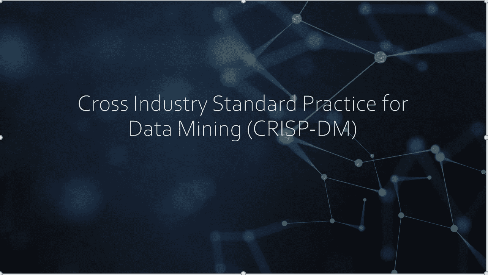
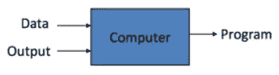

# 机器学习项目成功的 6 个阶段

> 原文：<https://medium.com/analytics-vidhya/6-stages-to-get-success-in-machine-learning-project-2900555327bc?source=collection_archive---------4----------------------->

> **“如果你愿意倾听，数据会和你说话”——吉姆·贝吉森**

毫不夸张地说，人工智能的进步让我们看到了自动驾驶汽车、语音识别、主动网络搜索以及面部和图像识别。这在今天是如此不可避免，以至于我们很可能每天都在不知不觉中使用它很多次。

随着各种机器学习算法的实现，解决方案成为可能。这些算法经常产生提高预测准确性的模型。然而，机器学习算法的结果取决于探索、理解和利用手头可用的数据。

由于机器学习项目可获得的数据量之大，感到不知所措是很自然的。一般来说，完成一个 ML 项目可能需要几个月的时间，因此为它建立一个结构是很重要的。如果您没有选择正确的途径或遵循结构化的方法，任何人都有可能迷失方向，浪费大量的精力和时间来分析数据。

想象一下，你正开车去一个小山车站，你的车在一个偏僻的地方抛锚了。你有一个工具箱，你想修理汽车。要做到这一点，你需要知道到底哪里出了问题。是引擎、电池还是你只是没有燃料了？

即使是有 1000 条记录的最小的 ML 项目也必须遵循一个定义好的结构来达到预期的目标。自 1996 年以来用于机器学习的最常见的结构被称为 [**CRISP-DM**](https://en.wikipedia.org/wiki/Cross-industry_standard_process_for_data_mining) 框架**——数据挖掘的跨行业标准流程。**

它体现了 ML 问题解决的完整生命周期，具有多个阶段。主要有 6 个阶段的 CRISP-DM，你必须遵循，以保持你的 ML 项目的进程，并取得成功。

1.  商业理解
2.  数据理解
3.  数据准备
4.  数据建模
5.  模型评估
6.  部署

值得注意的是，CRISP-DM 框架中的步骤在本质上不一定是连续的。比如你的数据理解，可以提高你对业务本身的理解。

1.  **业务理解**——对于一名 ML 工程师来说，理解业务及其具体问题至关重要。您应该关注这些具体方面，以获得所需的业务理解。

*   了解业务需求—业务的具体要求是什么？将其转化为可测量的具体目标，并形成问题陈述。将业务需求转化为 ML 问题。为了前任。产品会卖出去吗？
*   分析支持信息-列出所需的资源、假设和依赖性。识别和分析相关风险，准备缓解计划，进行投资回报分析。
*   选择适合的算法，成功标准是什么，KPI 等..
*   准备一个初步的计划，包括阶段的数量和持续时间、依赖性、目标、评估方法和技术。

**2。数据理解** —这个阶段围绕着数据收集、探索和理解，或者更普遍地称为探索性数据分析(EDA)。一旦你第一次接触到数据，你会想知道它的结构(文件数、行数、列数等)。)，了解它们彼此之间的关系，以及某些东西是否看起来不寻常，例如日期列有负值。总体而言，您对以下内容感兴趣:

*   数据收集—查找各种数据源和提取数据的步骤。在合并各种数据源的基础上，分析您是否需要更多数据，或者您是否需要丢弃一些特征和数据，只获取一个子集。考虑不是数字格式但对 ML 项目有用的资源。人员、领域知识经验等…
*   数据属性—探索数据并根据元数据值(如数量、金额等)对其进行描述。使用各种统计工具(如平均值、中值、模式、相关性等)查找关键特征和关系..使用 python、sql 或数据可视化工具中的工具找出数据属性、重要特征以及它们之间的关系。散点图和箱线图等图表可以提供异常值和数据分布。简单的散点图或线图可以帮助你找出趋势，这是查看数据行没有帮助的。您可以绘制多个变量之间的关系图，也可以绘制另一个变量之间的关系图，并查看两个变量之间的关系。这就是所谓的单变量和双变量分析。
*   数据质量—这里的主要目标是从完整性、正确性、错误类型、缺失值等方面验证数据质量。如果需要，纠正数据编码。检查是否有缺失值或异常值。就任何数据不一致之处进行沟通，并决定纠正这些差距的步骤。

在探索性数据分析(EDA)的整个练习中，以下工具可能会有所帮助:

*   使用来自 Pandas 库(Read.csv、pd.info、pd.head、pd.summary)和其他可视化库(如 matplotlib、Seaborn)的免费 python 命令组合来执行 EDA。此外，你可以使用 AWS、Google 和微软的抽象云服务来做类似的事情。这里提到了一些例子:
*   AWS glue——AWS 提供的完全托管服务，允许您上传、探索和理解可用数据的模式，它允许您查看元数据，如列名、数据类型等。
*   AWS Athena——无服务器的交互式 SQL 查询服务，可以对 S3 的存储数据进行查询。不需要在 AWS 红移或 EC2 中加载数据。
*   Amazon Quicksight —云计算 BI 服务，成本仅为其他可用服务的 1/10。

**3。数据准备**

> **“给我六个小时砍树，我会用前四个小时磨斧子。”—亚伯拉罕·林肯**

众所周知，在任何 ML 项目中，50–80%的时间都花在数据清理和准备上，因此数据准备成为最关键的步骤之一。数据准备阶段将重点关注以下活动:

*   最终数据集选择-根据需求和已知的项目约束条件(如总大小、数据类型、包含和排除的列、记录选择等)选择最终数据
*   清理-清理包含损坏数据和可变噪声(如无效或不太可能的值)的要素。
*   使用删除、插补方法(平均值、中值、零、计算值等)处理缺失值..).(阅读:“[为什么处理缺失数据很重要，以及处理缺失数据的 10 种方法](/@niwratti2019/why-it-is-important-to-handle-missing-data-and-10-methods-to-do-it-29d32ec4e6a?source=friends_link&sk=56482fe1959037152730554059e021d1)”，详细了解如何处理缺失值。)
*   变换数据-包括派生附加要素、使用相关方法(如最小-最大标量)归一化数据、使用一次热编码或其他相关方法进行要素变换。
*   合并-合并所有数据集，如果需要，执行上述步骤。

**4。数据建模**

***“如果你折磨数据足够久，它就会招供。”***

建模是数据分析的核心。人们可以把模型看作一个黑盒，它把相关数据作为输入，给出一个 ML 模型作为输出。让我们看看建模的步骤:

*   了解业务问题并选择正确的型号系列—从手头问题的类别中选择正确的型号。回归或分类，线性或随机森林或 SVM。
*   为相应的建模技术选择正确的工具，如 sklearn、MXnet、NLTK 或 keras
*   与所选模型相关的相关约束的数据准备，如文本、数字数据等
*   生成模型测试计划——通常，数据集以 70/30 或 80/20 的比例分为训练集和测试集。如果可用的训练数据有限，您还可以应用其他数据选择技术，如 Kfold、交叉验证等。
*   确定模型评估标准——每个 ML 算法都有相关的方法来评估性能，如回归——平方、分类——准确度、混淆矩阵、精确度等
*   按照以下步骤建立模型—训练模型，[调整超参数](/@niwratti2019/why-hyper-parameter-tuning-is-important-for-your-model-1ff4c8f145d3?source=friends_link&sk=7749444cf70c3cabd3bb477916e8b161)。

**5。模型评估-**

> **“适当的准备可以防止糟糕的表现。”**

模型评估的本质取决于前 4 个步骤中所做的工作。如果从模型评估中获得的结果不令人满意，您可以重复整个过程，否则您可以继续执行模型。评估是必要的，以确保您的模型是健壮和有效的。一个有趣的见解是，整个过程本质上是迭代的。模型的智能必须不断进化。

您可以使用不同的参数设置构建多个模型，并根据下面列出的一个或多个参数比较模型性能。

*   模型的准确性
*   性能和执行速度
*   计算成本
*   对看不见的/未知的数据进行模型概括(过拟合与欠拟合)-进行模型评估是为了验证或确认所开发的模型是正确的并且符合实际情况。在构建模型之后，我们需要检查模型是否在实际数据上工作良好，而不仅仅是构建模型的数据。
*   使用商业成功标准评估模型

**6。部署** — ML 模型部署大致遵循以下步骤

*   部署周期——在模型评估之后，最终模型应该经过彻底的测试和 UAT 周期，然后才应该部署。
*   维护和监控—应在生产中监控和维护已部署的模型，以发现任何性能变化。如果存在重大性能问题或结果降级，那么应该从头开始重建模型。

总的来说，整个 ML 生命周期经历了迭代的步骤，其中数据在形成适当的形状之前得到发展和修改，在此形状下，数据可以用于构建期望的模型。

> **我们的目标是将数据转化为信息，并将信息转化为洞察力。**