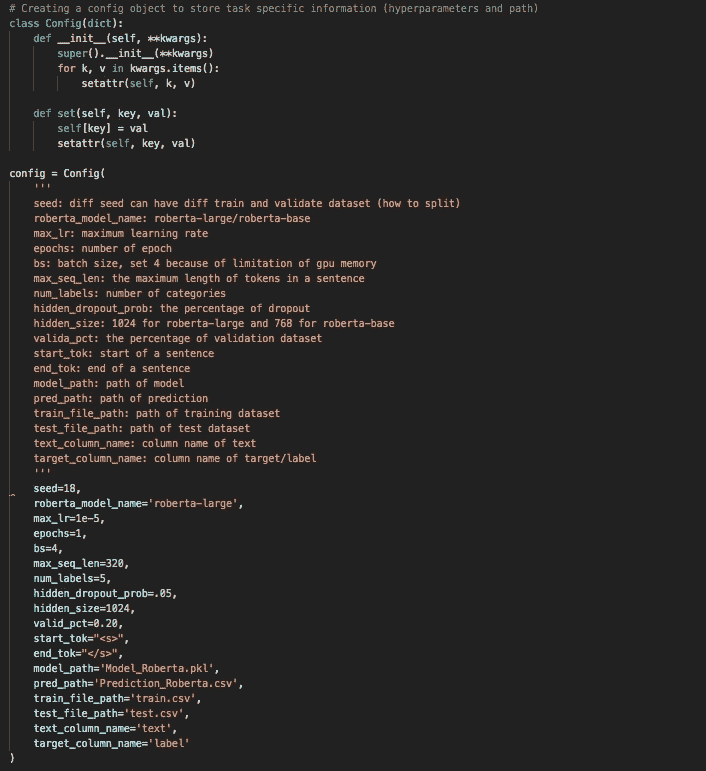
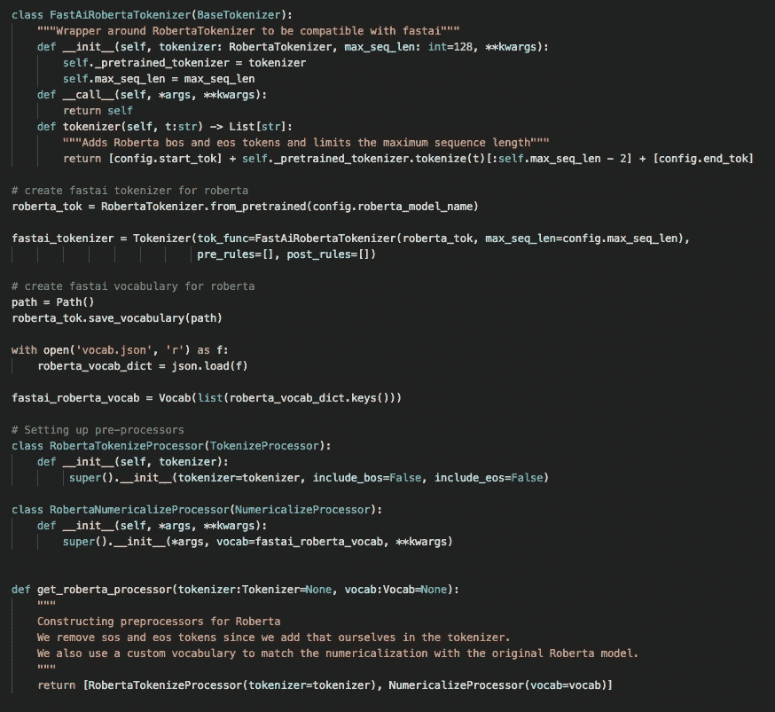
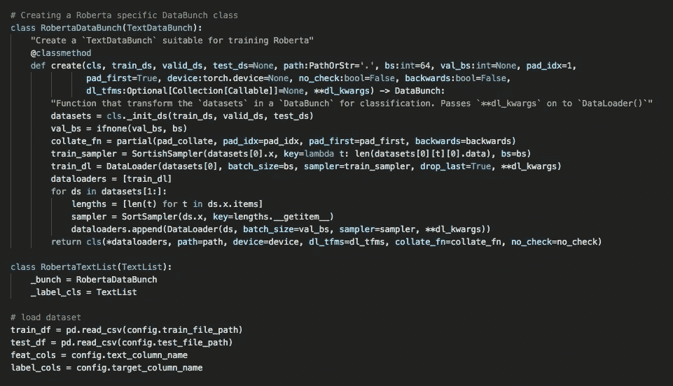
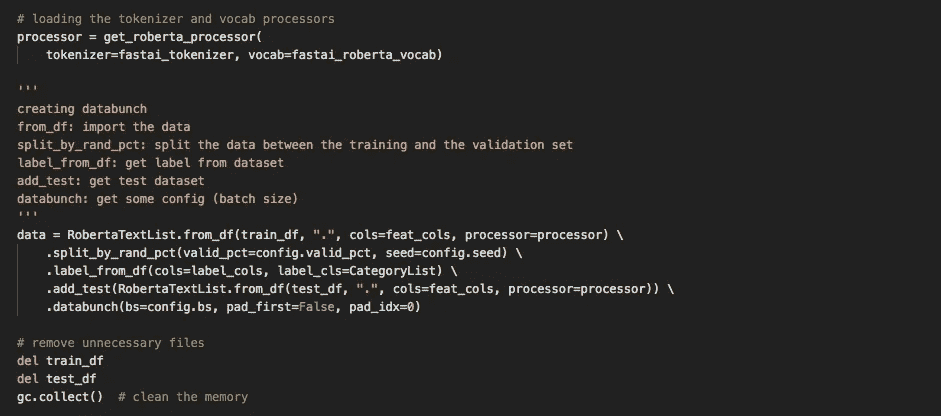
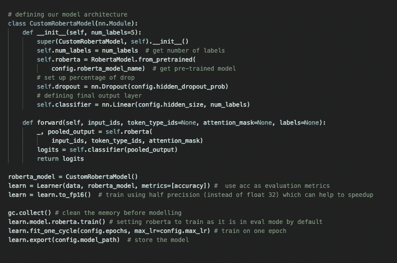
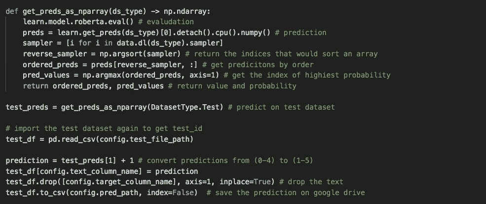

# 构建 RoBERTa 的 6 个步骤(稳健优化的 BERT 预训练方法)

> 原文：<https://medium.com/analytics-vidhya/6-steps-to-build-roberta-a-robustly-optimised-bert-pretraining-approach-e508ebe78b96?source=collection_archive---------5----------------------->

## 带代码的实践教程

> 您可以了解如何为 NLP 分类任务构建预训练模型


安妮·斯普拉特在 [Unsplash](https://unsplash.com?utm_source=medium&utm_medium=referral) 上的照片

在本文中，提供了一个实践教程来构建 RoBERTa(一种鲁棒优化的 BERT 预训练方法)用于 NLP 分类任务。

[***代码上传到 Github【点击这里】***](https://github.com/jinisaweaklearner/ML-DL-papers-and-code/blob/master/src/RoBERTa_multi_class_yelp5.ipynb) ***。***

使用最新/最先进的模型的问题是 API 不容易使用，并且几乎没有文档和教程(不像使用 XGBoost 或 LightGBM)。

在这里，我尽量简化步骤，以建立更多的和有更多的评论。如果你的任务是通过使用文本建立一个分类(二进制/多类)模型，**你只需要在步骤 2 中改变很少的参数/行**。

请随意使用、修改代码并给予反馈。让我们边做边学吧！

# 步骤 1-导入包

在步骤 1 中，我们需要如下导入所有的包。

为了给第一次使用这些软件包的人简化这一步，我强烈推荐使用 **Google Colab** 并将文件存储在 Google Drive 上。为什么？大部分包已经安装完毕，你可以在 Colab 上自由使用 GPU。

你需要安装的唯一软件包是“pytorch-transformers”。

# 步骤 2 —设置配置

几乎所有的更改都应该在“config”中。特别是，它们是模型的超参数、文件路径和列名。

要快速尝试一个参数较少的简单模型，我建议:

```
roberta_model_name: 'roberta-base'
max_seq_len: about 250
bs: 16 (you are free to use large batch size to speed up modelling)
```

为了提高**精度**并有更多的参数，我建议:

```
roberta_model_name: 'roberta-large'
max_seq_len: over 300
bs: 4 (because of the limitation of GPU memory)
```

以后要有多个不同的模型，用集成学习，我建议换:

```
seed
valid_pct
hidden_dropout_prob
```

要构建二元模型或多类模型，您可以更改:

```
num_labels
```



# 步骤 3 —设置令牌化器

你不需要改变这里的任何东西，:D



# 步骤 4 —设置数据集中

因为路径和列名已经在步骤 2 中设置好了，所以不需要在这里做任何更改。



# 步骤 5 —培训和评估

同样，您不需要在这里更改任何内容！我在下面留了一些注释，这样你就可以很容易地修改代码。



# 第六步——预测

这是最后一步！你可以得到预测，如果你想得到概率而不是 0/1，你需要在 get_preds_as_nparray 中改变返回。



[***您可以在这里***](/@jinisaweaklearner/everything-you-need-about-evaluating-classification-models-dfb89c60e643) 查看分类模型的 7 个不同评价指标。

# 资源

fast . ai:[https://www.fast.ai/](https://www.fast.ai/)

变形金刚 Github:[https://github.com/huggingface/transformers](https://github.com/huggingface/transformers)

变形金刚文档:[https://huggingface.co/transformers/](https://huggingface.co/transformers/)

Github 上二进制分类问题使用 RoBERTa 的一个例子:[https://Github . com/devkosal/fastai _ RoBERTa/blob/master/fastai _ RoBERTa _ IMDB/使用% 20 RoBERTa % 20 with % 20 fastai % 20 tutorial . ipynb](https://github.com/devkosal/fastai_roberta/blob/master/fastai_roberta_imdb/Using%20RoBERTa%20with%20Fastai%20Tutorial.ipynb)

fast.ai Youtube 教程:[https://www.youtube.com/playlist?list = PLtmWHNX-gukkocxqokqjuvxglsdywsh 9](https://www.youtube.com/playlist?list=PLtmWHNX-gukKocXQOkQjuVxglSDYWsSh9)

伯特论文:[https://arxiv.org/pdf/1810.04805.pdf](https://arxiv.org/pdf/1810.04805.pdf)

罗伯塔论文:[https://arxiv.org/pdf/1907.11692.pdf](https://arxiv.org/pdf/1907.11692.pdf)