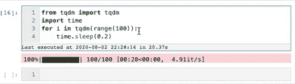

# 要构建的 7 个非常棒的 Python 包和示例项目！

> 原文：<https://medium.com/analytics-vidhya/7-awesome-python-packages-and-example-projects-to-build-921c8058c5c?source=collection_archive---------11----------------------->

# 介绍

每天有将近 100 个 python 包被创建。在撰写本文时，PyPI 上有 254，216 个项目。那么如何知道哪些包最有用呢？本文希望通过展示 7 个出色的 python 包、示例用例以及示例代码来解决这个问题。

这个列表主要面向数据科学，重点是让酷项目变得简单的**python**T2 包。


# slacker——易于使用的 Slack API

我喜欢 Slack 的易用 API。Slack 使得制作自动化机器人变得非常容易，从而提高你的团队的生产力。简单来说，我们可以使用 Slack 机器人来发送警报，如算法性能随时间的变化。更复杂的应用程序可以通过一个可以触发作业的模型接受用户的输入。

懒鬼包可以在[这里](https://pypi.org/project/slacker/+)找到，复杂应用的一个很好的例子可以在 [Glitch](https://glitch.com/@slack) 上找到。

## 示例—使用 Slacker 发送警报和文件

懒鬼是超级简单的使用和自动化相结合，可以非常有用。假设您希望每天早上使用它连接到 SQL，以获取每日销售快照，并将图表发送到渠道:

```
from slacker import Slacker
import matplotlib.pyplot as plt
import tempfile
from pathlib import Path# input slack credentials
slack = Slacker('<your-slack-api-token-goes-here>')# plot graph of sales by day
fig = plt.figure(figsize=(15,10))plt.plot(y=orders_df['sales'], 
             x=orders_df['date'], 
             color = '#2ae8bf', 
             linewidth = 2,
             label='Total Orders by day',
             alpha=0.2)

# use a temporary directory to send the graph to slack
with tempfile.TemporaryDirectory() as td:
    local_path = Path(td, f"output graph {psku}.png") 
    plt.savefig(local_path, pad_inches=1)
            # send graph to slack
    slack.files.upload(file=local_path.as_posix(), 
                    title='Daily Sales', 
                    initial_comment='Sales by day')
```

# Prophet —简单时间序列预测

虽然肯定有更复杂的时间序列预测方法，如使用 LSTM 神经网络，但当第一次开始时间序列预测项目时，一个很好的起点是脸书的开源包 Prophet 。

> *Prophet 是预测时间序列数据的过程。它基于一个加法模型，非线性趋势与每年、每周和每天的季节性以及假日效应相适应。它最适用于具有强烈季节效应的时间序列和几个季节的历史数据。Prophet 对缺失数据和趋势变化非常稳健，通常能够很好地处理异常值。*

Prophet 使使用时间序列数据生成预测变得很容易。在我们的上一个例子中，我们向 Slack 发送了一个包含每日销售更新的图表。在这个例子中，我们将使用 Prophet 来预测下一年的销售额。

## 使用 Prophet 预测销售

```
import pandas as pd
from fbprophet import Prophet# the first thing we need to do is change the column names such that the "date" variable is "ds" and the sales variable is "y"orders_df = orders_df.rename(columns={'date':'ds',
                                      'sales':'y'})# fit the model by instantiating a new Prophet object
m = Prophet()
m.fit(orders_df)# when then need to create a future dataframe, that is just the date variable for the number of days we want to forecast into the future (in this case, 365 days)future_df = m.make_future_dataframe(periods=365)# use the predict call to make a prediction! This returns a dataframe that includes the prediction, as well as lower and upper bounds.forecast_df = m.predict(future_df)# you can plot the forecast:
forecast_plot = m.plot(forecast_df)# you can also plot the individual components
m.plot_components(forecast_df)
```

# Spotify 访问丰富的 Spotify 数据

如果你喜欢听音乐，你应该尝试使用 [Spotipy](https://spotipy.readthedocs.io/en/2.13.0/) 套装。使用 Spotipy，您可以完全访问 Spotify API 提供的所有音乐数据。

使用 Spotipy 的一个令人惊奇的例子项目是[什么在旋转](https://www.whats-spinning.life/)。该项目使用 Spotify API 根据用户关注的播放列表向他们发送定制的电子邮件，向他们介绍他们可能喜欢的新艺术家和艺术作品。Spotify API 有助于获取播放列表歌曲、专辑插图、流派和艺术家信息，以生成高度定制的时事通讯。

Spotipy 库使得访问 Spotify 数据变得简单。在这个来自 Spotipy 的示例中，我们检索了音频样本和由 [Travis Scott](https://amzn.to/2XCwx43) 演唱的前 10 首歌曲的封面艺术:

```
**import** **spotipy**
**from** **spotipy.oauth2** **import** SpotifyClientCredentials

artist_uri = '[spotify:artist:36QJpDe2go2KgaRleHCDTp](https://open.spotify.com/artist/0Y5tJX1MQlPlqiwlOH1tJY?si=xqTfQrqzTyq9-d-oHyLkuQ)'

spotify = spotipy.Spotify(client_credentials_manager=SpotifyClientCredentials())results = spotify.artist_top_tracks(artist_uri)

**for** track **in** results['tracks'][:10]:
    print('track    : ' + track['name'])
    print('audio    : ' + track['preview_url'])
    print('cover art: ' + track['album']['images'][0]['url'])
    print()
```

**结果**:

```
track    : TKN (feat. Travis Scott)
audio    : [https://p.scdn.co/mp3-preview/3b011ea2f3a0b6faf549e21faf6d5ca5aa6f74fc?cid=94579f8ccd0a49feb4904ccee6acfcf3](https://p.scdn.co/mp3-preview/3b011ea2f3a0b6faf549e21faf6d5ca5aa6f74fc?cid=94579f8ccd0a49feb4904ccee6acfcf3)
cover art: [https://i.scdn.co/image/ab67616d0000b2732a3d01289b78099e4508ba0e](https://i.scdn.co/image/ab67616d0000b2732a3d01289b78099e4508ba0e)

track    : THE SCOTTS
audio    : [https://p.scdn.co/mp3-preview/36bf1375c8d3f3925556744935f234b5e060e0cc?cid=94579f8ccd0a49feb4904ccee6acfcf3](https://p.scdn.co/mp3-preview/36bf1375c8d3f3925556744935f234b5e060e0cc?cid=94579f8ccd0a49feb4904ccee6acfcf3)
cover art: [https://i.scdn.co/image/ab67616d0000b27311d6f8c713ef93a9bb64ddfe](https://i.scdn.co/image/ab67616d0000b27311d6f8c713ef93a9bb64ddfe)

track    : goosebumps
audio    : [https://p.scdn.co/mp3-preview/d6d1ec9bfc82463707878d5e36d15e7b8a364069?cid=94579f8ccd0a49feb4904ccee6acfcf3](https://p.scdn.co/mp3-preview/d6d1ec9bfc82463707878d5e36d15e7b8a364069?cid=94579f8ccd0a49feb4904ccee6acfcf3)
cover art: [https://i.scdn.co/image/ab67616d0000b273f54b99bf27cda88f4a7403ce](https://i.scdn.co/image/ab67616d0000b273f54b99bf27cda88f4a7403ce)

track    : HIGHEST IN THE ROOM
audio    : [https://p.scdn.co/mp3-preview/d9b90990dab9d8376d05c5d4a6b7ac3e99c03763?cid=94579f8ccd0a49feb4904ccee6acfcf3](https://p.scdn.co/mp3-preview/d9b90990dab9d8376d05c5d4a6b7ac3e99c03763?cid=94579f8ccd0a49feb4904ccee6acfcf3)
cover art: [https://i.scdn.co/image/ab67616d0000b273e42b5fea4ac4c3d6328b622b](https://i.scdn.co/image/ab67616d0000b273e42b5fea4ac4c3d6328b622b)

track    : SICKO MODE
audio    : [https://p.scdn.co/mp3-preview/1c3c01c64477b356e28a652b6447f4ef96689a71?cid=94579f8ccd0a49feb4904ccee6acfcf3](https://p.scdn.co/mp3-preview/1c3c01c64477b356e28a652b6447f4ef96689a71?cid=94579f8ccd0a49feb4904ccee6acfcf3)
cover art: [https://i.scdn.co/image/ab67616d0000b273072e9faef2ef7b6db63834a3](https://i.scdn.co/image/ab67616d0000b273072e9faef2ef7b6db63834a3)

track    : OUT WEST (feat. Young Thug)
audio    : [https://p.scdn.co/mp3-preview/e27985662ccbc644b64f49042d3d2b73b0bfc4e4?cid=94579f8ccd0a49feb4904ccee6acfcf3](https://p.scdn.co/mp3-preview/e27985662ccbc644b64f49042d3d2b73b0bfc4e4?cid=94579f8ccd0a49feb4904ccee6acfcf3)
cover art: [https://i.scdn.co/image/ab67616d0000b273dfc2f59568272de50a257f2f](https://i.scdn.co/image/ab67616d0000b273dfc2f59568272de50a257f2f)

track    : BUTTERFLY EFFECT
audio    : [https://p.scdn.co/mp3-preview/ca4f131887eae894020e48ea809af1186c95f542?cid=94579f8ccd0a49feb4904ccee6acfcf3](https://p.scdn.co/mp3-preview/ca4f131887eae894020e48ea809af1186c95f542?cid=94579f8ccd0a49feb4904ccee6acfcf3)
cover art: [https://i.scdn.co/image/ab67616d0000b273072e9faef2ef7b6db63834a3](https://i.scdn.co/image/ab67616d0000b273072e9faef2ef7b6db63834a3)

track    : STARGAZING
audio    : [https://p.scdn.co/mp3-preview/d2d23f9ea674dffde91d99783732b092655ccaf6?cid=94579f8ccd0a49feb4904ccee6acfcf3](https://p.scdn.co/mp3-preview/d2d23f9ea674dffde91d99783732b092655ccaf6?cid=94579f8ccd0a49feb4904ccee6acfcf3)
cover art: [https://i.scdn.co/image/ab67616d0000b273072e9faef2ef7b6db63834a3](https://i.scdn.co/image/ab67616d0000b273072e9faef2ef7b6db63834a3)

track    : CAN'T SAY
audio    : [https://p.scdn.co/mp3-preview/5cf7091a2bbb9811838dcba614b8dd4b57a17447?cid=94579f8ccd0a49feb4904ccee6acfcf3](https://p.scdn.co/mp3-preview/5cf7091a2bbb9811838dcba614b8dd4b57a17447?cid=94579f8ccd0a49feb4904ccee6acfcf3)
cover art: [https://i.scdn.co/image/ab67616d0000b273072e9faef2ef7b6db63834a3](https://i.scdn.co/image/ab67616d0000b273072e9faef2ef7b6db63834a3)

track    : YOSEMITE
audio    : [https://p.scdn.co/mp3-preview/93e6cdc0f8d46ff0d4dc1b9325f4a064ba32c5c8?cid=94579f8ccd0a49feb4904ccee6acfcf3](https://p.scdn.co/mp3-preview/93e6cdc0f8d46ff0d4dc1b9325f4a064ba32c5c8?cid=94579f8ccd0a49feb4904ccee6acfcf3)
cover art: [https://i.scdn.co/image/ab67616d0000b273072e9faef2ef7b6db63834a3](https://i.scdn.co/image/ab67616d0000b273072e9faef2ef7b6db63834a3)
```

在他们的开发者页面上有大量 Spotify API 的额外[用例。](https://developer.spotify.com/discover/)

# 文本包—组合相似的文本

这个可能看起来不合适——但是它非常有用。 [Textpack](https://pypi.org/project/textpack/) 允许您在一列中对相似的基于文本的值进行分组，并且快速、准确、高度可定制。

## 示例使用案例

Textpack 真的很棒。在引擎盖下，它使用余弦相似度和快速矩阵乘法计算文本文档之间的相似度。

我们使用 Textpack 将相似的新闻文章分组在一起，并计算它们的相似度。例如，我们使用它来决定向用户提供哪些内容，并限制重复主题:

```
from textpack import tp# Instantiate textpack and group find the similarity between the column "article_text" from news_data:tp_init = tp.TextPack(df=news_data,
                      columns_to_group=['article_text'],  
                      match_threshold=0.6,
                      ngram_remove=r'[,-./]',
                      ngram_length=2)# run the analyzer
tp_init.run()# get the similarity dataframe
similarity_df = tp_init.df
```

# VADER —简单且可定制的情感分析

[VADER](https://github.com/cjhutto/vaderSentiment) 是一款非常棒的情绪分析工具，专门针对社交媒体俚语进行了调整。它还非常擅长检测复杂的句子情绪，比如否定(“学习 python 既不无聊也不难”)或强调(“我喜欢 python！!").

> *VADER 情绪分析。VADER (Valence Aware 字典和情感推理器)是一个基于词典和规则的情感分析工具，专门针对社交媒体中表达的情感，对其他领域的文本也很有效。*

既然我们针对社交媒体分析调整了 VADER，那么一个很好的想法就是用它来分析来自 Twitter 的推文的情绪。我们可以看到，开箱即用的几行代码中，VADER 输出了非常准确的情感得分:

```
from vaderSentiment.vaderSentiment import SentimentIntensityAnalyzer# example tweets
sentences = ["Learning python is neither boring nor hard", 
            "I LOVE python!!",
            "I wear grey shirts.",
            "I really hate sitting in traffic!"]analyzer = SentimentIntensityAnalyzer()
for sentence in sentences:
    vs = analyzer.polarity_scores(sentence)
    print("{:-<65} {}".format(sentence, str(vs)))
```

输出:

```
Learning python is neither boring nor hard----------------------- {'neg': 0.149, 'neu': 0.611, 'pos': 0.24, 'compound': 0.1884}
I LOVE python!!-------------------------------------------------- {'neg': 0.0, 'neu': 0.266, 'pos': 0.734, 'compound': 0.7592}
I wear grey shirts.---------------------------------------------- {'neg': 0.0, 'neu': 0.714, 'pos': 0.286, 'compound': 0.0516}
I really hate sitting in traffic!-------------------------------- {'neg': 0.461, 'neu': 0.539, 'pos': 0.0, 'compound': -0.6468}
```

# TQDM —智能进度条

我们使用 tqdm 包让循环显示一个智能进度条。你需要做的就是用`tqdm(iterable)`包装任何 iterable，进度条就会显示！

这个包可以帮助你直观地看到一个 for 循环需要多长时间。

下面是 tqdm GitHub 中显示进度条的 gif 示例:



tqdm 进度条

# 简化—即时构建数据应用

Streamlit 简直不可思议——它真的值得自己写一篇文章。如果你从来没有尝试过，我强烈推荐。它使得构建漂亮的数据网络应用和仪表板变得极其容易。

通过 streamlit，您可以构建一些简单的东西，如图形或地图，或者通过[实时自动驾驶汽车图像识别](https://github.com/streamlit/demo-self-driving)更上一层楼。

例如，去看看 T4 网站。

*原载于 2020 年 8 月 5 日 https://www.analyticsvidhya.com**[*。*](https://www.analyticsvidhya.com/blog/2020/08/7-awesome-python-packages-and-example-projects-to-build/)*