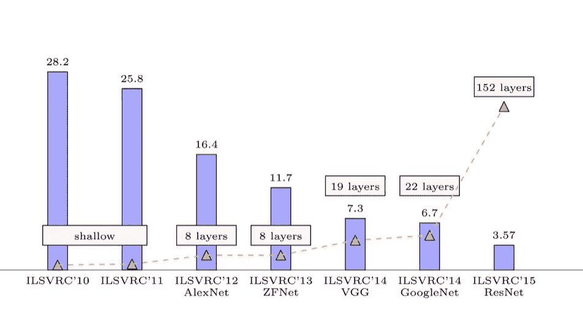

# 7 CNN 架构从 2010 年发展到 2015 年

> 原文：<https://medium.com/analytics-vidhya/7-cnn-architectures-evolved-from-2010-2015-fd5869bd744e?source=collection_archive---------14----------------------->

## 深度学习

1.  ILSVRC'10
2.  ILSVRC'11
3.  ILSVRC'12 (AlexNet)
4.  ILSVRC'13 (ZFNet)
5.  ILSVRC'14 (VGGNet)
6.  ILSVRC'14(谷歌网)
7.  ILSVRC'15 (ResNet)

*   *ILSVRC 代表 Imagenet 大规模视觉识别挑战或* …