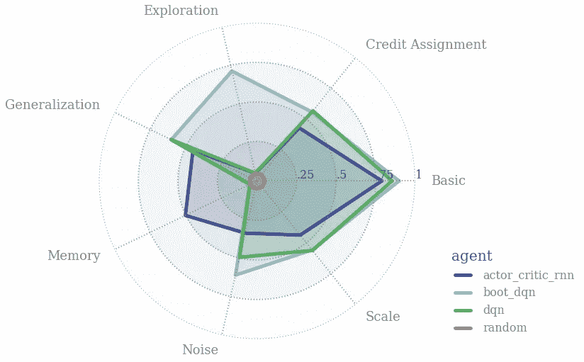

# 7 个数据科学项目来展示您的机器学习技能！

> 原文：<https://medium.com/analytics-vidhya/7-data-science-projects-to-showcase-your-machine-learning-skills-aa4f3b8dfd28?source=collection_archive---------12----------------------->


你准备好在你的[机器学习之旅](https://courses.analyticsvidhya.com/courses/applied-machine-learning-beginner-to-professional?utm_source=blog&utm_medium=7-data-science-projects-github-showcase-your-skills)中迈出下一大步了吗？研究玩具数据集和使用流行的数据科学库和框架是一个良好的开端。但是如果你真的想在竞争中脱颖而出，你需要一个飞跃，让自己与众不同。

一个绝妙的方法是做一个关于数据科学最新突破的项目。想成为[计算机视觉](https://courses.analyticsvidhya.com/courses/computer-vision-using-deep-learning-version2?utm_source=blog&utm_medium=7-data-science-projects-github-showcase-your-skills)专家？了解最新的对象检测算法是如何工作的。如果[自然语言处理(NLP)](https://courses.analyticsvidhya.com/courses/natural-language-processing-nlp?utm_source=blog&utm_medium=7-data-science-projects-github-showcase-your-skills) 是你的职业，那么学习一下 Transformer 架构的各个方面和分支。

我的观点是——随时准备并愿意致力于新的数据科学技术。这是行业中发展最快的领域之一，我们作为数据科学家需要与时俱进。

所以，让我们来看看 2019 年 8 月创建的七个数据科学 GitHub 项目。像往常一样，我保持了广泛的领域，包括从机器学习到强化学习的项目。

如果你遇到了任何不在这个列表中的库，请在这篇文章下面的评论部分告诉社区！

# 顶级数据科学 GitHub 项目


我将这些数据科学项目分为三大类:

*   机器学习项目
*   深度学习项目
*   规划项目

# 机器学习项目

# [py forest——在一行代码中导入所有 Python 数据科学库](https://github.com/8080labs/pyforest)

我真的，*真的*喜欢这个 Python 库。正如上面的标题所示，典型的数据科学库只使用一个库——py forest 导入。看看这个我从图书馆的 GitHub 库中获取的快速演示:


兴奋了吗？pyforest 目前包括 pandas、NumPy、matplotlib 和更多的数据科学库。

只需使用 *pip install pyforest* 在您的机器上安装库，您就可以开始了。您可以在一行代码中导入所有流行的用于数据科学的 Python 库:

厉害！我非常喜欢使用它，我相信你也会喜欢。如果你是 Python 语言的新手，你应该看看下面的免费课程:

*   [用于数据科学的 Python](https://courses.analyticsvidhya.com/courses/introduction-to-data-science/?utm_source=blog&utm_medium=7-data-science-projects-github-showcase-your-skills)

# [HungaBunga——一种使用 sklearn 构建机器学习模型的不同方式](https://github.com/ypeleg/HungaBunga)

你如何从你已经建立的模型中挑选出最好的机器学习模型？您如何确保正确的超参数值发挥作用？这些是数据科学家需要回答的关键问题。

而 *HungaBunga* 项目将帮助你比大多数数据科学图书馆更快地找到答案。贯穿所有 *sklearn* 车型(对，全部！)和所有可能的超参数，并使用[交叉验证](https://www.analyticsvidhya.com/blog/2018/05/improve-model-performance-cross-validation-in-python-r/)对它们进行排序。


以下是如何导入所有模型(分类和回归模型):

```
from hunga_bunga import HungaBungaClassifier, HungaBungaRegressor
```

你应该看看下面这篇关于监督机器学习算法的综合文章:

*   [常用的机器学习算法(用 Python 和 R 代码)](https://www.analyticsvidhya.com/blog/2017/09/common-machine-learning-algorithms/?utm_source=blog&utm_medium=7-data-science-projects-github-showcase-your-skills)

# 深度学习项目

# [deep mind 的强化学习行为套件(b Suite)](https://github.com/deepmind/bsuite)



Deepmind 最近出现在新闻中，原因是他们公布的同比巨额亏损。但让我们面对它，该公司在强化学习的研究方面仍然明显领先。作为人工智能的未来，他们在这个领域下了很大的赌注。

所以他们最新的开源版本来了 bsuite。这个项目是一个实验的集合，旨在了解强化学习代理的核心能力。

我喜欢这个研究领域，因为它本质上试图实现两个目标(根据他们的 GitHub 库):

*   收集信息丰富且可扩展的问题，这些问题捕获了高效通用学习算法设计中的关键问题
*   通过代理在这些共享基准上的表现来研究他们的行为

GitHub 资源库包含了如何在您的项目中使用 bsuite 的详细说明。您可以使用以下代码安装它:

```
pip install git+git://github.com/deepmind/bsuite.git
```

如果你是强化学习的新手，这里有几篇文章可以帮助你入门:

*   [强化学习简单初学者指南&其实现](https://www.analyticsvidhya.com/blog/2017/01/introduction-to-reinforcement-learning-implementation/?utm_source=blog&utm_medium=7-data-science-projects-github-showcase-your-skills)
*   [使用 Python 中的 OpenAI Gym 进行深度 Q 学习的实践介绍](https://www.analyticsvidhya.com/blog/2019/04/introduction-deep-q-learning-python/?utm_source=blog&utm_medium=7-data-science-projects-github-showcase-your-skills)

# [distil BERT——谷歌 BERT](https://github.com/huggingface/pytorch-transformers/tree/master/examples/distillation) 的一个更轻更便宜的版本

此时你一定听说过伯特。它是最受欢迎的框架之一，并迅速成为广泛采用的自然语言处理(NLP)框架。BERT 基于[变压器架构](https://www.analyticsvidhya.com/blog/2019/06/understanding-transformers-nlp-state-of-the-art-models/?utm_source=blog&utm_medium=7-data-science-projects-github-showcase-your-skills)。

但是它有一个警告——它可能相当耗费资源。那么，数据科学家如何在自己的机器上研究 BERT 呢？站出来——蒸馏者！


Distillated-BERT 的缩写，来自流行的 PyTorch-Transformers 框架背后的团队。这是一款基于 BERT 架构的小型廉价变压器。据该团队称，DistilBERT 运行速度提高了 60%，同时保留了 BERT 95%以上的性能。

这个 GitHub 存储库解释了 DistilBERT 如何与 Python 代码一起工作。您可以在此了解更多关于 PyTorch-Transformers 以及如何在 Python 中使用它的信息:

*   [py torch-Transformers 简介:一个不可思议的最新自然语言处理库(带 Python 代码)](https://www.analyticsvidhya.com/blog/2019/07/pytorch-transformers-nlp-python/?utm_source=blog&utm_medium=7-data-science-projects-github-showcase-your-skills)

# [ShuffleNet 系列——一种用于移动设备的极其高效的卷积神经网络](https://github.com/megvii-model/ShuffleNet-Series)

一个[计算机视觉](https://courses.analyticsvidhya.com/courses/computer-vision-using-deep-learning-version2/?utm_source=blog&utm_medium=7-data-science-projects-github-showcase-your-skills)项目给你！ShuffleNet 是一个计算效率极高的卷积神经网络(CNN)架构。它是为计算能力非常有限的移动设备设计的。


这个 GitHub 库包括以下 ShuffleNet 模型(是的，有多个):

*   ShuffleNet:一个用于移动设备的非常有效的卷积神经网络
*   ShuffleNetV2:高效 CNN 架构设计的实用指南
*   shuffle net v2+:shuffle net v2 的加强版。
*   ShuffleNetV2。大号:基于 ShuffleNetV2 的更深版本。
*   OneShot:具有均匀采样的单路径单触发神经架构搜索
*   DetNAS: DetNAS:用于对象检测的主干搜索

你想了解 CNN 吗？你知道我会保护你的:

*   [从零开始学习卷积神经网络的综合教程](https://www.analyticsvidhya.com/blog/2018/12/guide-convolutional-neural-network-cnn/?utm_source=blog&utm_medium=7-data-science-projects-github-showcase-your-skills)

# [RAdam —提高学习率的方差](https://github.com/LiyuanLucasLiu/RAdam)

RAdam 在不到两周前发布，已经累积了 1200+颗星星。这告诉你这个库做得有多好！

RAdam 背后的开发人员在[他们的论文](https://arxiv.org/pdf/1908.03265.pdf)中表明，我们在深度学习技术中面临的收敛问题是由于在模型训练的早期阶段自适应学习率的不期望的大变化。

RAdam 是 Adam 的一个新变体，它修正了自适应学习率的方差。这个版本相对于普通的 Adam 优化器来说有了很大的改进，因为普通的 Adam 优化器确实存在差异的问题。

以下是 RAdam 在不同学习速率下与 Adam 和 SGD 相比的性能(X 轴是历元数):


你一定要看看下面的机器学习优化指南(包括 Adam):

*   [机器学习中梯度下降算法(及其变体)介绍](https://www.analyticsvidhya.com/blog/2017/03/introduction-to-gradient-descent-algorithm-along-its-variants/?utm_source=blog&utm_medium=7-data-science-projects-github-showcase-your-skills)

# 规划项目

# [ggtext —改进了 ggplot2 的文本渲染](https://github.com/clauswilke/ggtext)

这个是给我们社区所有 R 用户的。尤其是所有经常使用令人敬畏的 *ggplot2* 包的人(基本上是每个人)。


*ggtext* 包使我们能够为我们生成的图生成富文本呈现。这里有一些你可以用 *ggtext* 尝试的东西:

*   一个名为 element_markdown()的新主题元素将文本呈现为 markdown 或 HTML
*   您可以在轴上包含图像(如上图所示)
*   使用 geom_richtext()生成 markdown/HTML 标签(如下所示)


GitHub 库包含一些直观的例子，您可以在自己的机器上复制这些例子。

还不能通过 CRAN 获得 ggtext ,所以您可以使用以下命令从 GitHub 下载并安装它:

想了解更多关于 *ggplot2* 以及如何在 R？给你:

*   [R 用户在使用 ggplot2 包时经常问的 10 个问题](https://www.analyticsvidhya.com/blog/2016/03/questions-ggplot2-package-r/?utm_source=blog&utm_medium=7-data-science-projects-github-showcase-your-skills)
*   [我如何在 R 中构建动画情节来分析我的健身数据(你也可以！)](https://www.analyticsvidhya.com/blog/2019/04/how-built-personalized-interactive-fitness-tracker-dashboard-r/?utm_source=blog&utm_medium=7-data-science-projects-github-showcase-your-skills)

# 结束注释

我喜欢写这些月度文章。数据科学领域的研究数量和突破是非同寻常的。无论和哪个时代、哪个标准比，进步之快令人咋舌。

你觉得哪个数据科学项目最有趣？你很快会尝试什么吗？请在下面的评论区告诉我，我们将讨论想法！

*原载于 2019 年 9 月 2 日*[*https://www.analyticsvidhya.com*](https://www.analyticsvidhya.com/blog/2019/09/7-data-science-projects-github-showcase-your-skills/)*。*