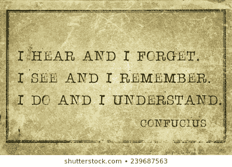

# 编程开始前给初学者的 7 条黄金法则

> 原文：<https://medium.com/analytics-vidhya/7-golden-rules-for-the-beginners-before-the-programming-kick-off-by-srishti-guleria-315dbe4d3126?source=collection_archive---------35----------------------->

## 您是否曾经为开启编程之旅的合适愿景感到焦虑？

作为一个初学者，我也觉得需要有适当的指导来遵循正确的方法来像专业人士一样掌握“编程”。

好了，下面是你所有疑惑的解决方案！

根据我个人的经验和一路走来积累的知识，我列出了一些需要牢记的基本规则，这些规则将会拯救你。

# **1。选择正确的编程语言:**

大多数初学者都为选择“正确的”语言而感到困惑。在我个人看来， **Python** 是最人性化的语言之一，语法非常清晰易懂。这对完全不熟悉编程的人来说更容易学习。

无论你选择哪种语言，坚持下去，直到你完全理解它。

**永远不要试图同时学习多种语言。你最终会一无所知。**

**掌握一门语言，获得深入的知识，探索，找到自己的位置，并在编程方面取得成功。**

# 2.边做边学:

大多数初学者犯的另一个最大的错误是**读代码。**

编程就是解决问题，你不能仅仅通过阅读来解决问题。不要记住密码。仅使用示例代码来获得关于语法、函数等的参考。然后练习各种例子。

**键入每一个代码。运行它。调试一下。再次运行它，直到你找到正确的出路。**

使用纸和笔来执行输出并找到 bug。当你完全陷入困境时，这是最有效的错误检测方法之一。

承诺一个适当的时间表。

# 3.学得快不如学得快:

向你的同龄人、同事或前辈求助，你会感到尴尬吗？

别担心，每个专家都曾经是乞丐。提出一大堆疑问或者求助，一点问题都没有。如果有人取笑你也没关系。

重要的是你已经通过提问解决了你的问题。就是这样！

> 伟大的工作不是靠力量而是靠毅力完成的。
> 
> 塞缪尔·约翰逊

你可以使用各种社交媒体平台，stackoverflow 等。向你所在社区的人寻求帮助，或者谷歌一下。

记住，坚持不懈是成功的关键！毕竟，失败是成功的支柱。每天专注练习。**不要停**！

**如此练习，练习，再练习。**

# 4.干净的代码就是一切:

不要搞 ***意大利面*** ！就是不要！五分钟后，当你回头看的时候，你甚至不能理解。

它们非常难以纠正、理解、修改和维护。

用可理解的语法和简单的功能写一个整洁干净的代码。向代码中添加注释。一个高效的程序员是能够用最简单的方式表达复杂代码的人。

不要过度缩写变量。保持他们的名字接近他们的用法。

# **5。重要因素:**

> 好的开始有好的结果。

最重要的是为您各自的语言选择正确的编译器。例如，在 C/C++的情况下，可以在 Turbo C++和 Dev-C++上运行程序。

然而，在最新的 windows 版本和最新的命令中，使用 Dev-C++要比使用 Turbo-C++容易得多。其他语言也是如此。

此外，要密切关注算法和数据结构，因为它们是任何语言中最不可或缺的部分。他们也会帮助你赢得面试！

# 6.没有找到合适的社区:

你觉得没有人可以讨论你的疑惑吗？

如果是这样的话，那么你需要和那些能帮你实现目标、帮你找到成功愿景的人在一起。

你可以通过 LinkedIn、Stackoverflow 等轻松做到这一点。不胜枚举..

利用在线资源。阅读文章和博客。别坐以待毙。

# 7.不理解也没关系:

你有没有觉得这个世界遥遥领先于你？

> 永远不要让自我怀疑束缚你
> 
> 罗伊·班尼特

你是未来。你是学习者。一旦你在一项技能上获得了完美，那么你就能最好地利用这项技能来解决世界上的任何问题。

永远不要拿自己和别人比较。卡住完全没问题。但是，不要让那压倒你。克服对犯错和失败的恐惧。

有时，这些节目一点也不容易掌握。它发生了！即使是专业开发人员。事情需要时间。

> 不要被你心中的恐惧所左右。被你心中的梦想所引领。
> 
> 罗伊·班尼特

**永远不要拿自己和别人比较。百分百关注你自己。这会帮助你更快更好的成长。**

**结论:** 1。选择正确的道路。

2.不要走捷径！

3.胜利者从不害怕失败。保持精神！

4.对意大利面条代码说不。

5.请记住重要的因素。

6.你的感觉吸引了你的部落。

7.永远不要说永远！

如果你觉得这篇博客有用，如果你能分享并点击下面的推荐按钮，我将不胜感激。

*快乐编码！*